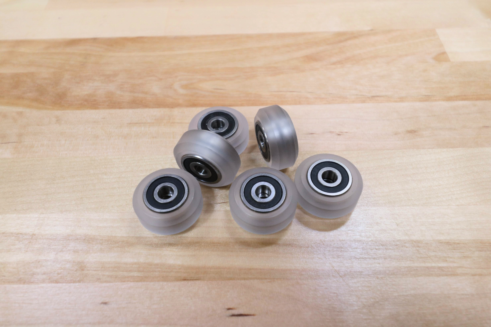
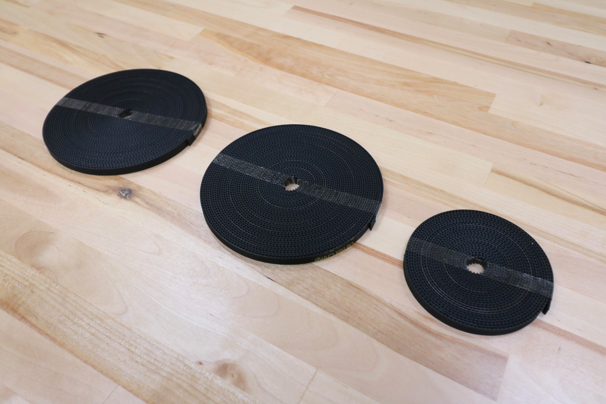
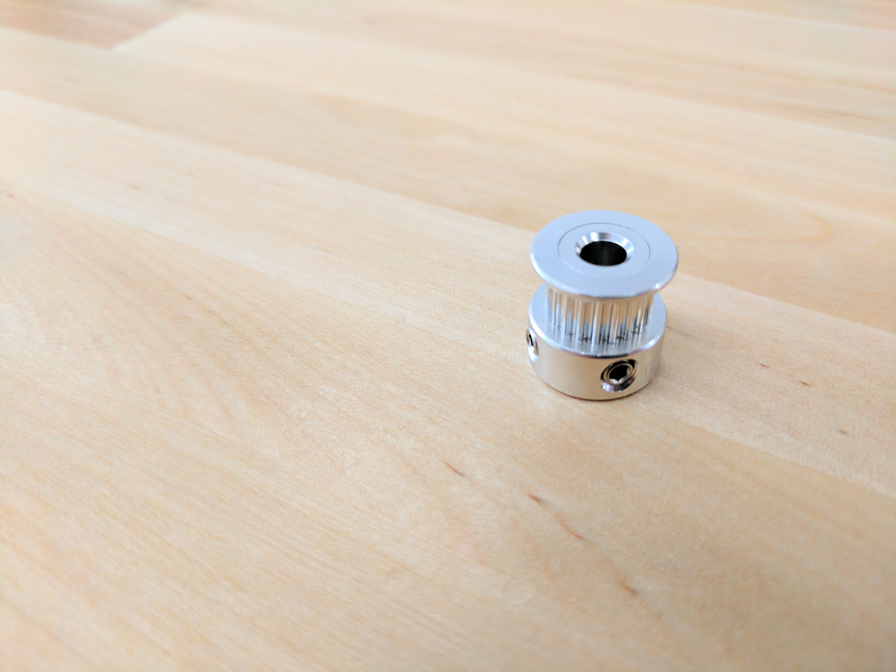

* toc
{:toc}

|Component                     |$/Unit                        |Express Qty                   |Express Subtotal              |XL Qty                        |XL Subtotal                   |MAX Qty                       |MAX Subtotal                  |
|------------------------------|------------------------------|------------------------------|------------------------------|------------------------------|------------------------------|------------------------------|------------------------------|
|[V-Wheel](#v-wheel)   |$6.00                         |10                            |$60.00                        |10                            |$60.00                        |10                            |$60.00
|[X-Axis GT2 Timing Belt](#gt2-timing-belt)|$40.00 to $180.00             |2                             |$80.00                        |2                             |$140.00                       |2                             |$360.00
|[Y-Axis GT2 Timing Belt](#gt2-timing-belt)|$15.00 to $25.00              |1                             |$15.00                        |1                             |$25.00                        |1                             |$25.00
|[Belt Sleeve](#belt-sleeve)|$0.50                         |6                             |$3.00                         |6                             |$3.00                         |6                             |$3.00
|[20 Tooth GT2 Pulley](#gt2-pulley)|$6.00                         |3                             |$18.00                        |3                             |$18.00                        |3                             |$18.00
|[5mm to 8mm Shaft Coupling](#5mm-to-8mm-shaft-coupling)|$6.00                         |1                             |$6.00                         |1                             |$6.00                         |1                             |$6.00
|[8mm ACME Leadscrew](#8mm-acme-leadscrew)|$35.00                        |1                             |$35.00                        |1                             |$35.00                        |1                             |$35.00
|[Leadscrew Block](#leadscrew-block)|$7.00                         |1                             |$7.00                         |1                             |$7.00                         |1                             |$7.00
|**TOTALS**                    |                              |**25**                        |**$224.00**                   |**25**                        |**$294.00**                   |**25**                        |**$514.00**

# V-Wheel
These polycarbonate V-wheels are precision machined to allow FarmBot to move in the X, Y, and Z directions smoothly and precisely. Each wheel comes pre-assembled with two stainless steel rubber-sealed ball bearings and one M5 precision shim.

|                              |                              |
|------------------------------|------------------------------|
|**Wheel Material**            |Clear Polycarbonate
|**Wheel Dimensions**          |23.9mm OD, 16mm ID, 10.23mm Thickness
|**Wheel Compression Strength**|86 Mpa
|**Wheel Rockwell Hardness**   |M 75
|**Bearing Trade Name**        |SS-625-2RS (SS = Stainless Steel, 625 = Bearing Size, 2RS = Two Rubber Seals)
|**Bearing Material**          |Stainless Steel
|**Bearing Dimensions**        |16mm OD, 5mm ID, 5mm Thickness
|**Bearing Seal**              |Rubber sealed
|**Precision Shim Material**   |Stainless Steel
|**Precision Shim Dimensions** |10mm OD, 5mm ID, 1mm Thickness
|**Price**                     |$6.00
|**Quantity**                  |30

<iframe class="embedly-embed" src="//cdn.embedly.com/widgets/media.html?src=https%3A%2F%2Fwww.youtube.com%2Fembed%2FR4hbZb2wRmY%3Ffeature%3Doembed&url=http%3A%2F%2Fwww.youtube.com%2Fwatch%3Fv%3DR4hbZb2wRmY&image=https%3A%2F%2Fi.ytimg.com%2Fvi%2FR4hbZb2wRmY%2Fhqdefault.jpg&key=02466f963b9b4bb8845a05b53d3235d7&type=text%2Fhtml&schema=youtube" width="854" height="480" scrolling="no" frameborder="0" allowfullscreen></iframe>

_Two of these bearings are used in each pre-assembled V-wheel._

_One of these M5 precision shims is included in between the two bearings of a pre-assembled V-wheel._

# GT2 Timing Belt

|                              |                              |
|------------------------------|------------------------------|
|**Material**                  |Neoprene with Fiberglass Cords
|**Lengths**                   |1.4m, 2.6m, 4.5m, 7.5m, 19.5m
|**Width**                     |5mm
|**Thickness**                 |0.75mm
|**Pitch**                     |GT2 (2mm)
|**Price**                     |1.4m - $15.00 2.6m - $25.00 4.5m - $40.00 7.5m - $70.00 19.5m - $180.00
|**Quantity**                  |Express: 1.4m - 1 4.5m - 2  Express XL: 2.6m - 1 7.5m - 2  Express MAX: 2.6m - 1 19.5m - 2

<iframe class="embedly-embed" src="//cdn.embedly.com/widgets/media.html?src=https%3A%2F%2Fwww.youtube.com%2Fembed%2FDu2sdMXKPEw%3Ffeature%3Doembed&url=http%3A%2F%2Fwww.youtube.com%2Fwatch%3Fv%3DDu2sdMXKPEw&image=https%3A%2F%2Fi.ytimg.com%2Fvi%2FDu2sdMXKPEw%2Fhqdefault.jpg&key=02466f963b9b4bb8845a05b53d3235d7&type=text%2Fhtml&schema=youtube" width="854" height="480" scrolling="no" frameborder="0" allowfullscreen></iframe>

_Pictured are 7.5m and 3.5m belts._

# Belt Sleeve
These sleeves secure the loose end of a belt to itself.

|                              |                              |
|------------------------------|------------------------------|
|**Material**                  |Aluminum
|**Price**                     |$0.50
|**Quantity**                  |6

# GT2 Pulley
These pulleys are attached directly to NEMA 17 stepper motor shafts or onto the driveshaft. They transfer power from the motor to the belt such that FarmBot can move in the X and Y directions.

|                              |                              |
|------------------------------|------------------------------|
|**Material**                  |Aluminum
|**Number of Teeth**           |20
|**Inner Diameter**            |5mm
|**Outer Diameter**            |15mm
|**Height**                    |14mm
|**Setscrews**                 |Two, 1.5mm
|**Max Belt Width**            |7mm
|**Pitch**                     |GT2 (2mm)
|**Price**                     |$6.00
|**Quantity**                  |3

# 5mm to 8mm Shaft Coupling
This aluminum coupling connects the Z-axis stepper motor to the leadscrew to allow FarmBot to move in the Z direction.

|                              |                              |
|------------------------------|------------------------------|
|**Material**                  |Aluminum
|**Length**                    |25mm
|**Outer Diameter**            |18mm
|**Inner Diameters**           |5mm and 8mm
|**Price**                     |$6.00
|**Quantity**                  |1

# 8mm ACME Leadscrew
This stainless steel leadscrew allows FarmBot to move in the Z direction.

|                              |                              |
|------------------------------|------------------------------|
|**Material**                  |Stainless Steel
|**Diameter**                  |8mm
|**Threads**                   |Tr8*8-2p (4 starts)
|**Pitch**                     |2mm
|**Lead**                      |8mm
|**Length**                    |800mm
|**Price**                     |$35.00
|**Quantity**                  |1

<iframe class="embedly-embed" src="//cdn.embedly.com/widgets/media.html?src=https%3A%2F%2Fwww.youtube.com%2Fembed%2F2GPDnuH1k9o%3Ffeature%3Doembed&url=http%3A%2F%2Fwww.youtube.com%2Fwatch%3Fv%3D2GPDnuH1k9o&image=https%3A%2F%2Fi.ytimg.com%2Fvi%2F2GPDnuH1k9o%2Fhqdefault.jpg&key=02466f963b9b4bb8845a05b53d3235d7&type=text%2Fhtml&schema=youtube" width="854" height="480" scrolling="no" frameborder="0" allowfullscreen></iframe>

# Leadscrew Block
This delrin block attaches to the cross-slide plate so that the leadscrew can move through it, allowing FarmBot to move in the Z direction.

|                              |                              |
|------------------------------|------------------------------|
|**Material**                  |Delrin
|**Threads**                   |Tr8*8-2p (4 starts)
|**Pitch**                     |2mm
|**Lead**                      |8mm
|**Mounting Holes**            |M5, 20mm apart
|**Length**                    |34mm
|**Width**                     |20mm
|**Thickness**                 |12mm
|**Price**                     |$7.00
|**Quantity**                  |1

