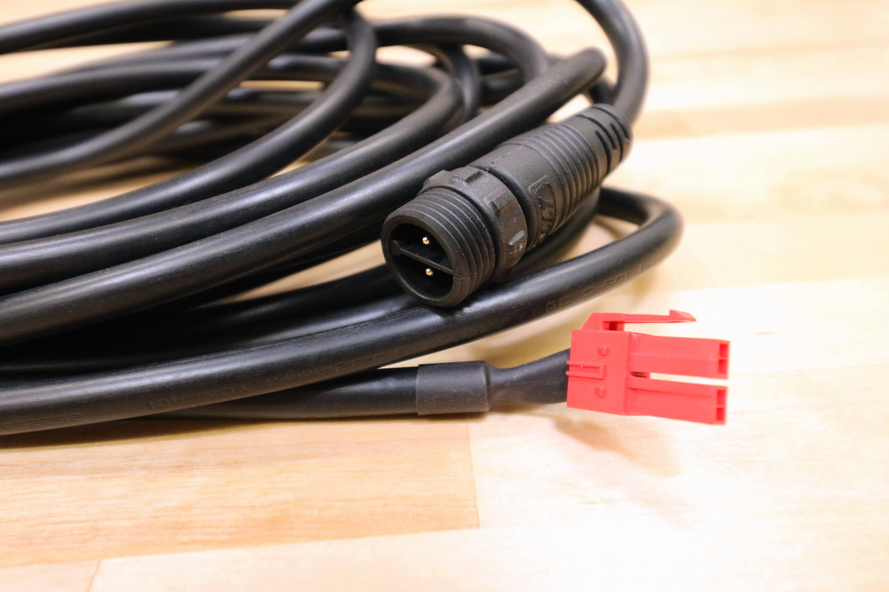
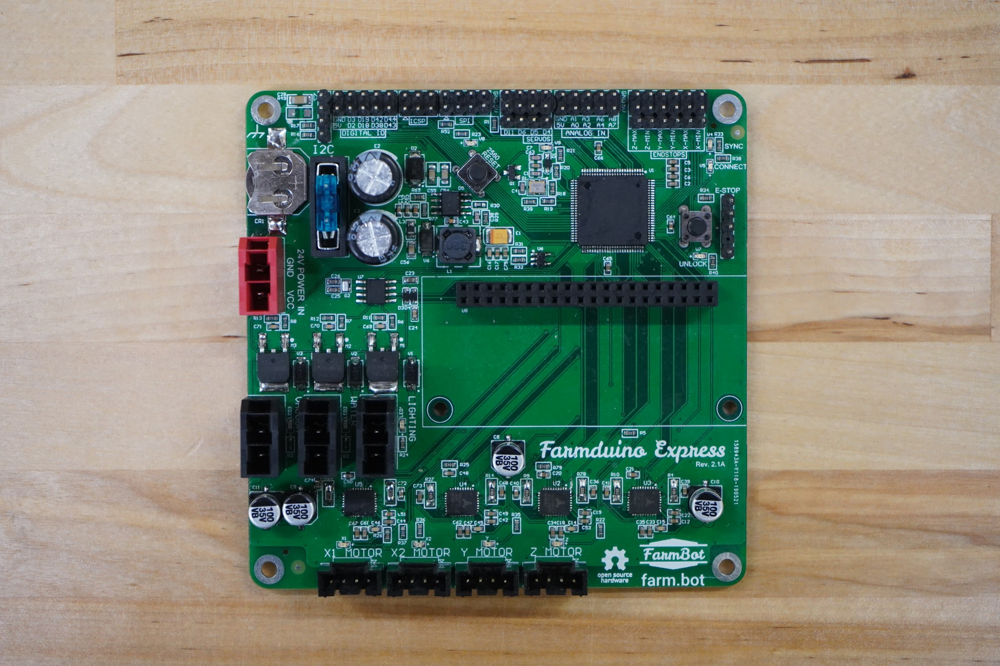

* toc
{:toc}

|Component                     |$/Unit                        |Express Qty                   |Express Subtotal              |XL Qty                        |XL Subtotal                   |MAX Qty                       |MAX Subtotal                  |
|------------------------------|------------------------------|------------------------------|------------------------------|------------------------------|------------------------------|------------------------------|------------------------------|
|[Electronics Box](#electronics-box)|$50.00                        |1                             |$50.00                        |1                             |$30.00                        |1                             |$30.00
|[Power Supply](#power-supply)|$60.00                        |1                             |$60.00                        |1                             |$30.00                        |1                             |$30.00
|[Power Supply Cable](#power-supply-cable)|$20.00 to $70.00              |1                             |$20.00                        |1                             |$30.00                        |1                             |$70.00
|[Raspberry Pi Zero W](#raspberry-pi-zero-w)|$15.00                        |1                             |$15.00                        |1                             |$15.00                        |1                             |$15.00
|[MicroSD Card](#microsd-card)|$15.00                        |1                             |$15.00                        |1                             |$15.00                        |1                             |$15.00
|[E-Stop Button](#e-stop-button)|$7.00                         |1                             |$7.00                         |1                             |$7.00                         |1                             |$7.00
|[Farmduino Express](#farmduino-express)|$75.00                        |1                             |$75.00                        |1                             |$75.00                        |1                             |$75.00
|[NEMA 17 Stepper Motors](#nema-17-stepper-motors)|$20.00                        |4                             |$80.00                        |4                             |$80.00                        |4                             |$80.00
|[Motor Cables](#motor-cables)|$15.00 to $32.00              |4                             |$80.00                        |4                             |$95.00                        |4                             |$95.00
|[X-Axis Cable Carrier](#cable-carrier)|$40.00 to $200.00             |1                             |$40.00                        |1                             |$70.00                        |1                             |$200.00
|[Y-Axis Cable Carrier](#cable-carrier)|$30.00 to $50.00              |1                             |$30.00                        |1                             |$50.00                        |1                             |$50.00
|[Z-Axis Cable Carriers](#cable-carrier)|$20.00                        |1                             |$20.00                        |1                             |$20.00                        |1                             |$20.00
|[Solenoid Valve](#solenoid-valve)|$8.00                         |1                             |$8.00                         |1                             |$8.00                         |1                             |$8.00
|[Solenoid Valve Cable](#solenoid-valve-cable)|$10.00                        |1                             |$10.00                        |1                             |$10.00                        |1                             |$10.00
|[Vacuum Pump](#vacuum-pump)|$15.00                        |1                             |$15.00                        |1                             |$15.00                        |1                             |$15.00
|[Vacuum Pump Cable](#vacuum-pump-cable)|$15.00 to $20.00              |1                             |$15.00                        |1                             |$20.00                        |1                             |$20.00
|[Camera](#camera)     |$30.00                        |1                             |$30.00                        |1                             |$30.00                        |1                             |$30.00
|[Camera Cable](#camera-cable)|$15.00 to $20.00              |1                             |$15.00                        |1                             |$20.00                        |1                             |$20.00
|[Camera Calibration Card](#camera-calibration-card)|$1.00                         |1                             |$1.00                         |1                             |$1.00                         |1                             |$1.00
|[LED Strip](#led-strip)|$20.00 to $40.00              |1                             |$20.00                        |1                             |$40.00                        |1                             |$40.00
|[Power Cord Protector](#power-cord-protector)|$7.00                         |1                             |$7.00                         |1                             |$7.00                         |1                             |$7.00
|**TOTALS**                    |                              |**28**                        |**$623.00**                   |**28**                        |**$728.00**                   |**28**                        |**$898.00**

# Electronics Box
This rainproof box protects FarmBot's electronics from rain and debris. It features an easy-to-use tool-less double latch design for quickly opening and closing the box, a rubber gasket to keep moisture out, and a custom gland for all of FarmBot's cables to be passed through. The lid, latches, and box are made of UV stabilized materials.

|                              |                              |
|------------------------------|------------------------------|
|**Materials**                 |Box - UV Stabilized ABS Lid - UV Stabilized ABS Latches - UV Stabilized ABS Gasket - Rubber Supergland - Rubber Screws and Nuts - Stainless Steel
|**Rainproof?**                |Yes
|**Colors**                    |Box - White Lid - Frosted Clear Latches - Black Gasket - Black Supergland - Black
|**Cover Type**                |Hinged with latches
|**Hinge Type**                |M3 x 35mm screws with locknuts
|**Price**                     |$50.00
|**Quantity**                  |1

# Power Supply
This universal input IP67 waterproof power supply provides FarmBot with all the electricity it needs.

|                              |                              |
|------------------------------|------------------------------|
|**Output Power**              |24 volts DC, 6.25 amps max (150 watts)
|**Output Cable**              |Two 4m long 2-core 16 AWG black cables with 4-pin plug for Farmduino Express
|**Input Power**               |110 volts AC with a max current draw of 1.36 amps (150 watts)  or  220 volt AC with a max current draw of 0.68 amps (150 watts)
|**Input Cable**               |0.3m long black cable with standard US 3-prong plug
|**Waterproof Rating**         |IP67
|**Brand**                     |Weho
|**Price**                     |$60.00
|**Quantity**                  |1

# Power Supply Cable
This modular 2-wire cable connects the power supply to the Farmduino Express. It features a waterproof 2-pin connector to attach to the power supply, and a red molex connector to attach to the Farmduino Express.

|                              |                              |
|------------------------------|------------------------------|
|**Number of Cores**           |2
|**Outer Color**               |Black
|**Connector 1**               |Waterproof 2-pin screw-type connector
|**Connector 2**               |[Molex Part Number 151049-2209](https://www.molex.com/molex/products/datasheet.jsp?part=active/1510492209_CRIMP_HOUSINGS.xml)
|**Length**                    |Express: 3m Express XL: 4.5m Express MAX: 10.5m
|**Quantity**                  |1
|**Price**                     |3m: $20.00 4.5m: $30.00 10.5m: $70.00

# Raspberry Pi Zero W
This is the "host computer" of FarmBot. You might also call it FarmBot's brain. The Raspberry Pi runs FarmBot OS, communicates with the web application over ethernet or WiFi, and talks to the Farmduino Express over a serial connection.

|                              |                              |
|------------------------------|------------------------------|
|**CPU**                       |1Ghz single core processor
|**RAM**                       |512MB
|**WiFi**                      |2.4GHz 802.11n wireless
|**USB**                       |1x micro USB port
|**Storage**                   |MicroSD
|**GPIO**                      |40-pin header
|**Price**                     |$15.00
|**Quantity**                  |1

# MicroSD Card
The microSD card holds FarmBot OS and is inserted into the Raspberry Pi.

|                              |                              |
|------------------------------|------------------------------|
|**Form Factor**               |MicroSD
|**Capacity**                  |8GB
|**Brand**                     |SanDisk
|**Price**                     |$15.00
|**Quantity**                  |1

# E-Stop Button
This waterproof E-Stop button comes pre-mounted on the top of the electronics box along with a wiring harness pre-connected to the Farmduino Express board.

|                              |                              |
|------------------------------|------------------------------|
|**Color**                     |Red
|**Waterproof?**               |Yes
|**Wiring?**                   |Included
|**Price**                     |$7.00
|**Quantity**                  |1

# Farmduino Express
The Farmduino Express board receives G-code commands from the Raspberry Pi and then moves the motors, reads sensors, activate peripherals, and more.



|                              |                              |
|------------------------------|------------------------------|
|**Microcontrollers**          |ATmega2560
|**Input Voltage**             |24V
|**Power Connector**           |[Molex Part Number 151048-1209](https://www.molex.com/molex/products/datasheet.jsp?part=active/1510481209_PCB_HEADERS.xml)
|**Peripheral Connectors**     |[Molex Part Number 151048-1206](https://www.molex.com/molex/products/datasheet.jsp?part=active/1510481206_PCB_HEADERS.xml)
|**DC Current per I/O Pin**    |40 mA
|**DC Current for 3.3V Pin**   |50 mA
|**Flash Memory**              |256 KB (8 KB used by bootloader)
|**SRAM**                      |8 KB
|**EEPROM**                    |4 KB
|**Clock Speed**               |16 MHz
|**Price**                     |$75.00
|**Quantity**                  |1

# NEMA 17 Stepper Motors
These powerful 200 resolution stepper motors allow FarmBot to move precisely in the X, Y, and Z directions. Download the [motor spec sheet](https://drive.google.com/file/d/1Ehqu20q84Lyycn1fOj6dvWKbrMLvoNv4/view?usp=sharing).

|Motor Specs                   |                              |
|------------------------------|------------------------------|
|**Motor Resolution**          |200 steps/revolution (1.8 deg/step)
|**Winding Type**              |Bipolar
|**Voltage**                   |12V
|**Current Draw**              |1.68A max
|**Shaft Diameter**            |5mm diameter
|**Mount Hole Pattern**        |4x M3 holes, standard NEMA 17 pattern
|**Motor Connector**           |6-pin connector (only 4 pins used)
|**Price**                     |$20.00
|**Quantity**                  |4

# Motor Cables
These 4-wire cables connect each NEMA 17 stepper motor to the Farmduino Express. They are labelled on the Farmduino Express end `X1`, `X2`, `Y`, and `Z`. Furthermore, the Z motor cable is split into two sections with a 90-degree waterproof connector.

|                              |                              |
|------------------------------|------------------------------|
|**Lengths**                   |**Express** 0.6m (X1) 1.8m (X2) 2.2m (Y) 2.1m (Z, Y-Axis Section) 1.8m (Z, Z-Axis Section)  **Express XL and MAX** 0.6m (X1) 3.0m (X2) 3.4m (Y) 3.3m (Z, Y-Axis Section) 1.8m (Z, Z-Axis Section)
|**Cores**                     |4
|**Gauge**                     |18
|**Motor Connector**           |6 pin connector (only 4 pins used)
|**Farmduino Connector**       |2.54mm pitch 4 pin dupont connector with locking tab
|**Outer Color**               |Black
|**Price**                     |**Express** X1 - $15.00 X2- $18.00 Y - $20.00 Z - $27.00  **Express XL and MAX** X1 - $15.00 X2 - $23.00 Y - $25.00 Z - $32.00

_(Z motor cable, Y-axis section)_

_(Z motor cable, Z-axis section)_

# Cable Carrier
These hollow plastic chains are used throughout FarmBot to manage cables and tubing along each of the three axes.

|                              |                              |
|------------------------------|------------------------------|
|**Material**                  |Nylon PA66
|**Lengths**                   |**Express** X-Axis - 1.7m (85 links + end pieces) Y-Axis - 1.4m (70 links + end pieces) Z-Axis - 0.74m (37 links + end pieces)  **Express XL** X-Axis - 3.2m (160 links + end pieces) Y-Axis - 2.6m (130 links + end pieces) Z-Axis - 0.74m (37 links + end pieces)  **Express MAX** X-Axis - 9.2m (460 links + end pieces) Y-Axis - 2.6m (130 links + end pieces) Z-Axis - 0.74m (37 links + end pieces)
|**Inside Height**             |15mm
|**Inside Width**              |30mm
|**Outside Height**            |20mm
|**Outside Width**             |38.2mm
|**Pitch**                     |20mm
|**Bending Radius**            |28mm
|**Price**                     |**Express** X-Axis - $40.00 Y-Axis - $30.00 Z-Axis - $20.00  **Express XL** X-Axis - $70.00 Y-Axis - $50.00 Z-Axis - $20.00  **Express MAX** X-Axis - $200.00 Y-Axis - $50.00 Z-Axis - $20.00
|**Quantity**                  |1 for each axis

# Solenoid Valve
This 24V valve controls the flow of water from your garden hose to FarmBot's tubing.

|                              |                              |
|------------------------------|------------------------------|
|**Inlet**                     |3/4" NPT (National Pipe Thread)
|**Outlet**                    |3/4" NPT (National Pipe Thread)
|**Operation**                 |Normally closed
|**Working Pressure Range**    |0.02 to 0.8 Mpa (3 to 116 PSI)
|**Flow Direction**            |One-way, indicated by an arrow molded into the plastic
|**Input Voltage**             |24V
|**Current Draw**              |160mA
|**Power Consumption**         |3.84 Watts
|**Price**                     |$8.00
|**Quantity**                  |1

<iframe class="embedly-embed" src="//cdn.embedly.com/widgets/media.html?src=https%3A%2F%2Fwww.youtube.com%2Fembed%2FMkIYGSv_tdA%3Ffeature%3Doembed&url=http%3A%2F%2Fwww.youtube.com%2Fwatch%3Fv%3DMkIYGSv_tdA&image=https%3A%2F%2Fi.ytimg.com%2Fvi%2FMkIYGSv_tdA%2Fhqdefault.jpg&key=02466f963b9b4bb8845a05b53d3235d7&type=text%2Fhtml&schema=youtube" width="854" height="480" scrolling="no" frameborder="0" allowfullscreen></iframe>

# Vacuum Pump
This 24V vacuum pump sucks air through the seeder's luer lock needle in order to suction-hold a seed on the needle tip during planting.

|                              |                              |
|------------------------------|------------------------------|
|**Input Voltage**             |24V DC
|**Current Draw**              |0.5A
|**Price**                     |$15.00
|**Quantity**                  |1

# Vacuum Pump Cable
This cable connects the vacuum pump to the Farmduino.

|                              |                              |
|------------------------------|------------------------------|
|**Length**                    |**Express** 2.1m (Y-axis section) 1.0m (Z-axis section)  **Express XL and MAX** 3.3m (Y-axis section) 1.0m (Z-axis section)
|**Gauge**                     |18 AWG
|**Wire Type**                 |Stranded copper
|**Number of Wires**           |2
|**Rated Voltage**             |300V
|**Inner Colors**              |Red and black
|**Outer Color**               |Black
|**Connector 1**               |[Molex Part Number 151049-2206](https://www.molex.com/molex/products/datasheet.jsp?part=active/1510492206_CRIMP_HOUSINGS.xml)
|**Connector 2**               |Two 3/16" female shielded quick-connect terminals
|**Price**                     |Express - $15.00 Express XL and MAX - $20.00
|**Quantity**                  |1

_Y-axis section_

_Z-axis section_

# Solenoid Valve Cable
This cable connects the solenoid valve to the Farmduino.

|                              |                              |
|------------------------------|------------------------------|
|**Length**                    |0.6m
|**Gauge**                     |18 AWG
|**Wire Type**                 |Stranded copper
|**Number of Wires**           |2
|**Rated Voltage**             |300V DC
|**Inner Colors**              |Red and black
|**Outer Color**               |Black
|**Connector 1**               |[Molex Part Number 151049-2206](https://www.molex.com/molex/products/datasheet.jsp?part=active/1510492206_CRIMP_HOUSINGS.xml)
|**Connector 2**               |Two 1/4" female shielded quick-connect terminals
|**Price**                     |$10.00
|**Quantity**                  |1

# Camera
The camera is mounted on the z-axis and allows FarmBot to take photos of the garden and plants for weed detection and other future use cases such as plant growth tracking.

|                              |                              |
|------------------------------|------------------------------|
|**Resolution**                |1024 x 768
|**Waterproof?**               |Yes
|**Focal Distance**            |0.5m
|**Outer Diameter**            |11mm
|**Camera Length**             |38mm
|**Cable Length**              |1.0m
|**Connection**                |4-pin 90-degree waterproof connector
|**Price**                     |$30.00
|**Quantity**                  |1

# Camera Cable

|                              |                              |
|------------------------------|------------------------------|
|**Lengths**                   |Express: 2.1m Express XL and MAX: 3.3m
|**End 1**                     |4-pin waterproof 90 degree connector
|**End 2**                     |Straight microUSB connector
|**Price**                     |2.1m - $15.00 3.3m - $20.00
|**Quantity**                  |2.1m - Express: 1 3.3m - Express XL and MAX: 1

# Camera Calibration Card
Use this card to perform an automatic calibration of FarmBot's camera.

|                              |                              |
|------------------------------|------------------------------|
|**Material**                  |Matte cardstock
|**Thickness**                 |16pt
|**Printing**                  |[Front.pdf](https://cdn.shopify.com/s/files/1/2040/0289/files/Camera_Calibration_Card_Rev_A_front.pdf?v=1596066432) [Back.pdf](https://cdn.shopify.com/s/files/1/2040/0289/files/Camera_Calibration_Card_Rev_A_back.pdf?v=1596066431)
|**Price**                     |$1.00
|**Quantity**                  |1

# LED Strip
This LED strip is strung through the gantry's horizontal cable carrier supports so that you can light up your garden at night to show friends or for easy harvesting. Please note: this is not a "grow light".

|                              |                              |
|------------------------------|------------------------------|
|**Light Color**               |White 6000K
|**Strip Length**              |Express - 1.2m Express XL and MAX - 2.4m
|**Lead Length**               |1m
|**Connector**                 |[Molex Part Number 151049-2206](https://www.molex.com/molex/products/datasheet.jsp?part=active/1510492206_CRIMP_HOUSINGS.xml)
|**Price**                     |1.2m - $20.00 2.4m - $40.00
|**Quantity**                  |1

# Power Cord Protector

|                              |                              |
|------------------------------|------------------------------|
|**Color**                     |Green
|**Rainproof?**                |Yes
|**Submersible?**              |No
|**Price**                     |$7.00
|**Quantity**                  |1

