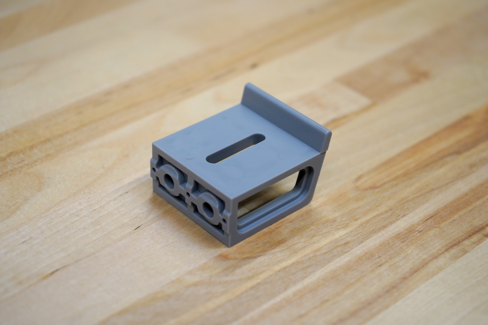
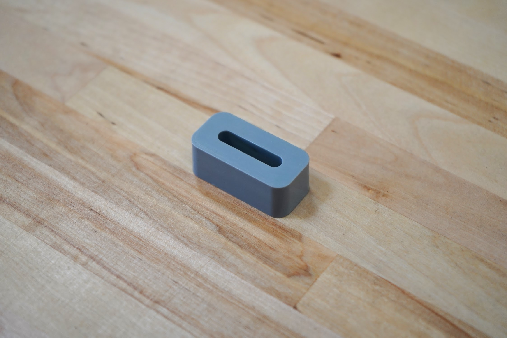
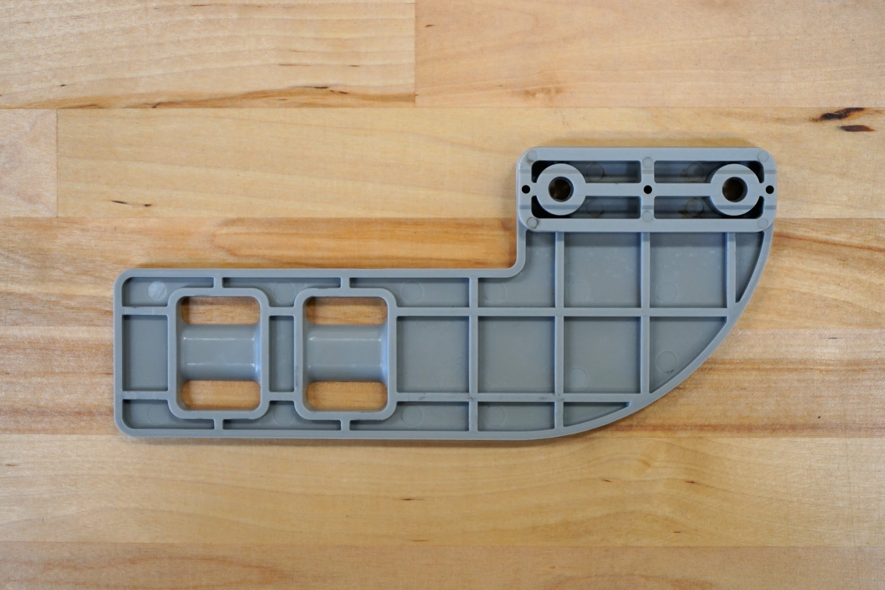
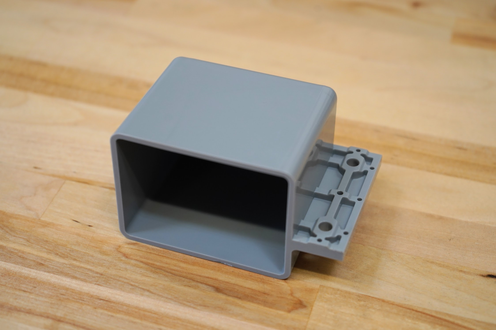

* toc
{:toc}

|Component                     |$/Unit                        |Express Qty                   |Express Subtotal              |XL Qty                        |XL Subtotal                   |MAX Qty                       |MAX Subtotal                  |
|------------------------------|------------------------------|------------------------------|------------------------------|------------------------------|------------------------------|------------------------------|------------------------------|
|[Gantry Plate Spacer Block](#gantry-plate-spacer-block)|$6.00                         |2                             |$12.00                        |2                             |$12.00                        |2                             |$12.00
|[40mm Horizontal Cable Carrier Support](#40mm-horizontal-cable-carrier-support)|$3.00                         |4                             |$12.00                        |8                             |$24.00                        |8                             |$24.00
|[40mm Vertical Cable Carrier Support](#40mm-vertical-cable-carrier-support)|$3.00                         |4                             |$12.00                        |4                             |$12.00                        |4                             |$12.00
|[40mm Cable Carrier Spacer Block](#40mm-cable-carrier-spacer-block)|$3.00                         |1                             |$3.00                         |1                             |$3.00                         |1                             |$3.00
|[Solenoid Valve Mount](#solenoid-valve-mount)|$6.00                         |1                             |$6.00                         |1                             |$6.00                         |1                             |$6.00
|[Vacuum Pump Mount](#vacuum-pump-mount)|$6.00                         |1                             |$6.00                         |1                             |$6.00                         |1                             |$6.00
|[50mm Horizontal Motor Housing](#50mm-horizontal-motor-housing)|$8.00                         |3                             |$24.00                        |3                             |$24.00                        |3                             |$24.00
|[60mm Vertical Motor Housing](#60mm-vertical-motor-housing)|$10.00                        |1                             |$10.00                        |1                             |$10.00                        |1                             |$10.00
|[Vacuum Pump Housing](#vacuum-pump-housing)|$15.00                        |1                             |$15.00                        |1                             |$15.00                        |1                             |$15.00
|[3-in-1 Tool Head](#3-in-1-tool-head)|$20.00                        |1                             |$20.00                        |1                             |$20.00                        |1                             |$20.00
|[Seed Trough Holder](#seed-trough-holder)|$8.00                         |1                             |$8.00                         |1                             |$8.00                         |1                             |$8.00
|[Seed Trough](#seed-trough)|$3.00                         |2                             |$6.00                         |2                             |$6.00                         |2                             |$6.00
|[Camera Mount Half](#camera-mount-half)|$3.00                         |2                             |$6.00                         |2                             |$6.00                         |2                             |$6.00
|**TOTALS**                    |                              |**24**                        |**$140.00**                   |**28**                        |**$152.00**                   |**28**                        |**$152.00**

# Gantry Plate Spacer Block
These part offset the gantry wheel plates from the gantry columns, and serve as attachment spacers for v-wheels.

|                              |                              |
|------------------------------|------------------------------|
|**Material**                  |Gray UV stabilized ABS
|**Price**                     |$6.00
|**Quantity**                  |2
|**Recommended Supplier**      |[The FarmBot Shop](http://shop.farm.bot)
|**Internal Part Name**        |`Gantry Plate Spacer Block Rev A`

# 40mm Horizontal Cable Carrier Support
These parts are used to mount and support both the x-axis and y-axis cable carriers. The gusset also functions as an area for cables, tubes, and LED light strips to be routed through.

|                              |                              |
|------------------------------|------------------------------|
|**Material**                  |Gray UV stabilized ABS
|**Price**                     |$3.00
|**Quantity**                  |Express - 4 Express XL - 8 Express MAX - 8
|**Recommended Supplier**      |[The FarmBot Shop](http://shop.farm.bot)
|**Internal Part Name**        |`40mm Horizontal CC Support Rev B`

# 40mm Vertical Cable Carrier Support
These parts are used to guide and support the z-axis cable carrier. The gusset also functions as an area for the z-axis motor's cables to be routed through.

|                              |                              |
|------------------------------|------------------------------|
|**Material**                  |Gray UV stabilized ABS
|**Price**                     |$3.00
|**Quantity**                  |4
|**Recommended Supplier**      |[The FarmBot Shop](http://shop.farm.bot)
|**Internal Part Name**        |`40mm Vertical CC Support Rev B`

# 40mm Cable Carrier Spacer Block
This component offsets the z-axis cable carrier from the cross-slide plate.

|                              |                              |
|------------------------------|------------------------------|
|**Material**                  |Gray UV stabilized ABS
|**Price**                     |$3.00
|**Quantity**                  |1
|**Recommended Supplier**      |[The FarmBot Shop](http://shop.farm.bot)
|**Internal Part Name**        |`40mm CC Spacer Block Rev A`

# Solenoid Valve Mount
This component features slots for the solenoid valve to be mounted with zip ties. It also doubles as a cable management part for routing cables behind the electronics box.

|                              |                              |
|------------------------------|------------------------------|
|**Material**                  |Gray UV stabilized ABS
|**Price**                     |$6.00
|**Quantity**                  |1
|**Recommended Supplier**      |[The FarmBot Shop](http://shop.farm.bot)
|**Internal Part Name**        |`Solenoid Valve Mount Rev A`

# Vacuum Pump Mount
The vacuum pump mount features slots for zip ties to secure the vacuum pump to the z-axis extrusion.

|                              |                              |
|------------------------------|------------------------------|
|**Material**                  |Gray UV stabilized ABS
|**Price**                     |$6.00
|**Quantity**                  |1
|**Recommended Supplier**      |[The FarmBot Shop](http://shop.farm.bot)
|**Internal Part Name**        |`Vacuum Pump Mount Rev B`

# 50mm Horizontal Motor Housing
These housings protect the gantry and cross-slide motors and encoders from rain.

|                              |                              |
|------------------------------|------------------------------|
|**Material**                  |Gray UV stabilized ABS
|**Price**                     |$8.00
|**Quantity**                  |3
|**Recommended Supplier**      |[The FarmBot Shop](http://shop.farm.bot)
|**Internal Part Name**        |`50mm Horizontal Motor Housing Rev A`

# 60mm Vertical Motor Housing
This component protects the z-axis motor from rain.

|                              |                              |
|------------------------------|------------------------------|
|**Material**                  |Gray UV stabilized ABS
|**Price**                     |$10.00
|**Quantity**                  |1
|**Recommended Supplier**      |[The FarmBot Shop](http://shop.farm.bot)
|**Internal Part Name**        |`60mm Vertical Motor Housing Rev B`

# Vacuum Pump Housing
This housing protects the vacuum pump from rain. It is mounted on the z-axis extrusion.

|                              |                              |
|------------------------------|------------------------------|
|**Material**                  |Gray UV stabilized ABS
|**Price**                     |$15.00
|**Quantity**                  |1
|**Recommended Supplier**      |[The FarmBot Shop](http://shop.farm.bot)
|**Internal Part Name**        |`Vacuum Pump Cover Rev A`

# 3-in-1 Tool Head
This part combines the watering, weeding, and seed injection functions of FarmBot into one static tool head.

|                              |                              |
|------------------------------|------------------------------|
|**Material**                  |Gray UV stabilized ABS
|**Price**                     |$20.00
|**Quantity**                  |1
|**Recommended Supplier**      |[The FarmBot Shop](http://shop.farm.bot)
|**Internal Part Name**        |`3-in-1 Tool Head Rev B`

# Seed Trough Holder
This gantry-mounted seed trough holder allows FarmBot to bring seeds with it while traveling along the x-axis, shortening the time needed for seed injection.

|                              |                              |
|------------------------------|------------------------------|
|**Material**                  |Gray UV stabilized ABS
|**Price**                     |$8.00
|**Quantity**                  |1
|**Recommended Supplier**      |[The FarmBot Shop](http://shop.farm.bot)
|**Internal Part Name**        |`Seed Trough Holder Rev B`

# Seed Trough
These troughs fit into the seed trough holder, allowing FarmBot to bring seeds with it while traveling along the x-axis.

|                              |                              |
|------------------------------|------------------------------|
|**Material**                  |Gray UV stabilized ABS
|**Price**                     |$3.00
|**Quantity**                  |2
|**Recommended Supplier**      |[The FarmBot Shop](http://shop.farm.bot)
|**Internal Part Name**        |`Seed Trough Rev A`

# Camera Mount Half
These small plastic components fasten the borescope camera to the z-axis extrusion.

|                              |                              |
|------------------------------|------------------------------|
|**Material**                  |Gray UV stabilized ABS
|**Price**                     |$3.00
|**Quantity**                  |2
|**Recommended Supplier**      |[The FarmBot Shop](http://shop.farm.bot)
|**Internal Part Name**        |`Camera Mount Halves Rev A`

