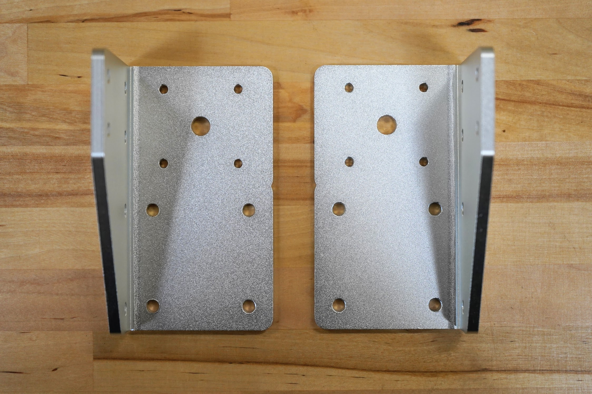
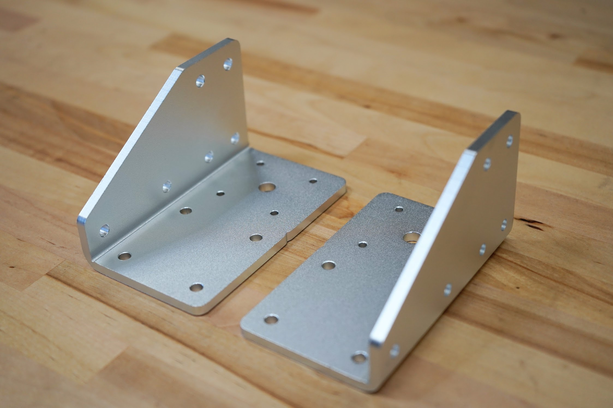
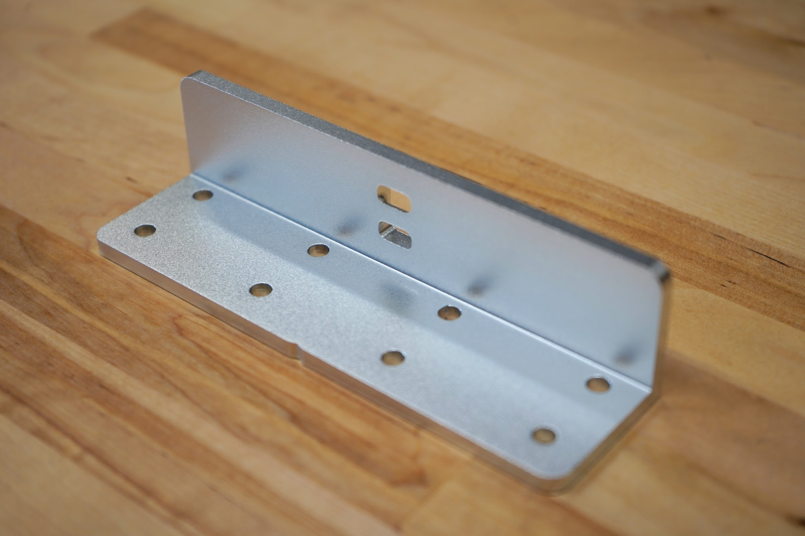
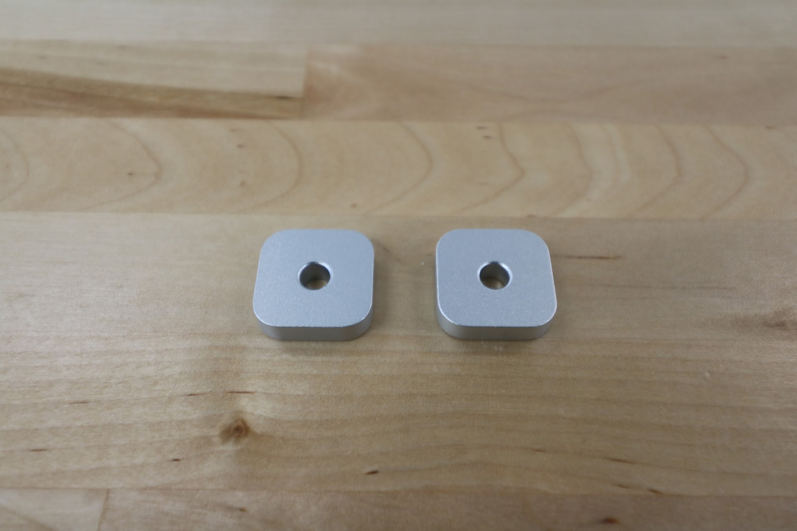

* toc
{:toc}

|Component                     |$/Unit                        |Express Qty                   |Express Subtotal              |XL Qty                        |XL Subtotal                   |MAX Qty                       |MAX Subtotal                  |
|------------------------------|------------------------------|------------------------------|------------------------------|------------------------------|------------------------------|------------------------------|------------------------------|
|[Gantry Wheel Plate](#gantry-wheel-plate)|$25.00                        |2                             |$50.00                        |2                             |$50.00                        |2                             |$50.00
|[Gantry Corner Bracket](#gantry-corner-bracket)|$25.00                        |2                             |$50.00                        |2                             |$50.00                        |2                             |$50.00
|[Gantry Joining Bracket](#gantry-joining-bracket)|$25.00                        |-                             |-                             |1                             |$25.00                        |1                             |$25.00
|[Cross-Slide Plate](#cross-slide-plate)|$20.00                        |1                             |$20.00                        |1                             |$20.00                        |1                             |$20.00
|[Z-Axis Motor Mount](#z-axis-motor-mount)|$20.00                        |1                             |$20.00                        |1                             |$20.00                        |1                             |$20.00
|[50mm Cable Carrier Mount](#50mm-cable-carrier-mount)|$8.00                         |1                             |$8.00                         |1                             |$8.00                         |1                             |$8.00
|[65mm Cable Carrier Mount](#65mm-cable-carrier-mount)|$10.00                        |1                             |$10.00                        |1                             |$10.00                        |1                             |$10.00
|[Belt Clip](#belt-clip)|$4.00                         |6                             |$24.00                        |6                             |$24.00                        |6                             |$24.00
|[Z-Axis Hardstop](#z-axis-hardstop)|$3.00                         |2                             |$6.00                         |2                             |$6.00                         |2                             |$6.00
|**TOTALS**                    |                              |**16**                        |**$188.00**                   |**17**                        |**$213.00**                   |**17**                        |**$213.00**

# Gantry Wheel Plate

|                              |                              |
|------------------------------|------------------------------|
|**Thickness**                 |5mm
|**Material**                  |6061 Aluminum
|**Surface Treatments**        |Tumble polished Sand blasted Clear anodized
|**Price**                     |$25.00
|**Quantity**                  |2
|**Recommended Supplier**      |[The FarmBot Shop](http://shop.farm.bot)
|**Internal Part Name**        |`Express Gantry Wheel Plate Rev A`

# Gantry Corner Bracket

|                              |                              |
|------------------------------|------------------------------|
|**Thickness**                 |5mm
|**Material**                  |5052 Aluminum
|**Surface Treatments**        |Tumble polished Sand blasted Clear anodized
|**Price**                     |$30.00
|**Quantity**                  |2 (1 left-hand and 1 right-hand version) :raised_hands:
|**Recommended Supplier**      |[The FarmBot Shop](http://shop.farm.bot)
|**Internal Part Names**       |`Left Gantry Corner Bracket Rev A` `Right Gantry Corner Bracket Rev A`

# Gantry Joining Bracket

|                              |                              |
|------------------------------|------------------------------|
|**Thickness**                 |5mm
|**Material**                  |6061 Aluminum
|**Surface Treatments**        |Tumble polished Sand blasted Clear anodized
|**Price**                     |$35.00
|**Quantity**                  |Express - 0 Express XL - 1 Express MAX - 1
|**Recommended Supplier**      |[The FarmBot Shop](http://shop.farm.bot)
|**Internal Part Name**        |`Gantry Joining Bracket Rev B`

# Cross-Slide Plate

|                              |                              |
|------------------------------|------------------------------|
|**Thickness**                 |5mm
|**Material**                  |6061 Aluminum
|**Surface Treatments**        |Tumble polished Sand blasted Clear anodized
|**Price**                     |$25.00
|**Quantity**                  |1
|**Recommended Supplier**      |[The FarmBot Shop](http://shop.farm.bot)
|**Internal Part Name**        |`Express Cross-Slide Plate Rev A`

# Z-Axis Motor Mount
This component securely attached the z-axis motor to the z-axis extrusion.

|                              |                              |
|------------------------------|------------------------------|
|**Material**                  |Machined 6061 Aluminum
|**Surface Treatments**        |Tumble polished Sandblasted Clear anodized
|**Price**                     |$20.00
|**Quantity**                  |1
|**Recommended Supplier**      |[The FarmBot Shop](http://shop.farm.bot)
|**Internal Part Name**        |`Express Z-Axis Motor Mount Rev A`

# 50mm Cable Carrier Mount
This part allows the x-axis cable carrier to be mounted to the gantry column.

|                              |                              |
|------------------------------|------------------------------|
|**Material**                  |Machined 6061 Aluminum
|**Surface Treatments**        |Tumble polished Sandblasted Clear anodized
|**Price**                     |$8.00
|**Quantity**                  |1
|**Recommended Supplier**      |[The FarmBot Shop](http://shop.farm.bot)
|**Internal Part Name**        |`50mm CC Mount Rev A`

# 65mm Cable Carrier Mount
This part allows the y-axis cable carrier to be mounted to the cross-slide plate.

|                              |                              |
|------------------------------|------------------------------|
|**Material**                  |Machined 6061 Aluminum
|**Surface Treatments**        |Tumble polished Sandblasted Clear anodized
|**Price**                     |$10.00
|**Quantity**                  |1
|**Recommended Supplier**      |[The FarmBot Shop](http://shop.farm.bot)
|**Internal Part Name**        |`65mm CC Mount Rev A`

# Belt Clip

|                              |                              |
|------------------------------|------------------------------|
|**Thickness**                 |5mm
|**Material**                  |6061 Aluminum
|**Surface Treatments**        |Tumble polished Sand blasted Clear anodized
|**Price**                     |$3.00
|**Quantity**                  |6
|**Recommended Supplier**      |[The FarmBot Shop](http://shop.farm.bot)
|**Internal Part Name**        |`Belt Clip Rev A`

# Z-Axis Hardstop
These components mount on the z-axis extrusion and physically limit how low and high FarmBot can move the z-axis.

|                              |                              |
|------------------------------|------------------------------|
|**Thickness**                 |5mm
|**Material**                  |6061 Aluminum
|**Surface Treatments**        |Tumble polished Sand blasted Clear anodized
|**Price**                     |$3.00
|**Quantity**                  |2
|**Recommended Supplier**      |[The FarmBot Shop](http://shop.farm.bot)
|**Internal Part Name**        |`Z-Axis Hardstop Rev A`

