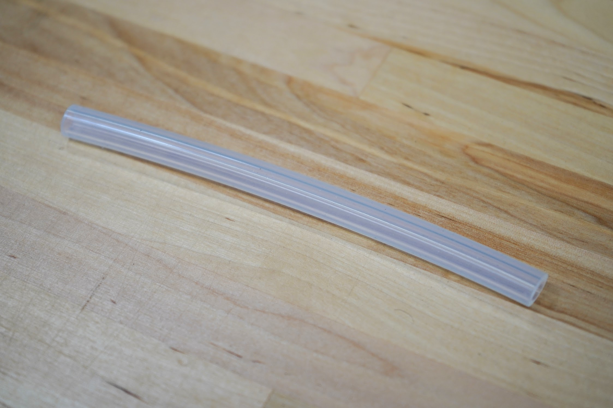
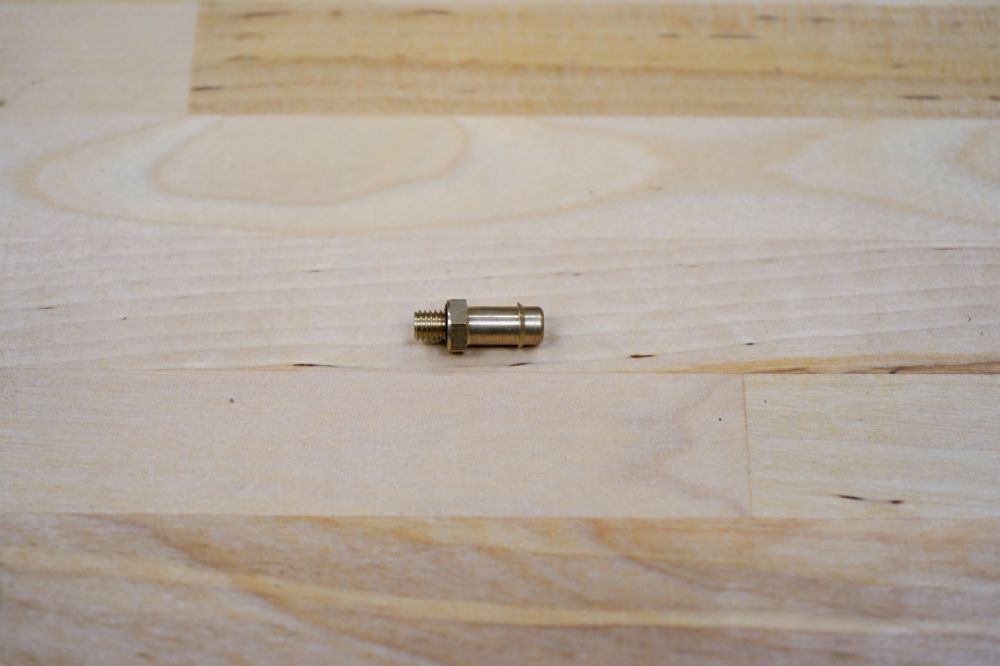
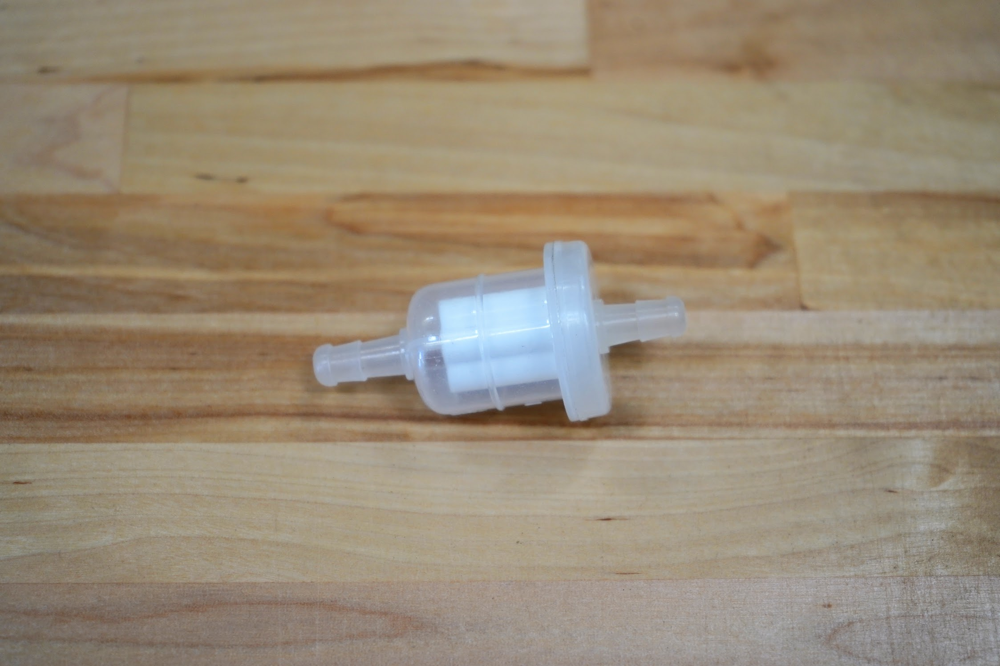
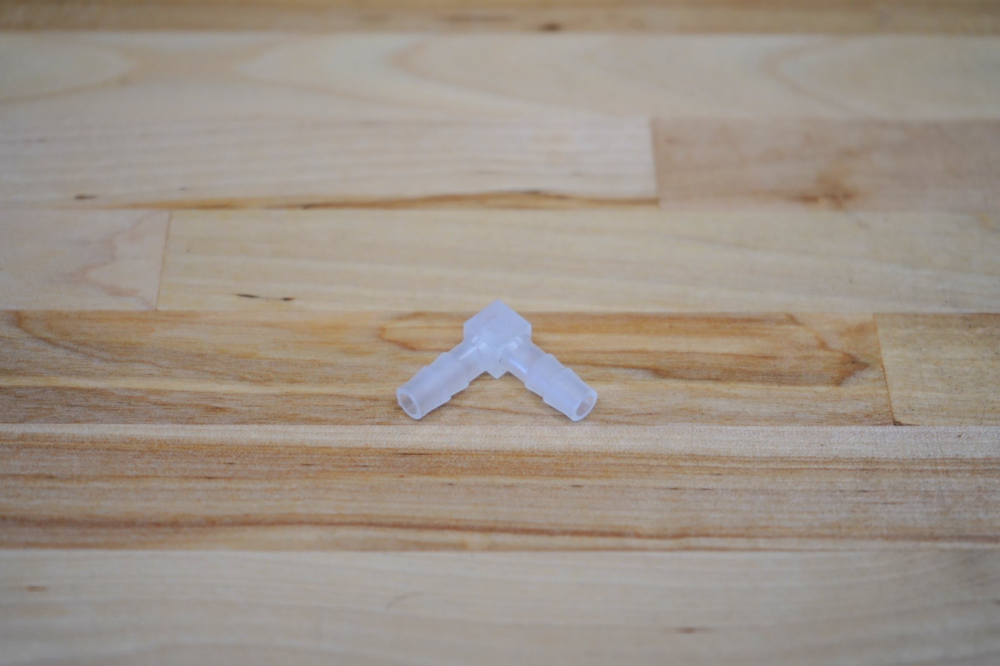
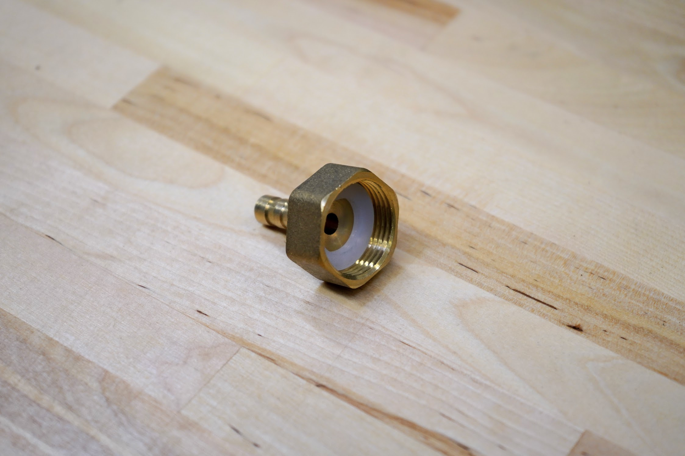
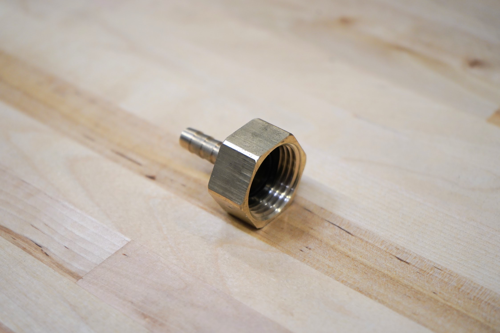

* toc
{:toc}

|Component                     |$/Unit                        |Express Qty                   |Express Subtotal              |XL Qty                        |XL Subtotal                   |MAX Qty                       |MAX Subtotal                  |
|------------------------------|------------------------------|------------------------------|------------------------------|------------------------------|------------------------------|------------------------------|------------------------------|
|[Water Tubes](#tubes) |$5.00 to $35.00               |3                             |$22.00                        |3                             |$30.00                        |3                             |$50.00
|[Vacuum Air Tube](#tubes)|$2.00                         |2                             |$4.00                         |2                             |$4.00                         |2                             |$4.00
|[Inline Air Filter](#inline-air-filter)|$10.00                        |1                             |$10.00                        |1                             |$10.00                        |1                             |$10.00
|[M5 Barb](#m5-barb)  |$6.00                         |2                             |$12.00                        |2                             |$12.00                        |2                             |$12.00
|[90-Degree Barb](#90-degree-barb)|$2.00                         |1                             |$2.00                         |1                             |$2.00                         |1                             |$2.00
|[NPT to Barb Adapter](#npt-to-barb-adapter)|$5.00                         |2                             |$10.00                        |2                             |$10.00                        |2                             |$10.00
|[Garden Hose to Barb Adapter](#garden-hose-to-barb-adapter)|$7.00                         |1                             |$7.00                         |1                             |$7.00                         |1                             |$7.00
|[Pressure Regulator](#pressure-regulator)|$8.00                         |1                             |$8.00                         |1                             |$8.00                         |1                             |$8.00
|[Luer Lock Adapter](#luer-lock-adapter)|$5.00                         |1                             |$5.00                         |1                             |$5.00                         |1                             |$5.00
|[Luer Lock Needles](#luer-lock-needles)|$3.00                         |9                             |$27.00                        |9                             |$27.00                        |9                             |$27.00
|**TOTALS**                    |                              |**23**                        |**$107.00**                   |**23**                        |**$115.00**                   |**23**                        |**$135.00**

# Tubes
These ultra flexible silicone tubes carry water to the tool head and suck vacuum air.

|                              |                              |
|------------------------------|------------------------------|
|**Lengths**                   |**Express** 3m, 1.8m, 0.95m, and 0.15m  **Express XL** 4.5m, 3m, 0.95m, and 0.15m  **Express MAX** 10.5m, 3m, 0.95m, and 0.15m
|**Material**                  |Silcone
|**Color**                     |Semi-clear
|**Flexibility**               |Very Flexible
|**Compatible Tube Fittings**  |Barbs
|**Inner Diameter**            |6mm
|**Outer Diameter**            |9mm
|**Wall Thickness**            |1.5mm
|**Price**                     |$2.00 - 0.15m $5.00 - 0.95m $7.00 - 1.8m $10.00 - 3m $15.00 - 4.5m $35.00 - 10.5m
|**Quantity**                  |See above lengths

# M5 Barb
These brass barbs screw into the tool head and accept the water and air lines.

|                              |                              |
|------------------------------|------------------------------|
|**For Tube ID**               |6mm
|**Threads**                   |M5
|**Hex Size**                  |8mm
|**Gasket?**                   |Yes
|**Material**                  |Brass
|**Price**                     |$6.00
|**Quantity**                  |2

# Inline Air Filter
This filter is used to prevent soil and other debris from entering the vacuum pump.

|                              |                              |
|------------------------------|------------------------------|
|**Price**                     |$10.00
|**Quantity**                  |1

# 90-Degree Barb
This barb is used to connect the y-axis water tube to the z-axis water tube.

|                              |                              |
|------------------------------|------------------------------|
|**Price**                     |$2.00
|**Quantity**                  |1

# NPT to Barb Adapter
These adapters are used on the inlet of the solenoid valve and the outlet of the pressure reducer.

|                              |                              |
|------------------------------|------------------------------|
|**Material**                  |Brass
|**For Tube ID**               |6mm
|**Threads**                   |3/4" female NPT (National Pipe Thread)
|**Rubber Gasket?**            |Included
|**Price**                     |$5.00
|**Quantity**                  |2

# Garden Hose to Barb Adapter
This adapter connects a standard US garden hose to a 6mm ID tube.

|                              |                              |
|------------------------------|------------------------------|
|**Material**                  |Brass
|**For Tube ID**               |6mm
|**Threads**                   |3/4" Female GHT (Garden Hose Thread)
|**Rubber Gasket?**            |Included
|**Price**                     |$7.00
|**Quantity**                  |1

# Pressure Regulator
This pressure regulator reduces the pressure from a municipal water supply down to 15 PSI (103 kpa, 1.03 bar) so that FarmBot can more easily control the amount of water it disperses.

|                              |                              |
|------------------------------|------------------------------|
|**Material**                  |UV resistant plastic
|**Inlet**                     |3/4 in. female pipe thread
|**Outlet**                    |3/4 in. male pipe thread
|**Color**                     |Black
|**Length**                    |6 inches (152.4mm)
|**Outer Diameter**            |1.25 inches (31.75mm)
|**Outlet Pressure**           |15 PSI (103 kpa, 1.02 bar)
|**Max Input Pressure**        |100 PSI (688 kpa, 6.88 bar)
|**Price**                     |$8.00
|**Quantity**                  |1

# Luer Lock Adapter
This adapter screws into the tool head and allows various luer lock needles to be quickly attached for seed injection.

|                              |                              |
|------------------------------|------------------------------|
|**Material**                  |Stainless steel
|**Threads**                   |M5
|**Price**                     |$5.00
|**Quantity**                  |1

# Luer Lock Needles
These needles are used for seed injection.

|                              |                              |
|------------------------------|------------------------------|
|**Material**                  |Stainless steel
|**Gauges**                    |16, 19, and 22
|**Length**                    |40mm
|**Covers?**                   |Included
|**Price**                     |$3.00
|**Quantity**                  |3 of each gauge

