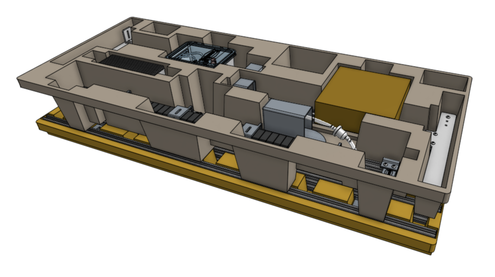
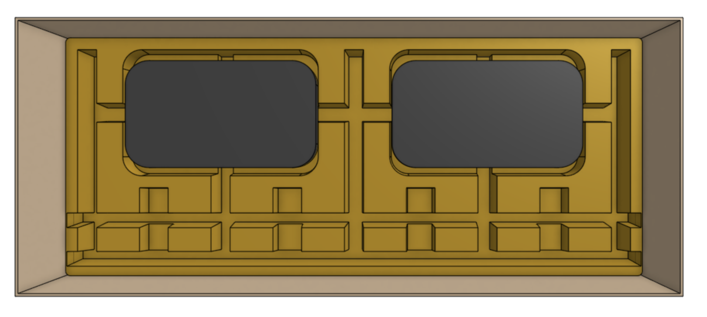
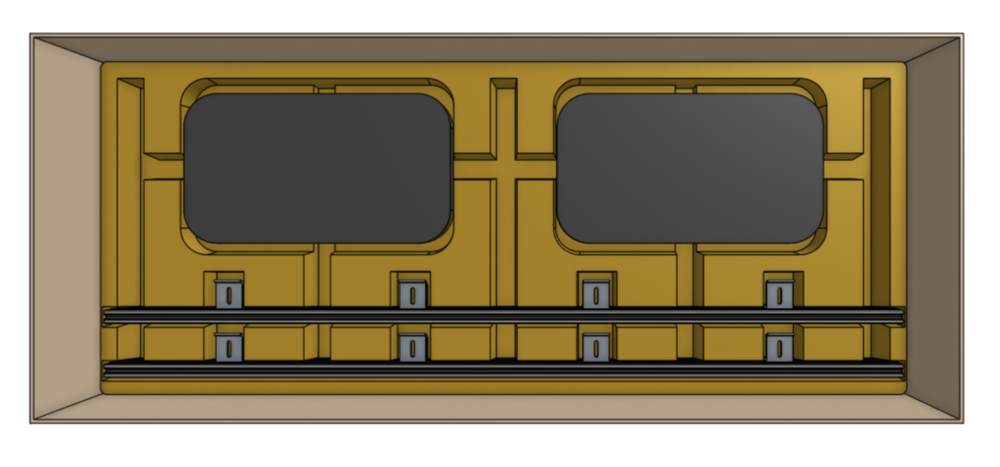
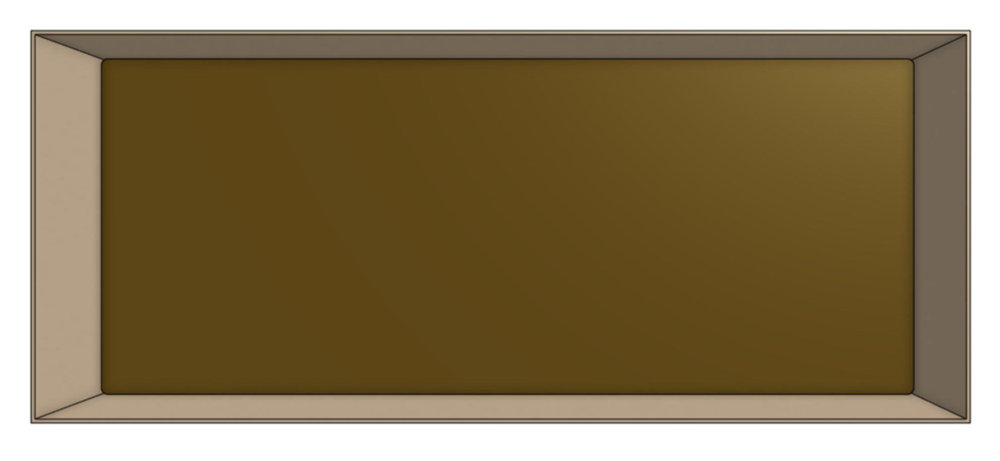
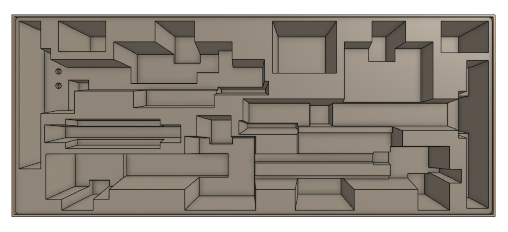
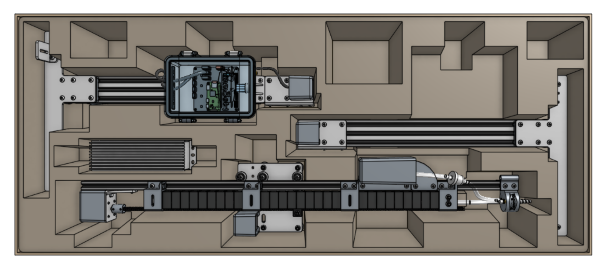
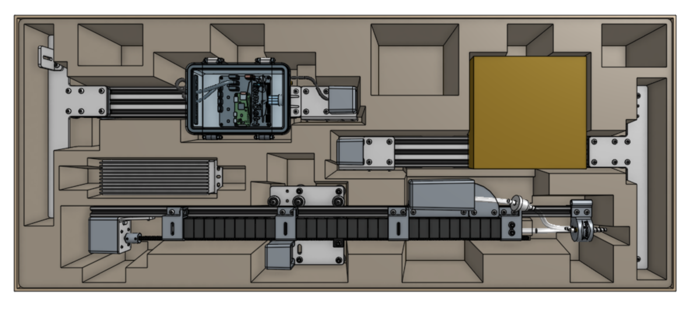
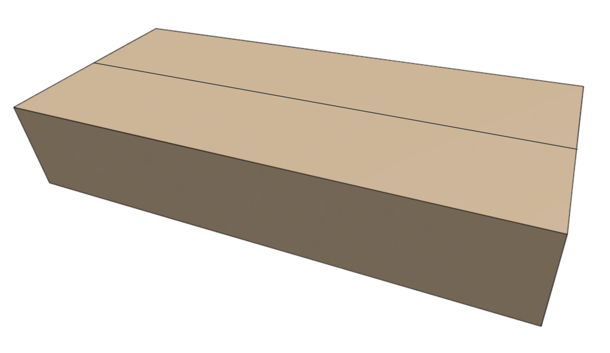
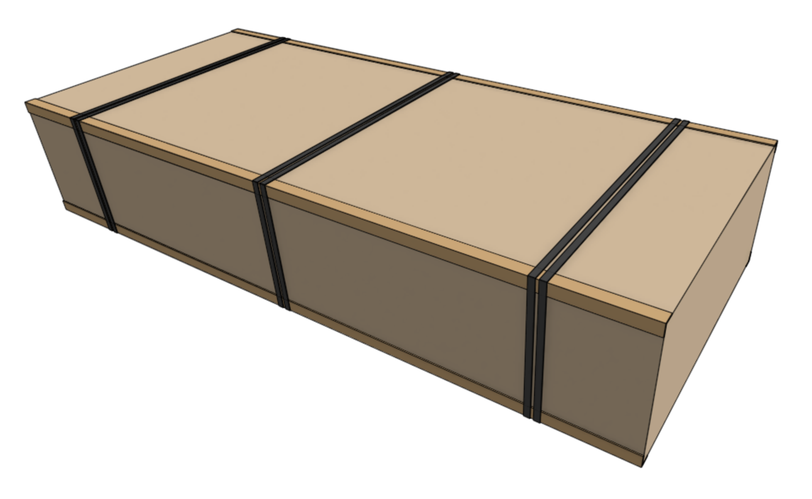

* toc
{:toc}

# Box specifications

|                              |                              |
|------------------------------|------------------------------|
|**Inner dimensions (L x W x H)**|1210mm x 500mm x 217mm
|**Outer dimensions (L x W x H)**|1220mm x 510mm x 227mm
|**Material**                  |Cardboard
|**Color**                     |Brown
|**Printing**                  |[Express v1.0](https://drive.google.com/open?id=18UmvSD0mbIaWk9RcUdK-3NRXliM-qCgA) [Express XL v1.0](https://drive.google.com/open?id=1IIamo2Ho_0C98S5_kgoEby-87YKafSsk)
|**Fill**                      |Two egg-carton trays One cardboard tray divider Recycled kraft paper

# Packing list
The table below shows the items that should be packed into the **main carton** for each version of the kit.

|Item                          |Express Qty                   |XL Qty                        |
|------------------------------|------------------------------|------------------------------|
|[Pre-assembled Left Gantry Column](pre-assembly/left-gantry-column.md)|1                             |1
|[Pre-assembled Right Gantry Column](pre-assembly/right-gantry-column.md)|1                             |1
|[Pre-assembled Gantry Main Beam](pre-assembly/gantry-main-beam.md)|1                             |2
|[Pre-assembled Cross-Slide and Z-Axis](pre-assembly/cross-slide-z-axis.md)|1                             |1
|[Loaded X-Axis Cable Carrier (Express)](pre-assembly/cable-carriers.md#x-axis-cable-carrier)|1                             |-
|[Loaded X-Axis Cable Carrier (Express XL)](pre-assembly/cable-carriers.md#x-axis-cable-carrier)|-                             |1
|[Loaded Y-Axis Cable Carrier (Express)](pre-assembly/cable-carriers.md#y-axis-cable-carrier)|1                             |-
|[Loaded Y-Axis Cable Carrier (Express XL)](pre-assembly/cable-carriers.md#y-axis-cable-carrier)|-                             |1
|[Hardware Box (Express)](pre-assembly/hardware-box.md)|1                             |-
|[Hardware Box (Express XL)](pre-assembly/hardware-box.md)|-                             |1
|Power Supply                  |1                             |1
|Getting Started Guide         |1                             |1
|Camera Calibration Card       |1                             |1
|Crop Stickers                 |1                             |1

# Packing instructions
## Step 1: Load the bottom tray
Insert the **bottom tray** into the **main carton**.

Place the **loaded x-axis cable carrier** and **loaded y-axis cable carrier** into the tray. Fill unused space with **recycled kraft paper**.



Place the **pre-assembled gantry main beam(s)** intro the tray. Express kits should have one main beam, while Express XL kits should have two main beams.

## Step 2: Insert the cardboard divider
Place the **cardboard tray divider** on top of the bottom tray.

## Step 3: Load the top tray
Insert the **top tray** into the main carton, on top of the cardboard divider.

Insert the **pre-assembled left gantry column**, **pre-assembled right gantry column**, **pre-assembled cross-slide and z-axis**, and **power supply** into the top tray.

Then add some **crumpled kraft paper fill** on top of the **pre-assembled cross-slide and z-axis**.

Insert the **hardware box** into the tray.



Then place the **getting started guide**, **camera calibration card**, and **crop stickers** on top of the hardware box.

## Step 4: Close the main carton
Close the flaps of the **main carton** and seal with **clear packing tape**.

Position **25mm x 25mm cardboard edge protectors** along the four long edges of main carton. Then secure everything with six **black polystraps**. The polystraps should be in pairs: one pair in the middle, and one pair spaced approximately 150mm from each end of the main carton.

<meta name="theme-color" content="#942401">

