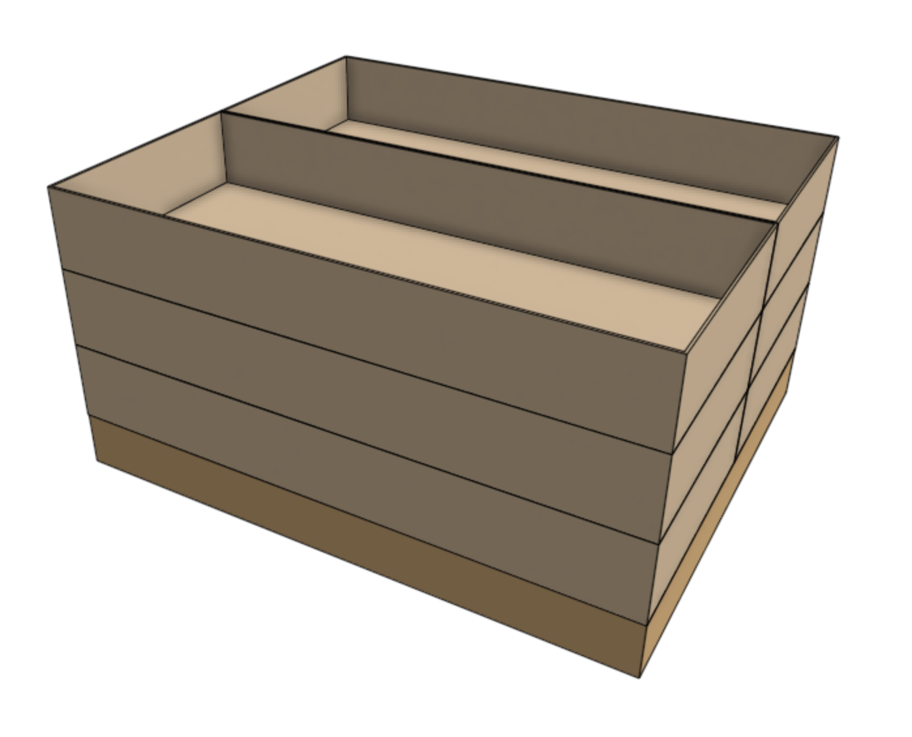
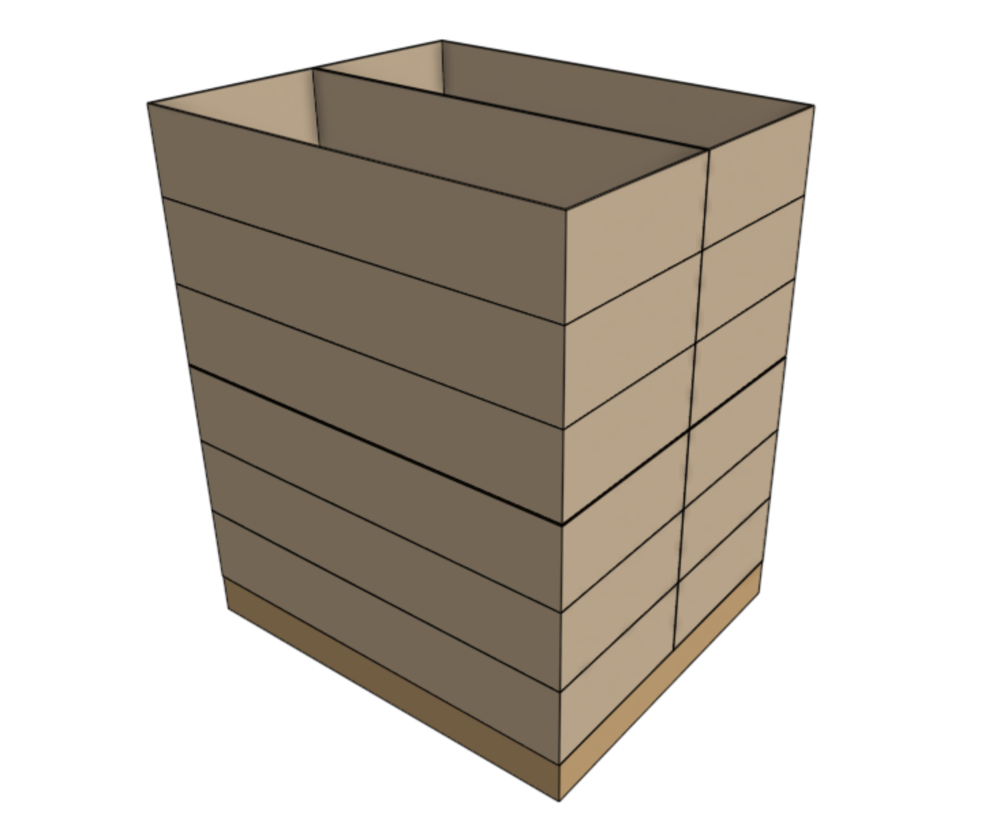

* toc
{:toc}

# Step 1: First three layers
Stack three layers of **main cartons** onto a **standard sized pallet**. Ensure the cartons are positioned on the pallet without overhang. Overhanging cartons can become damaged.

# Step 2: Cardboard separator
Place a **cardboard separator** on top of the first three layers. This will help stabilize the stack.

# Step 3: Three more layers
Place three more layers of main cartons onto the stack.

# Step 4: Plastic wrap
Wrap the entire stack with clear plastic.

<meta name="theme-color" content="#942401">

