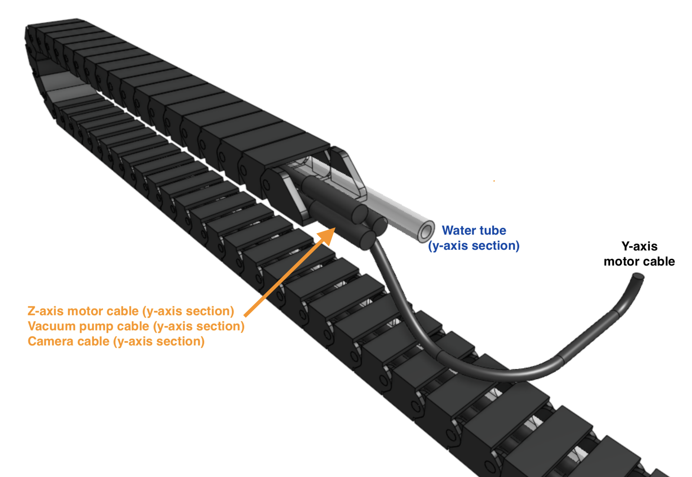

* toc
{:toc}

# End piece orientation
Each cable carrier has two **end pieces** that are slightly different, and will come pre-mounted in a specific orientation from the manufacturer. This allows the cable carriers to be mounted onto the FarmBot in the correct orientation.

The cables must be inserted into the cable carriers in the correct orientation so that the connectors on each end can be plugged into the electronics board, motor, peripheral, etc.

_X and Y axis Cable Carrier End Pieces_

_Z axis Cable Carrier End Pieces_

# X-axis cable carrier
Insert the following items into the **x-axis cable carrier**. Each item must be fed through the cable carrier in the correct orientation as shown in the image. Furthermore, each item must have the correct length extending out of the cable carrier according to the table below.

|Item                          |Length out of the top of the cable carrier|
|------------------------------|------------------------------|
|Water tube (x-axis section)   |35cm
|Power supply cable - Red molex connector must stick out the top of the cable carrier|40cm

# Y-axis cable carrier
Insert the following items into the **y-axis cable carrier**. Each item must be fed through the cable carrier in the correct orientation as shown in the image. Furthermore, each item must have the correct length extending out of the cable carrier according to the table below.

|Item                          |Length out of top of cable carrier|
|------------------------------|------------------------------|
|Y-axis motor cable - motor-side connector must stick out the top of the cable carrier|20cm
|Water tube (y-axis section)   |3cm
|Z-axis motor cable (y-axis section) - waterproof connector must stick out the top of the cable carrier|3cm
|Vacuum pump cable (y-axis section) - waterproof connector must stick out the top of the cable carrier|3cm
|Camera cable (y-axis section) - waterproof connector must stick out the top of the cable carrier|3cm

# Z-axis cable carrier
Insert the following items into the **z-axis cable carrier**. Each item must be fed through the cable carrier in the correct orientation as shown in the image. Furthermore, each item must have the correct length extending out of the cable carrier according to the table below.

|Item                          |Length out of cable carrier   |
|------------------------------|------------------------------|
|Water tube (z-axis section)   |5cm
|Z-axis motor cable (z-axis section) - waterproof connector must stick out the top of the cable carrier|5cm
|Vacuum pump cable (z-axis section) - waterproof connector must stick out the top of the cable carrier|5cm
|Camera - waterproof connector must stick out the top of the cable carrier|5cm

The motor connector of the **z-axis motor cable (z-axis section)** will eventually be connected to the **z-axis motor**, by being routed up the z-axis through the vertical cable carrier supports. This part of the subassembly will happen later.

<meta name="theme-color" content="#942401">

