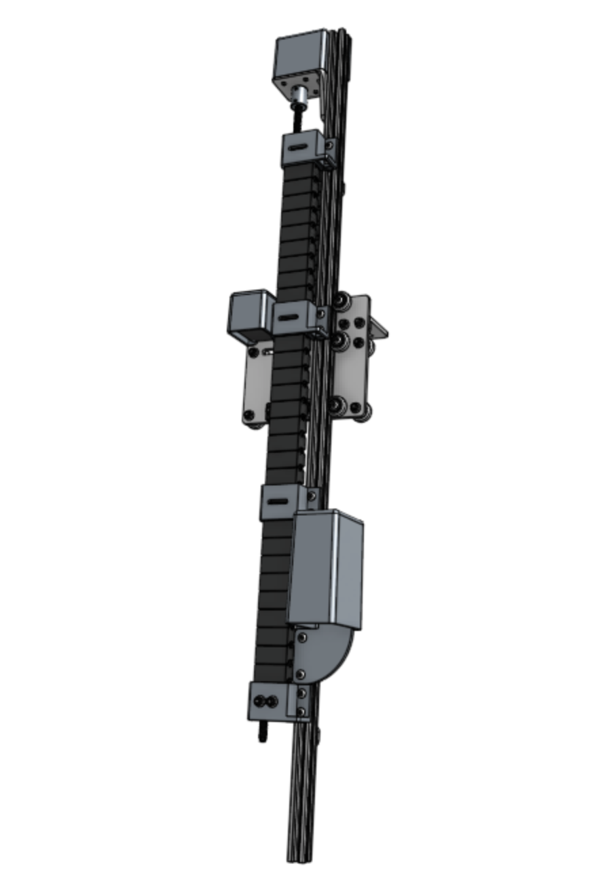
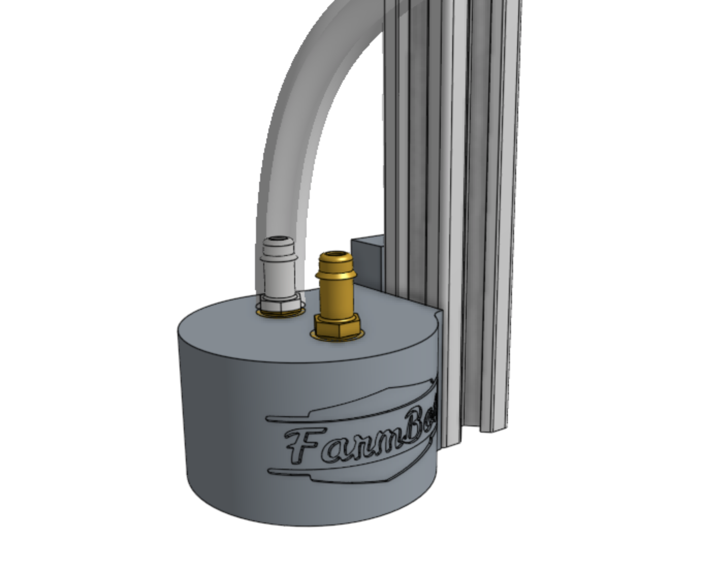
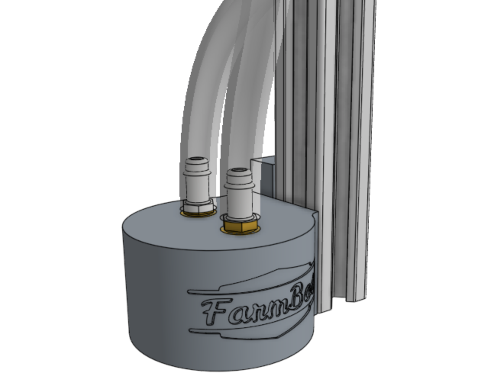

* toc
{:toc}

# Step 1: Adjust the eccentric spacers for maximum clearance
Using the **8mm thin wrench**, rotate the three **eccentric spacers** shown in the image below such that the `6mm` text on the spacer is pointing towards the right side of the cross-slide plate.

# Step 2: Slide the z-axis into the cross-slide
Slide the **z-axis sub-assembly** into the **cross-slide** until the **leadscrew** touches the **leadscrew block**.

{%
include callout.html
type="warning"
title="Do not force the extrusion into the cross-slide"
content="The extrusion should be able to slide into the cross-slide easily. If you encounter resistance, DO NOT FORCE IT. If the extrusion does not slide in, ensure the eccentric spacers are adjusted according to the instructions in step 1. If the extrusion still does not slide in, loosen the flange locknuts for the two v-wheels with normal spacers, push those v-wheels towards the motor and retighten. There should now be enough clearance between the v-wheels for the extrusion to slide into the cross-slide."
%}

# Step 3: Adjust the eccentric spacers
Using the **8mm thin wrench**, finely adjust the same three **eccentric spacers** from before to eliminate any wobble the extrusion has when sliding up and down. **Do not overtighten the eccentric spacers.** The idea here is to achieve a smooth, wobble-free movement, but not introduce unnecessary friction and resistance into the system.

Once the eccentric spacers are adjusted properly, move onto the next step.

# Step 4: Turn the leadscrew by hand
Turn the **leadscrew** by hand to screw it into the **leadscrew block**. Continue until the **cross-slide** is positioned roughly in the middle of the **z-axis extrusion**.

# Step 5: Attach the z-axis hardstops
Attach the two **z-axis hardstops** to the back side of the **z-axis extrusion** using **M5 x 10mm screws** and **drop-in tee nuts**. The lower hardstop should be positioned 120mm above the bottom of the extrusion. The upper hardstop should be positioned 200mm below the top of the extrusion.

# Step 6: Mount the 3-in-1 tool head
Attach the **3-in-1 tool head** to the **z-axis extrusion** using two **M5 x 16mm screws** and one **40mm nut bar**. The bottom of the tool head should be flush with the bottom of the extrusion.

Screw the two **barbs** into the top of the **3-in-1 tool head**.

Press the **vacuum tube** onto the **barb** that is farthest from the FarmBot logo.

Press the **water tube** onto the **barb** that is closest to the FarmBot logo.

Screw the **luer lock adapter** and **spiral spray nozzle** into the bottom of the **3-in-1 tool head**.

# Step 7: Attach the camera
Mount the **camera** to the **z-axis extrusion** using two **camera mount halves**, two **M5 x 10mm screws**, and one **40mm nut bar**.

# Step 8: Attach the cable carrier
Attach the **z-axis cable carrier** to the **cross-slide plate** using two **M5 x 30mm screws**, two **M5 flange locknuts**, and the **cable carrier spacer block**.

<meta name="theme-color" content="#942401">

