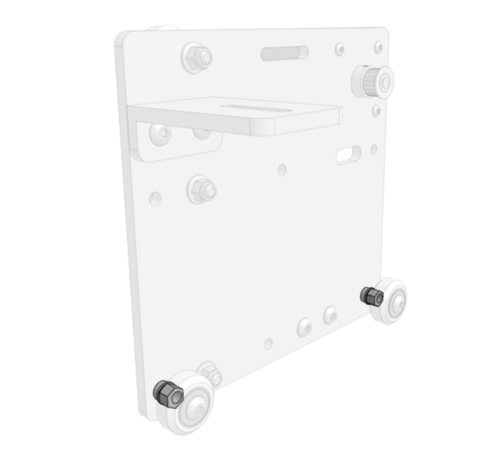

* toc
{:toc}

# Component list

|Component                     |Qty                           |
|------------------------------|------------------------------|
|Cross-Slide Plate             |1
|65mm Cable Carrier Mount      |1
|50mm Horizontal Motor Housing |1
|NEMA 17 Stepper Motor         |1
|20 Tooth GT2 Pulley           |1
|Leadscrew Block               |1
|V-Wheel                       |10
|M5 x 6mm Spacer               |5
|M5 x 6mm Eccentric Spacer     |5
|M5 x 30mm Screw               |10
|M5 x 25mm Screw               |2
|M5 x 20mm Screw               |2
|M5 Flange Locknut             |14
|M3 x 12mm Screw               |4

# Step 1: Attach the motor
Insert the **motor shaft** through the hole in the upper left of the **cross-slide plate** as shown. The motor connector should be facing down, towards the slot in the cross-slide plate.

Slide the **50mm horizontal motor housing** over the motor. The open end of the housing should be facing down, towards the slot in the cross-slide plate.

Secure the motor and housing using four **M3 x 12mm screws**.

Mount the **20 tooth GT2 pulley** onto the motor shaft, ensuring the setscrews are aligned with the flat parts of the shaft. There should be 1mm of space between the pulley and the cross-slide plate.

# Step 2: Attach the leadscrew block
Attach the **leadscrew block** to the **cross-slide plate** using two **M5 x 25mm screws** and two **M5 flange locknuts**. The leadscrew block should be on the same side of the plate as the motor.

# Step 3: Attach the cable carrier mount
Attach the **65mm cable carrier mount** to the **cross-slide plate** using two **M5 x 20mm screws** and two **M5 flange locknuts**. The mount should be on the same side of the plate as the pulley.

# Step 4: Attach the v-wheels with eccentric spacers
Attach three **v-wheels** to the **cross-slide plate** using **eccentric spacers**, **M5 x 30mm screws**, and **M5 flange locknuts**.

Attach two more **v-wheels** to the other side of the **cross-slide plate** using **eccentric spacers**, **M5 x 30mm screws**, and **M5 flange locknuts**.

# Step 5: Attach the v-wheels with normal spacers
Attach three **v-wheels** to the **cross-slide plate** using **M5 x 6mm spacers**, **M5 x 30mm screws**, and **M5 flange locknuts**.

Attach two more **v-wheels** to the other side of the **cross-slide plate** using **M5 x 6mm spacers**, **M5 x 30mm screws**, and **M5 flange locknuts**.

