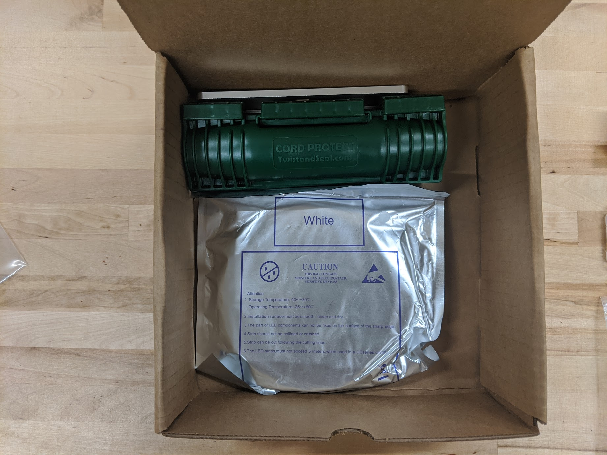
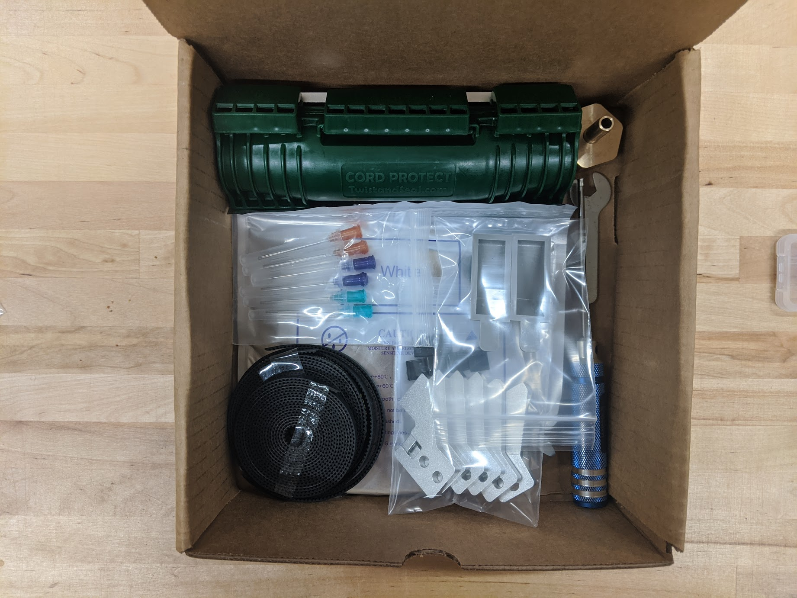
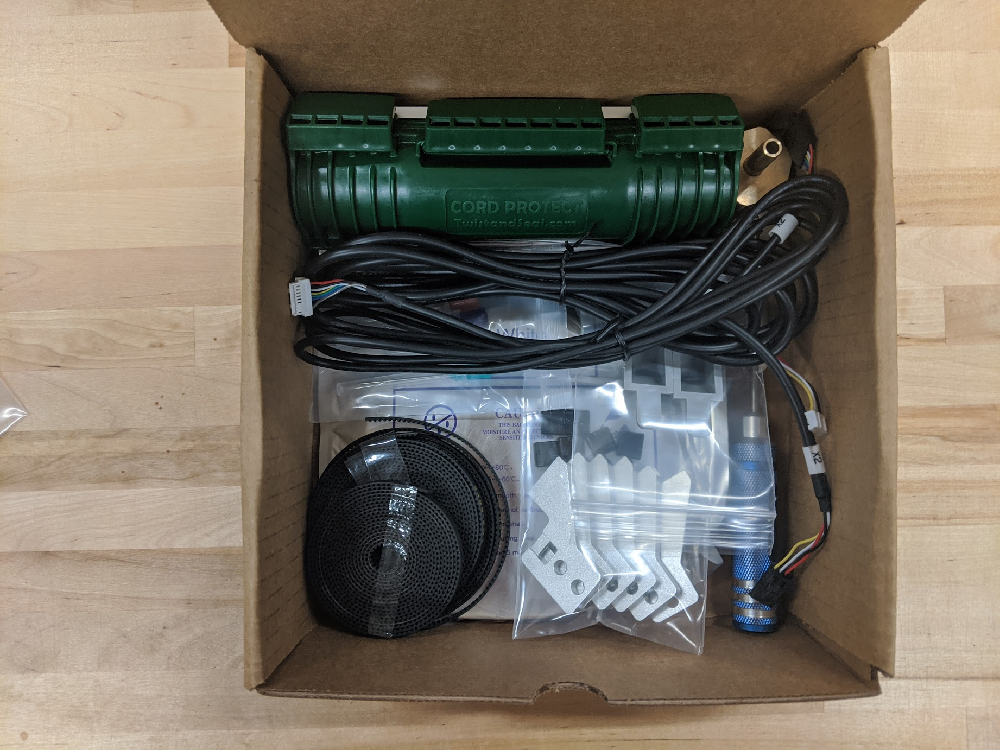
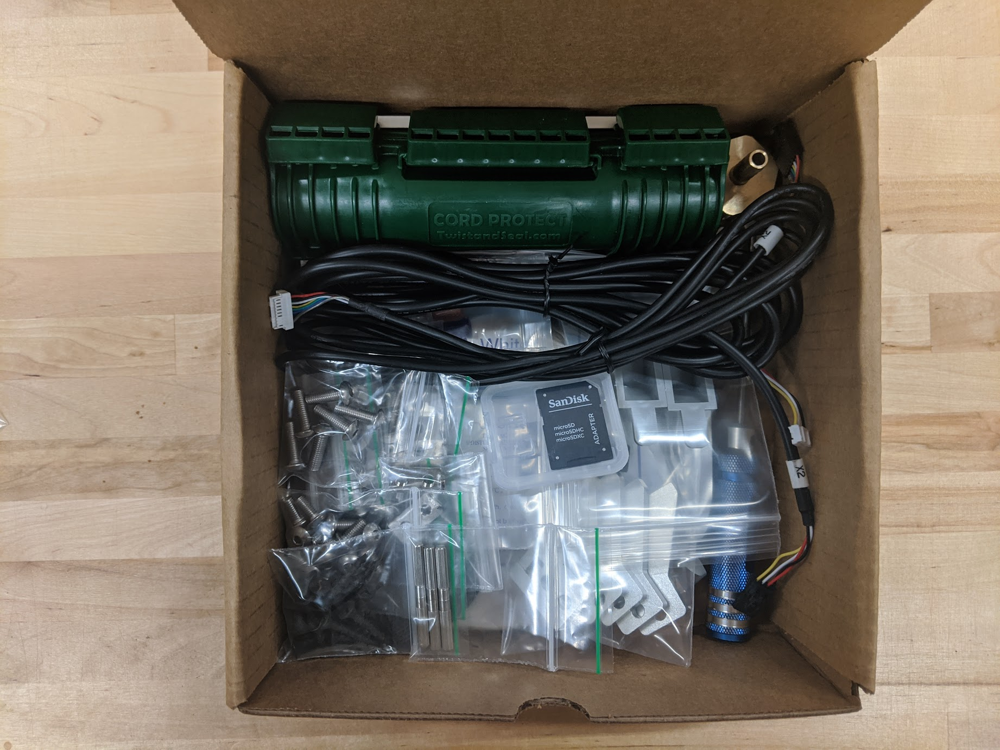
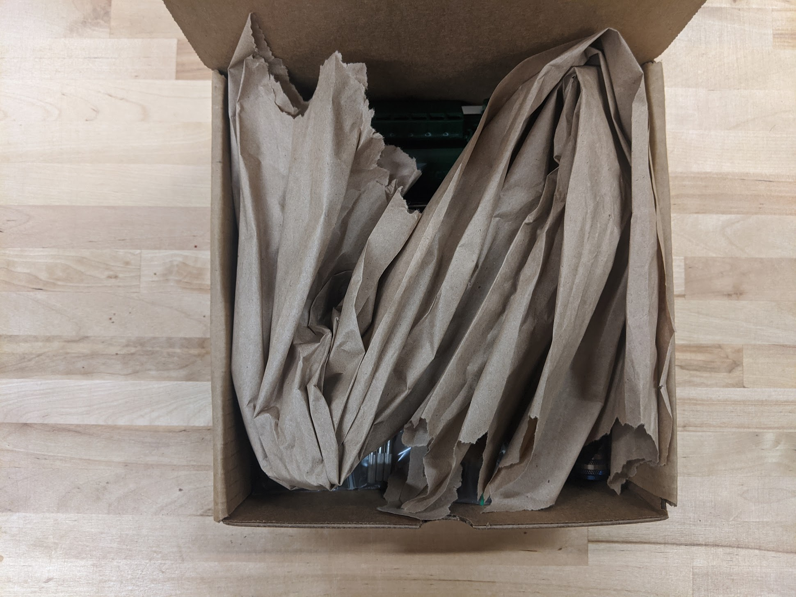

* toc
{:toc}

# Box specifications

|                              |                              |
|------------------------------|------------------------------|
|**Box style**                 |Top flap (standard FarmBot box design)
|**Inner dimensions (L x W x H)**|20cm x 20cm x 6cm
|**Outer dimensions (L x W x H)**|21cm x 21cm x 7cm
|**Material**                  |Cardboard
|**Color**                     |Brown
|**Printing**                  |None
|**Fill**                      |Recycled kraft paper

# Packing list
There are two versions of the **hardware box**: one for **Express** kits and one for **Express XL** kits. The tables below show the items that should be packed into each version.

## Express

|Item                          |Sub-packing                   |Express Qty                   |
|------------------------------|------------------------------|------------------------------|
|X2 Motor Cable - 1.8m         |Twist-tied                    |1
|24V LED Strip - 1.2m          |In anti-static bag            |1
|GT2 Timing Belt - 1.4m        |Coiled                        |1
|GT2 Timing Belt - 4.5m        |Coiled                        |2
|60mm Nut Bars                 |In press-to-seal bag          |4
|20mm Nut Bars                 |In press-to-seal bag          |2
|Seed Troughs                  |In press-to-seal bag          |2
|6x Belt Clips + 6x Belt Sleeves|In press-to-seal bag          |1 pack
|Luer Lock Needles with Covers - 2x 16 gauge - 2x 19 gauge - 2x 22 gauge|In press-to-seal bag          |1 pack
|M5 x 30mm Screws              |In press-to-seal bag          |2
|M5 x 10mm Screws              |In press-to-seal bag          |20
|M5 x 16mm Screws              |In press-to-seal bag          |6
|M5 Flange Locknuts            |In press-to-seal bag          |12
|M5 SS Drop-in Tee Nuts        |In press-to-seal bag          |10
|25mm Wood Screws              |In press-to-seal bag          |15
|RTC Battery                   |In press-to-seal bag          |1
|MicroSD Card Adapter          |In original plastic case      |1
|65mm CC Mount                 |None                          |1
|3mm Hex Driver                |None                          |1
|8mm Thin Wrench               |None                          |1
|2.5mm Hex Key                 |None                          |1
|Power Cord Protector          |None                          |1
|Garden Hose to Barb Adapter with Rubber Gasket|None                          |1

## Express XL

|Item                          |Sub-packing                   |Express XL Qty                |
|------------------------------|------------------------------|------------------------------|
|X2 Motor Cable - 3.0m         |Twist-tied                    |1
|24V LED Strip - 2.4m          |In anti-static bag            |1
|GT2 Timing Belt - 2.6m        |Coiled                        |1
|GT2 Timing Belt - 7.5m        |Coiled                        |2
|Dowel Pins                    |In press-to-seal bag          |3
|60mm Nut Bars                 |In press-to-seal bag          |8
|20mm Nut Bars                 |In press-to-seal bag          |2
|Seed Troughs                  |In press-to-seal bag          |2
|6x Belt Clips + 6x Belt Sleeves|In press-to-seal bag          |1 pack
|Luer Lock Needles with Covers - 2x 16 gauge - 2x 19 gauge - 2x 22 gauge|In press-to-seal bag          |1 pack
|M5 x 30mm Screws              |In press-to-seal bag          |2
|M5 x 10mm Screws              |In press-to-seal bag          |20
|M5 x 16mm Screws              |In press-to-seal bag          |6
|M5 Flange Locknuts            |In press-to-seal bag          |12
|M5 SS Drop-in Tee Nuts        |In press-to-seal bag          |10
|25mm Wood Screws              |In press-to-seal bag          |15
|RTC Battery                   |In press-to-seal bag          |1
|MicroSD Card Adapter          |In original plastic case      |1
|65mm CC Mount                 |None                          |1
|Gantry Joining Bracket        |None                          |1
|3mm Hex Driver                |None                          |1
|8mm Thin Wrench               |None                          |1
|2.5mm Hex Key                 |None                          |1
|Power Cord Protector          |None                          |1
|Garden Hose to Barb Adapter with Rubber Gasket|None                          |1

# Packing instructions



First pack in the bulkiest items: power cord protector, gantry joining bracket (for Express XL kits only), and LED strip.

Then pack in the next bulkiest items: belts, seed troughs, luer lock needles, belt clips, 3mm hex driver, 8mm thin wrench, and garden hose adapter.

Pack in the X2 motor cable.

_(Note: the photo is incorrect, there should be no X2 encoder cable)_

Pack in the small remaining items.

_(Note: the photo is incorrect, there should be no X2 encoder cable)_

Fill the remaining space with recycled kraft paper.

