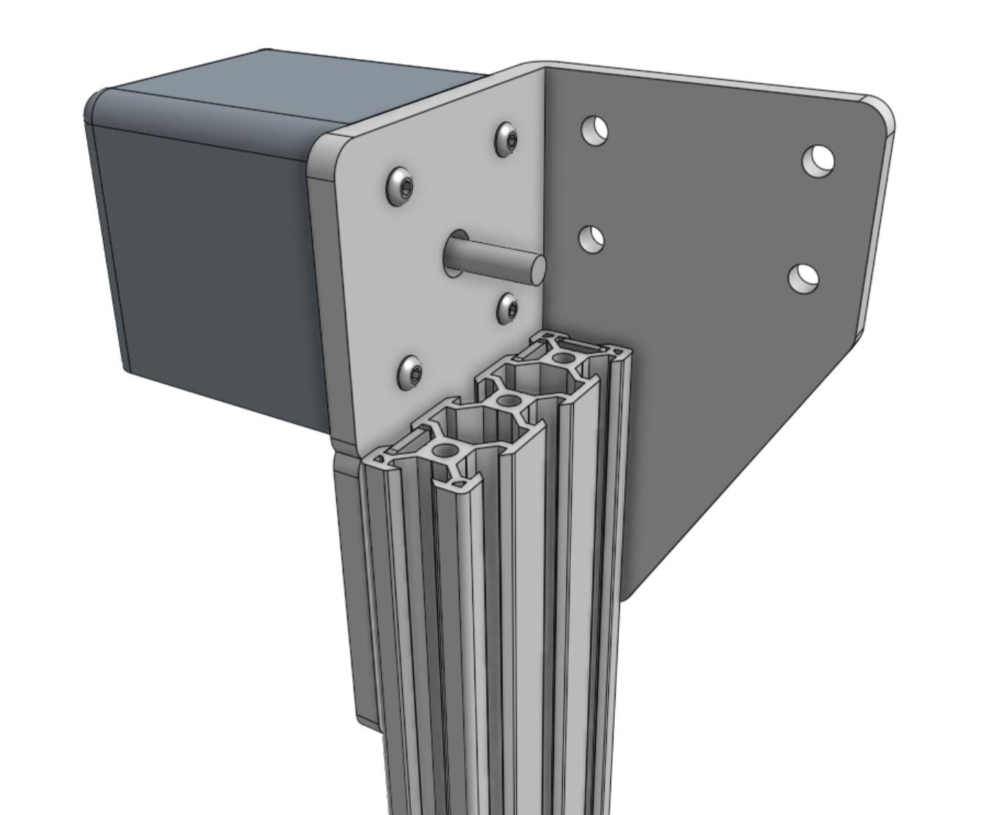
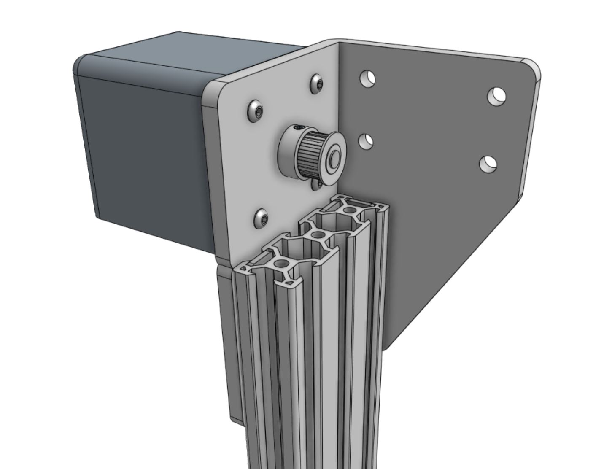

* toc
{:toc}

# Component list

|Component                     |Qty                           |
|------------------------------|------------------------------|
|Gantry Wheel Plate            |1
|Gantry Column                 |1
|Gantry Plate Spacer Block     |1
|Idler Pulleys                 |4
|Right Gantry Corner Bracket   |1
|50mm Horizontal Motor Housing |1
|NEMA 17 Motor                 |1
|20 Tooth GT2 Pulley           |1
|M5 x 40mm Screw               |4
|M5 x 20mm Screw               |4
|M5 x 10mm Screw               |6
|M5 Flange Locknut             |4
|M5 x 14.5mm Spacer            |2
|M3 x 12mm Screw               |4
|60mm Nut Bar                  |5

# Step 1: Mount the idler pulleys
Mount two **idler pulleys** to the **gantry wheel plate** using two **M5 x 40mm screws**, two **M5 flange locknuts**, and the **gantry plate spacer block** as a spacer.

Mount the other two idler pulleys with M5 x 40mm screws and M5 flange locknuts, this time using two **M5 x 14.5mm spacers**.

# Step 2: Attach the gantry column
Lightly screw four **M5 x 20mm screws** to two **60mm nut bars**. The nut bars should be loose enough to slide into the end of an extrusion in the next step.

Slide the **gantry column** onto the assembly, ensuring the cut end of the extrusion fits flush against the horizontal stop on the **gantry plate spacer block**. Then tighten the four M5 x 20mm screws.

# Step 3: Attach the gantry corner bracket
Attach the **right gantry corner bracket** to the **gantry column** using three **60mm nut bars** and six **M5 x 10mm screws**. The top of the extrusion should be aligned with the notch in the corner bracket.

_The top of the extrusion should be aligned with the notch in the corner bracket._

# Step 4: Attach the X2 motor
Insert the shaft of the **NEMA 17 stepper motor** into the hole in the center of the **gantry corner bracket**. The motor connector should be facing down, towards the gantry wheel plate.

Slide the **50mm horizontal motor housing** over the top of the motor. The open end of the motor housing should be facing down, towards the gantry wheel plate.

Secure the motor and housing in place with four **M3 x 12mm screws**.

Slide the **20 tooth GT2 pulley** onto the motor shaft, ensuring the two setscrews are aligned with the flat sides of the motor shaft. The pulley's toothed area should be aligned with the large holes in the extrusion such that the belt can be routed through the extrusion without rubbing. Then tighten the setscrews.

_The pulley's toothed area should be aligned with the large holes in the extrusion such that the belt can be routed through the extrusion without rubbing._

<meta name="theme-color" content="#942401">

