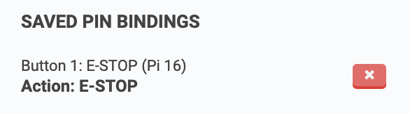
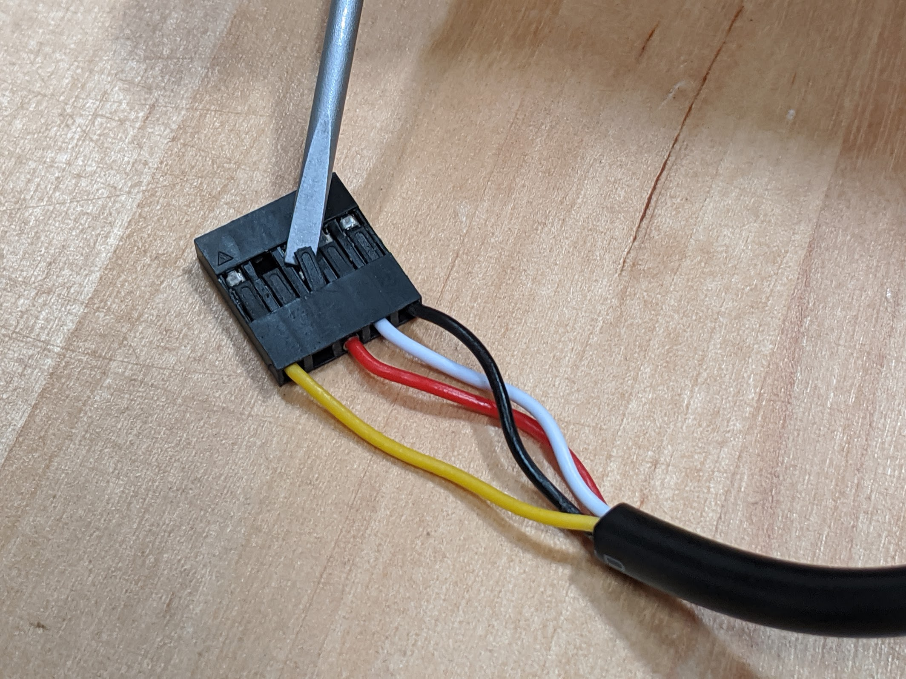

* toc
{:toc}

# Step 1: Check the pin binding
Navigate to the [pin bindings section](https://my.farm.bot/app/designer/settings?highlight=pin_bindings) of the settings panel and verify that you have a binding for **Button 1: E-STOP (Pi 16)** to trigger the **E-STOP** **Action**. Ensure this has been saved and synced to the FarmBot.

# Step 2: Power down FarmBot
[Shutdown FarmBot](https://my.farm.bot/app/designer/settings?highlight=shutdown_farmbot) and unplug the power.

# Step 3: Rewire the button
Unplug the **E-stop button wiring harness** from the electronics board and then the button itself. Note that the blue connector has a locking tab that must be pressed to remove the connector from the button.

Using a small bladed screwdriver, gently lift the **tab** holding the **red wire and metal contact** into the **black plastic connector**.

Gently remove the **red wire and metal contact** from the **black plastic connector**. Do NOT remove the metal contact from the wire.



Plug the wiring harness's blue connector back onto the button. Then plug the black connector back into the electronics board. The yellow wire should be closest to the green Raspberry Pi Zero electronics board. Then plug the red wire into the top-right pin on the electronics board.





# Step 4: Power up FarmBot
Plug the FarmBot back in and wait for it to boot up. Try sending some movement commands to ensure it is fully up and running. Then test the E-stop button to ensure it works as expected.

