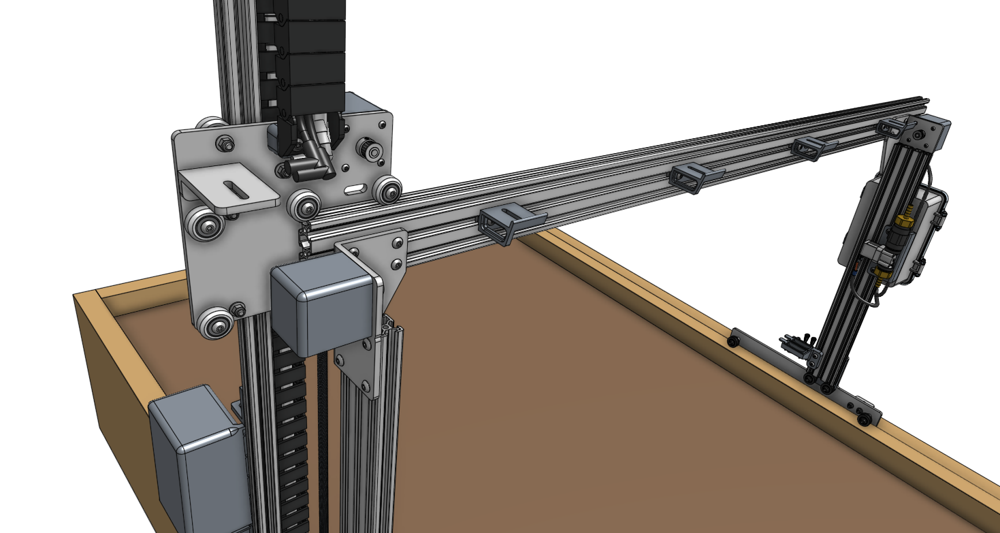

* toc
{:toc}

# Step 1: Slide on the cross-slide and z-axis
Carefully slide the **cross-slide and z-axis subassembly** onto the **gantry** from the right side (the side without the electronics box). When sliding it on, make sure to hold and slide it perpendicular to the main beam. Rotating the z-axis before it is fully on the beam will apply a large force on the v-wheels and could result in damage.



# Step 2: Attach the y-axis belt
Slide a **belt sleeve** onto the **y-axis belt** (the shortest belt in the kit). Then insert the belt into the slot in a **belt clip** and wrap the belt back onto itself such that the belt teeth mesh. There should be about 3cm of overlap. Then slide the belt sleeve over the meshed section. This should keep the belt from pulling out of the belt clip.

Secure the belt clip to the top of the **main beam** using two **M5 x 10mm screws** and one **20mm nut bar**. The belt clip should be flush with the end of the main beam, and the belt clip's tab should be on the same side of the main beam as the cross-slide plate.

Route the belt under the wheels of the cross-slide plate and over the y-axis motor pulley.

Attach another **belt clip** to the other end of the **main beam**, again ensuring the tab is on the same side of the main beam as the cross-slide plate.

Using the same method as before, secure the loose end of the belt to the second belt clip. When pulling the belt through the clip and engaging the teeth, ensure the belt is pulled snug. There should be no slack in the system once the belt sleeve is in place.

# Step 3: Connect the y-axis cable carrier
Lay the **loaded y-axis cable carrier** onto the **horizontal cable carrier supports**.

Attach the **cable carrier** to the **cross-slide** using two **M5 x 16mm screws** and **M5 flange locknuts**.

Attach the other end of the **cable carrier** to the **horizontal cable carrier support** nearest the electronics box using two **M5 x 16mm screws** and **M5 flange locknuts**.

<meta name="theme-color" content="#942401">

