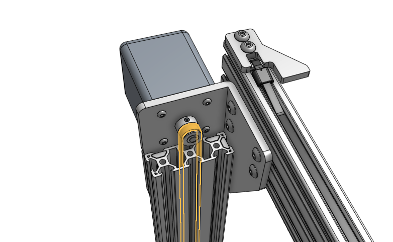
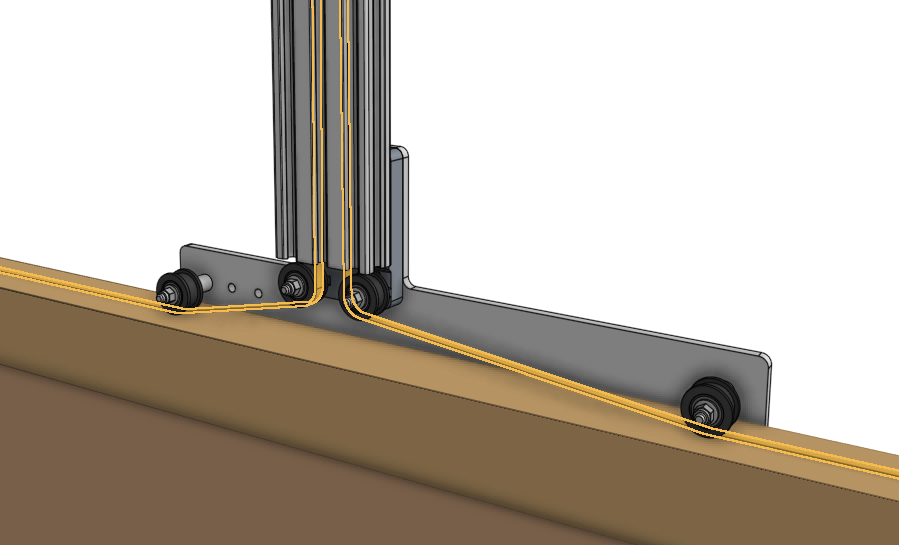
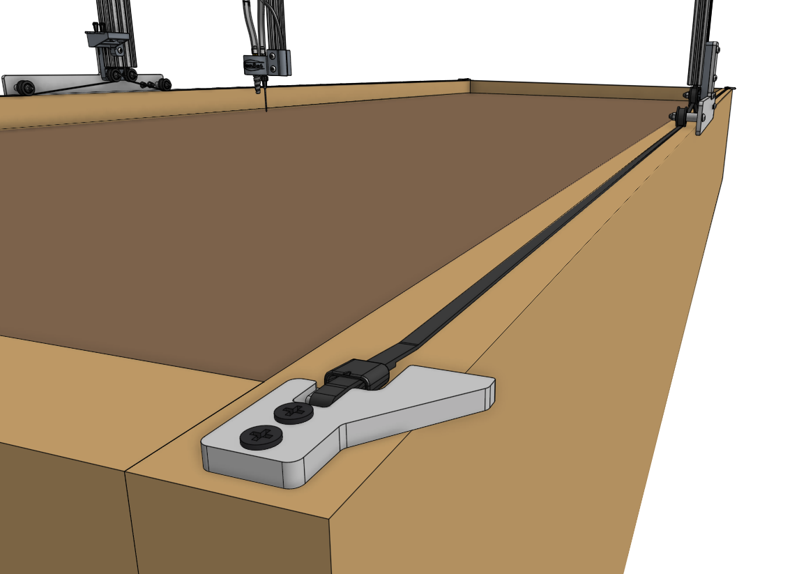
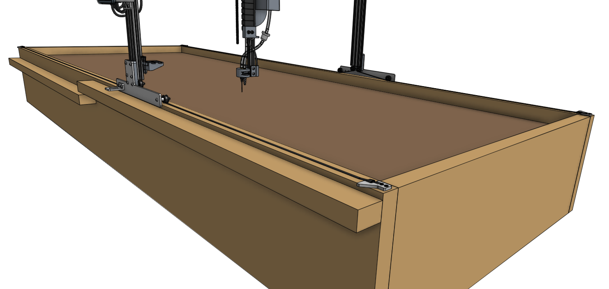
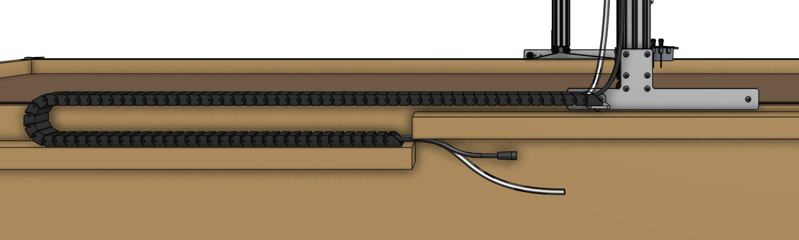
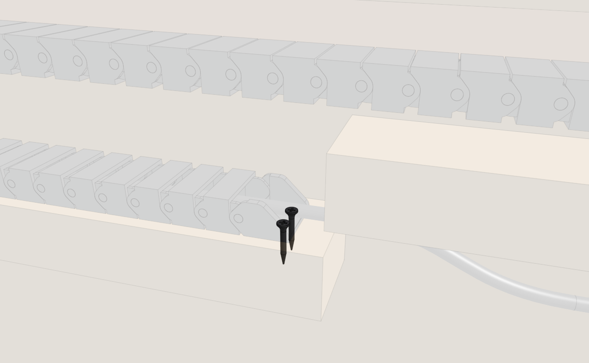
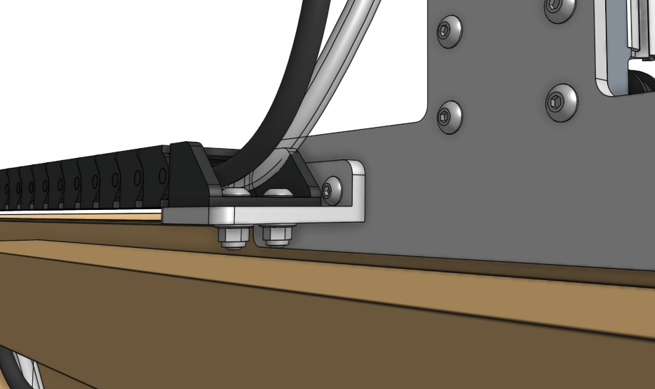

* toc
{:toc}

# Step 1: Route the belts
Feed each end of the **x axis belts** down through the center channels in the two **gantry columns**.

Route the **belts** under the **idler pulleys**. Ensure there are no twists inside the extrusions. The belt teeth should be facing down towards the bed.

# Step 2: Secure the belts
Secure both ends of each **belt** to a **belt clip** using a **belt sleeve** and the same method used when [securing the y-axis belt](../assembly/attach-the-z-axis.md#step-2-attach-the-y-axis-belt). Then attach the belt clips to the **raised bed** using two **wood screws**. The belt clip tabs should be extending over the outside of the bed to serve as hardstops against the gantry wheel plate.

# Step 3: Attach the x-axis cable carrier
Lay the **loaded x-axis cable carrier** onto the bed's **cable carrier support**.

Attach the **cable carrier** to the **bed** with two **wood screws**.

Attach the **cable carrier** to the **cable carrier mount** using two **M5 x 16mm screws** and **M5 flange locknuts**.

<meta name="theme-color" content="#942401">

# What's next?

 * [Plug Everything In](../assembly/plug-everything-in.md)
