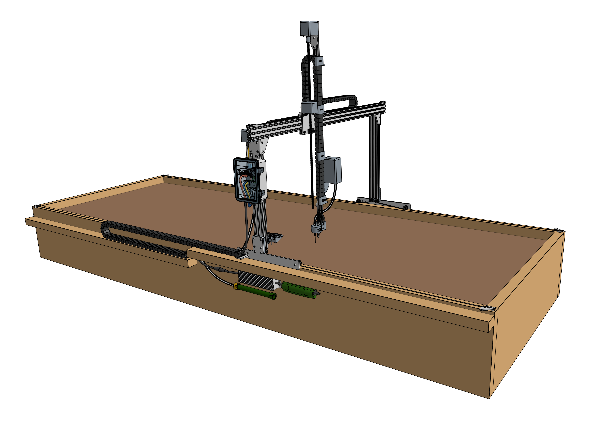

* toc
{:toc}

**FarmBot Express** is designed to be an affordable and easy-to-use FarmBot for those who want to get setup and running quickly and don't need all of the features and customization options available with [FarmBot Genesis](http://genesis.farm.bot). The driving factors behind the design are simplicity, ease-of-setup, and affordability.

FarmBot Express is available in three sizes: a standard sized model suitable for small yards, greenhouses, classrooms, and research labs; an XL model suitable for families, larger spaces, multi-class school use; and a MAX model suitable for small commercial farms and large scale R&D.

|Model                         |Gantry Width                  |Length                        |Area                          |Max Plant Height              |
|------------------------------|------------------------------|------------------------------|------------------------------|------------------------------|
|Express                       |1.2m                          |3m                            |3.6m2              |0.5m
|Express XL                    |2.4m                          |6m                            |14.4m2             |0.5m
|Express MAX ([cancelled](https://farm.bot/blogs/news/putting-farmbot-genesis-max-and-express-max-on-hold))|2.4m                          |18m                           |43.2m2             |0.5m

<iframe class="embedly-embed" src="//cdn.embedly.com/widgets/media.html?src=https%3A%2F%2Fwww.youtube.com%2Fembed%2F0s5GU9SWquQ%3Ffeature%3Doembed&url=http%3A%2F%2Fwww.youtube.com%2Fwatch%3Fv%3D0s5GU9SWquQ&image=https%3A%2F%2Fi.ytimg.com%2Fvi%2F0s5GU9SWquQ%2Fhqdefault.jpg&key=f2aa6fc3595946d0afc3d76cbbd25dc3&type=text%2Fhtml&schema=youtube" width="854" height="480" scrolling="no" frameborder="0" allow="autoplay; fullscreen" allowfullscreen="true"></iframe>

<iframe class="embedly-embed" src="//cdn.embedly.com/widgets/media.html?src=https%3A%2F%2Fwww.youtube.com%2Fembed%2F6XWiTzFPWWc%3Ffeature%3Doembed&url=https%3A%2F%2Fwww.youtube.com%2Fwatch%3Fv%3D6XWiTzFPWWc&image=https%3A%2F%2Fi.ytimg.com%2Fvi%2F6XWiTzFPWWc%2Fhqdefault.jpg&key=f2aa6fc3595946d0afc3d76cbbd25dc3&type=text%2Fhtml&schema=youtube" width="854" height="480" scrolling="no" frameborder="0" allow="autoplay; fullscreen" allowfullscreen="true"></iframe>

Express, Express XL, and Express MAX share many of the same components and assembly steps. This documentation covers the assembly, bill of materials, troubleshooting tips, and more of all sized kits. When certain information only applies to one kit or the other, there will be clear indication.

# High level overview
FarmBot Express, Express XL, and Express MAX are primarily constructed from V-Slot aluminum extrusions and aluminum plates and brackets. They are driven by four NEMA 17 stepper motors with rotary encoders, the Farmduino Express microcontroller, and a Raspberry Pi Zero computer.

_FarmBot Express v1.0_

_FarmBot Express XL v1.0_

_FarmBot Express MAX v1.0_

## Tracks
FarmBot Express does not have tracks like FarmBot Genesis does. Instead, Express bots roll directly on the wood raised bed. While this doesn't provide the same level of precision as aluminum tracks do, this system is much faster to install and less expensive.

## Gantry
The **gantry** is the the structural component that bridges the long edges of the bed and allows the tool head to be moved in the X-direction. It also serves as a linear guide for the cross-slide, and a support structure for mounting the electronics box and seed tray holster.

## Cross-slide
The **cross-slide** moves in the Y-direction across the gantry. This motion provides the second major degree of freedom for FarmBot Express and allows operations such as planting to be done anywhere in the XY plane.

## Z-axis
The **Z-axis** moves through the cross-slide and provides the FarmBot with Z-direction movement. It also serves as the base for attaching the tool head, vacuum pump, and camera.

# Economies of scale
The table below shows the cost/m2 of growing area based on the size of your FarmBot. Predictably, the larger your FarmBot is, the lower the cost will be per square meter of growing area. Thus, we recommend installing the largest possible FarmBot in your space in order to get the most value out of the device.

*Note that the costs below do not account for [supporting infrastructure](supporting-infrastructure.md), which will also increase in cost as the device size increases.*

|Model                         |Gantry Width                  |Length                        |Growing Area                  |Cost                          |Cost/m^2                      |
|------------------------------|------------------------------|------------------------------|------------------------------|------------------------------|------------------------------|
|Express                       |1.2m                          |3m                            |3.6m2              |~$1,800                       |$500
|Express XL                    |2.4m                          |6m                            |14.4m2             |~$2,300                       |$160
|Express MAX                   |2.4m                          |18m                           |43.2m2             |~$3,000                       |$70

# Purchasing a kit
Our kits include everything you need in one box and are backed by our customer support. Your purchase goes towards improving and supporting the open-source hardware plans, software, and documentation you are reading right now.

**[Order your FarmBot here!](http://buy.farm.bot)**

<iframe class="embedly-embed" src="//cdn.embedly.com/widgets/media.html?src=https%3A%2F%2Fwww.youtube.com%2Fembed%2F_jw98qozK4s%3Ffeature%3Doembed&url=http%3A%2F%2Fwww.youtube.com%2Fwatch%3Fv%3D_jw98qozK4s&image=https%3A%2F%2Fi.ytimg.com%2Fvi%2F_jw98qozK4s%2Fhqdefault.jpg&key=02466f963b9b4bb8845a05b53d3235d7&type=text%2Fhtml&schema=youtube" width="854" height="480" scrolling="no" frameborder="0" allowfullscreen></iframe>

# License
Please see our [licensing page](https://meta.farm.bot/docs/licensing) to understand how our various works (hardware, software, documentation, etc) are licensed.

# What's next?

 * [Supporting Infrastructure](supporting-infrastructure.md)
