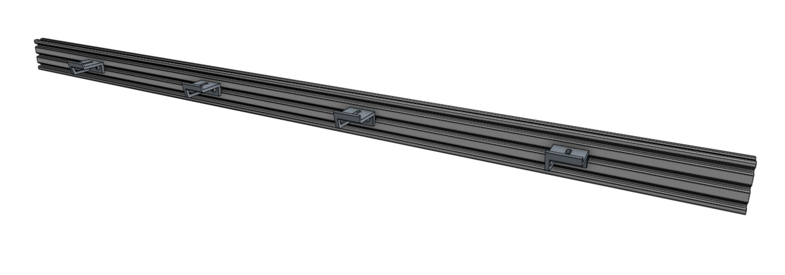
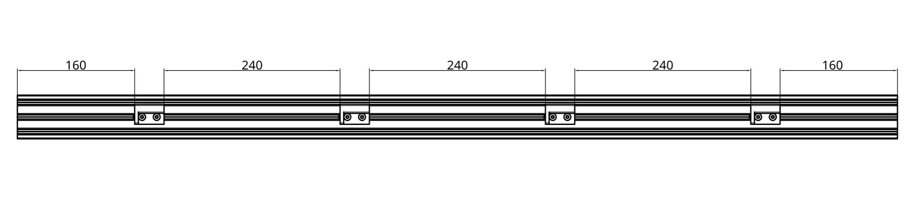

# Component list

|Component                     |Express Qty                   |XL Qty                        |
|------------------------------|------------------------------|------------------------------|
|Gantry Main Beam (1200mm long)|1                             |2
|40mm Horizontal Cable Carrier Support|4                             |8
|M5 x 10mm Screw               |8                             |16
|40mm Nut Bar                  |4                             |8

# Step 1: Mount the cable carrier supports
Mount four **40mm horizontal cable carrier supports** into the middle slot of the **gantry main beam** using eight **M5 x 10mm screws** and four **40mm nut bars**. The supports should be spaced as shown in the drawing below.



# Step 2: Repeat (for XL only)
Repeat step 1 to create a second gantry main beam with attached cable carrier supports.

