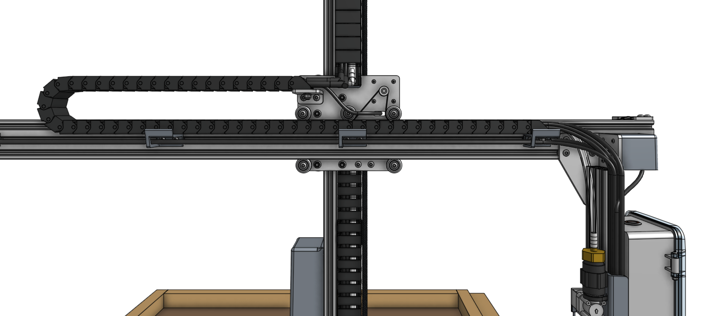

* toc
{:toc}

# Step 1: Slide on the cross-slide and z-axis

Carefully slide the **cross-slide and z-axis subassembly** onto the **gantry** from the right side (the side without the electronics box). If necessary, rotate the **leadscrew** (and z-axis motor) by hand to adjust the subasssembly so that it can fit past the other gantry components and raised bed.

{%
include callout.html
type="warning"
title="Do not force it on"
content="The cross-slide's v-wheels have been factory adjusted to fit snugly on the main beam's extrusion. However, slight dimensional changes in the extrusions and wheels can impact this fit.

When sliding the subassembly onto the main beam, make sure to hold and slide it _perpendicular_ to the main beam. Sliding it at an angle could result in damage. **Do not force it on.** If it feels too tight, refer to [this document to adjust the v-wheels](../../Extras/eccentric-spacer-adjustment.md)."
%}



# Step 2: Attach the y-axis belt

Slide a **belt sleeve** onto the **y-axis belt** (the shortest belt in the kit). Then insert the belt into the slot in a **belt clip** and wrap the belt back onto itself such that the belt teeth mesh. There should be about 3cm of overlap. Then slide the belt sleeve over the meshed section. This should keep the belt from pulling out of the belt clip.

Secure the belt clip to the top of the **main beam** using two **M5 x 10mm screws** and one **20mm nut bar**. The belt clip should be flush with the end of the main beam, and the belt clip's tab should be on the same side of the main beam as the cross-slide plate.

Route the belt under the wheels of the cross-slide plate and over the y-axis motor pulley.

Attach another **belt clip** to the other end of the **main beam**, again ensuring the tab is on the same side of the main beam as the cross-slide plate. Using the same method as before, secure the loose end of the belt to the second belt clip.





# Step 3: Connect the y-axis cable carrier

Lay the **loaded y-axis cable carrier** onto the **horizontal cable carrier supports**. Attach it to the **cross-slide** and to the **horizontal cable carrier support** nearest the electronics box using **M5 x 16mm screws** and **M5 flange locknuts**.



# What's next?

 * [Mount FarmBot to the Bed](mount-farmbot-to-the-bed.md)
