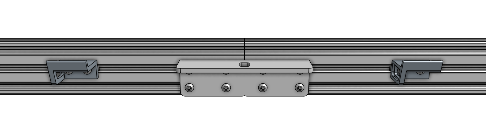
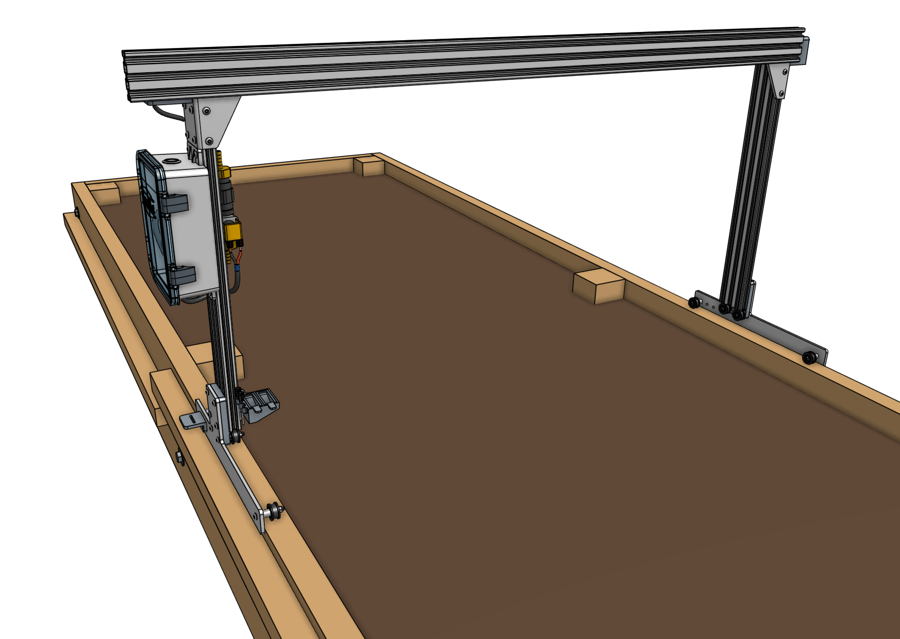
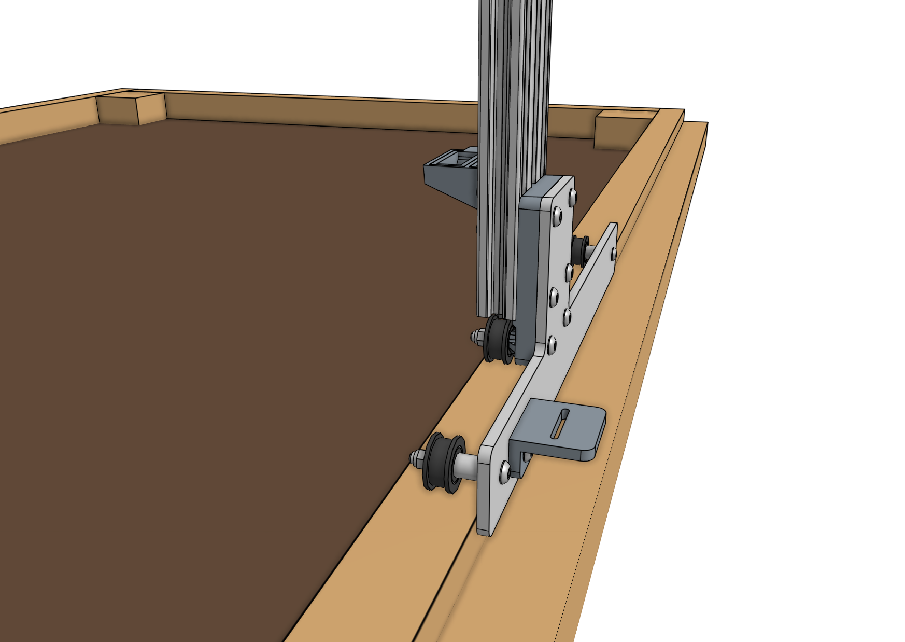

# Step 1: Assemble the main beam



Place both [[gantry main beams]] on a flat surface such as a table or patio. Using two [[140mm nut bars]] and eight [[M5 x 10mm screws]], attach the [[gantry joining bracket]] to the *lower two slots* of both extrusions on the same side of the extrusions as the cable carrier supports. The notch in the middle of the bracket should be aligned with the joint between the two extrusions.

The completed main beam for (XL) bots should now look like this. Note that in the rest of the documentation we'll be showing images of the standard sized main beam, but all the instructions are the same from here on out.

# Step 2: Attach the gantry columns

Insert two [[60mm nut bars]] into the lower two slots on the backside of the [[gantry main beam]].

Position the **gantry column subassembly with the electronics box and solenoid valve** as shown and use four [[M5 x 10mm screws]] to loosely attach it to the gantry main beam. The screws should only be tightened 50% of the way such that the column will not fall off, but so that it can still be moved within the main beam's slots.

Repeat with the other **gantry column subassembly**.

# Step 3: Fit FarmBot to the bed

Carefully move the gantry and position it onto the raised bed. Slide the columns along the main beam's extrusion slots until each column's wheel plate is positioned against the outer faces of the bed.

Ensure one of the columns is perpendicular to the main beam and then fully tighten the four screws to firmly fasten the column to the main beam.

Ensure the fastened column's wheel plate is pressed against the outer face of the bed.

Slide and position the second column such that it is perpendicular to the main beam, and so that there is 1cm of space between the outer face of the bed and the inner face of the wheel plate.

Tighten the four screws holding the second column to the main beam.

# What's next?

 * [Attach the Z-Axis](attach-the-z-axis.md)
