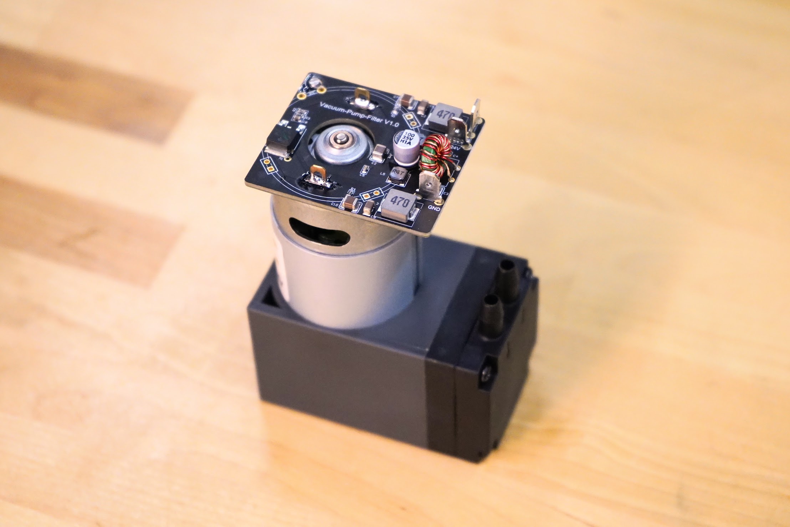

# Farmduino Express v1.1

The newest version of the [[Farmduino Express]] electronics board features an integrated USB hub connected to the Raspberry Pi via two pogo pins. The USB hub is directly connected to the Arduino's MCU, providing more reliable flashing of the firmware. Also connected to the hub are a built-in Ethernet adapter for users who need a wired connection to their FarmBot, and two USB Type-C ports for the FarmBot camera and future USB accessories.

The new board also features smaller and more DIY friendly 2.54mm pitch receptacles for the solenoid valve, LED strip, and vacuum pump peripherals. And both the vacuum pump and input power receptacles are now 3-pin connections to provide `PE` (protected earth) grounding to reduce the likelihood of EMI issues that affected some v1.0 systems.

Last, the new board includes a pulldown resistor to fix an issue that affected E-stop button performance in the v1.0 design.



# Raspberry Pi Zero 2 W

Express v1.1 includes an upgraded [[Raspberry Pi Zero 2 W]] computer to provide faster booting and greater overall performance when compared to the Zero W included in Express v1.0 kits.



# Vacuum pump with EMI filter

The [[vacuum pump]] now features a circuit board directly soldered onto the back of the motor which performs EMI filtering and reduces the startup current draw of the motor. This circuitry will help reduce WiFi interference caused by the vacuum pump, as well as the potential for the pump to drop the system voltage below acceptable levels when starting up.

Additionally, the [[vacuum pump cable]] is now a shielded cable, with the shielding connected via a third quick-connect terminal to the vacuum pump motor's housing. The shielding is then connected to `PE` (protected earth) grounding at the Farmduino.



# Updated power supply and power supply cable

The [[power supply]] is now a smaller and lighter 100W unit. Additionally, the [[power supply cable]] is now a 3-core cable to provide `PE` (protected earth) grounding for the Farmduino.

# Smaller cable carrier

All three [[cable carriers]] have been reduced in size to `15mm x 20mm` internal dimensions. This saves significant weight and reduces friction when moving. With this change comes new, narrower versions of many other parts adding to overall material, weight, and cost reductions in the kit:

* [[Cross-Slide Plate]]
* [[Z-Axis Motor Mount]]
* [[60mm Vertical Motor Housing]]
* [[30mm Vertical Cable Carrier Supports]]
* [[30mm Horizontal Cable Carrier Supports]]
* [[35mm Horizontal Cable Carrier Mount]]
* [[52.5mm Horizontal Cable Carrier Mount]]
* [[30mm Cable Carrier Spacer Block]]
* [[Leadscrew Block]]
* [[M3 x 16mm Flat Head Screws]]
* [[M3 x 30mm Flat Head Screws]]

# Cable and connector changes

* The [[camera]] and [[camera cable]] are now manufactured with shielded USB 2.0 cable (`28AWG/1p + 24AWG/2c`) to reduce interference problems that affected some v1.0 installations.
* The [[camera cable]] now features a USB Type-C plug.
* Additional shrinkwrap labels have been added to differentiate the 90-degree connectors at the Y/Z interface.
* The [[solenoid valve cable]], [[Y vacuum pump cable]], and [[LED strip]] now feature smaller and more DIY friendly 2.54mm pitch plugs.

# Packaging

Extensive effort was put into reducing the size and weight of the Express v1.1 packaging. All of the parts and pre-assemblies now fit into a single cardboard tray insert, reducing the height of the main carton and the overall shipped weight of the kit by 20%. Importantly, this brought the weight of Express (XL) kits under the 50lb threshold where an overweight surcharge applies.

# Deprecated FarmBot Express MAX

Due to low demand, **FarmBot Express MAX** was [cancelled](https://farm.bot/blogs/news/putting-farmbot-genesis-max-and-express-max-on-hold) and is no longer supported in the v1.1 documentation.

# Miscellaneous

* Added blue thread locker to the pre-assembly of the [[pulley]] and [[shaft coupler]] screws as well as the [[M5 to luer lock adapter]].
* Replaced all M5 drop-in tee nuts with [[10mm Nut Bars]].
* Replaced the 3mm hex driver with a [[3mm hex key]].
* Added a [[2mm hex key]].
