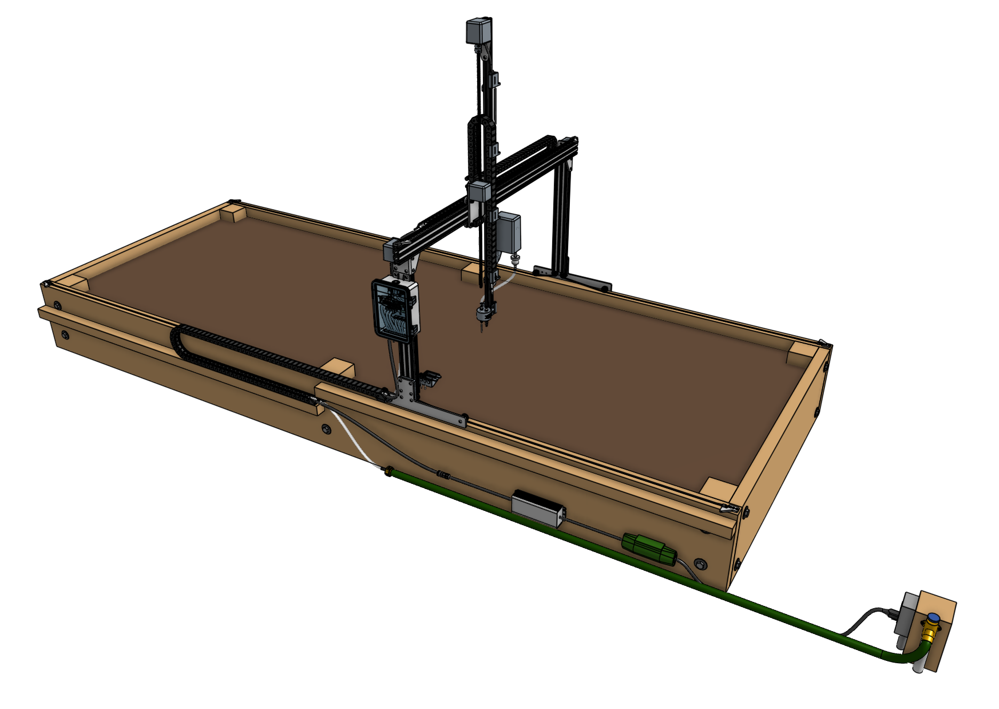
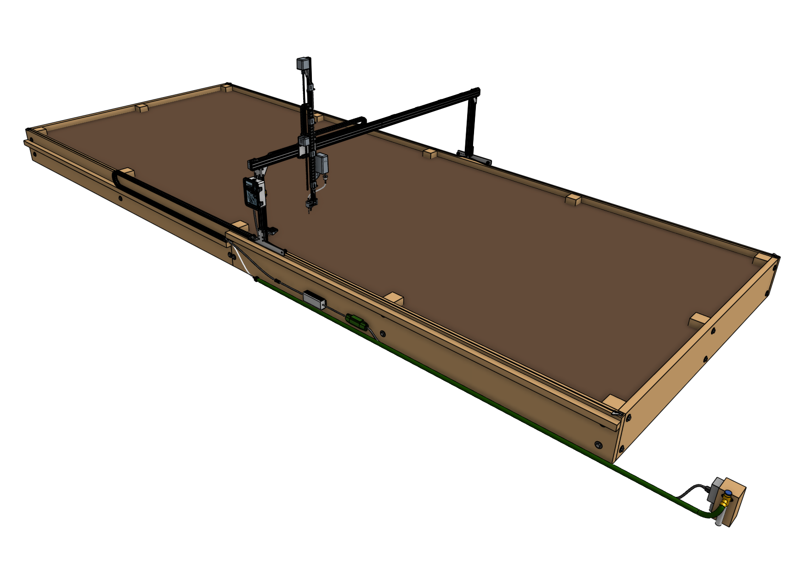

FarmBot Express and Express (XL) are primarily constructed from V-slot aluminum extrusions and aluminum plates and brackets. They are driven by four NEMA 17 stepper motors, the Farmduino Express microcontroller, and a Raspberry Pi Zero 2 W computer.



## Tracks

FarmBot Express does not have tracks like FarmBot Genesis does. Instead, Express bots roll directly on the wood raised bed. While this doesn't provide the same level of precision as aluminum tracks do, this system is much faster to install and less expensive.

The slightly lower precision is acceptable because FarmBot Express features a [[3 in 1 tool head]] and thus has no need to perform precision tool changes like FarmBot Genesis.

## Gantry

The **gantry** is the the structural component that bridges the long edges of the bed and allows the tool head to be moved in the X-direction. It also serves as a linear guide for the cross-slide, and a support structure for mounting the electronics box and seed troughs.

## Cross-slide

The **cross-slide** moves in the Y-direction across the gantry. This motion provides the second major degree of freedom for FarmBot Express and allows operations such as planting to be done anywhere in the XY plane.

## Z-axis

The **z-axis** moves through the cross-slide and provides the FarmBot with Z-direction movement. It also serves as the base for attaching the tool head, vacuum pump, and camera.

# Economies of scale

The table below shows the cost/m2 of growing area based on the size of your FarmBot. Predictably, the larger your FarmBot is, the lower the cost will be per square meter of growing area. Thus, we recommend installing the largest possible FarmBot in your space in order to get the most value out of the device.

|Model        |Width |Length |Area              |Cost    |Cost/m^2|
|-------------|------|-------|------------------|--------|--------|
|Express      |1.2m  |3m     |3.6m2  |~$1,800 |$500
|Express (XL) |2.4m  |6m     |14.4m2 |~$2,300 |$160



# What's next?

 * [Product Safety](product-safety.md)
