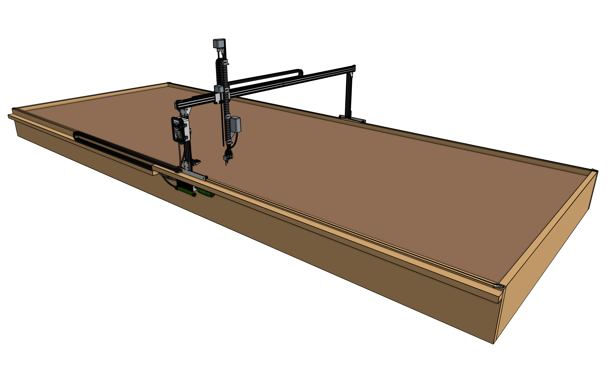



# Express v1.0





**Manufacturing**

|Model            |# of Kits Manufactured|Selling Period    |First Shipped|
|-----------------|----------------------|------------------|-------------|
|Express v1.0     |175                   |Jul '19 to Mar '21|May '20
|Express (XL) v1.0|250                   |Jul '19 to Mar '21|May '20

# What's next?

 * [Supporting Infrastructure](../supporting-infrastructure.md)
