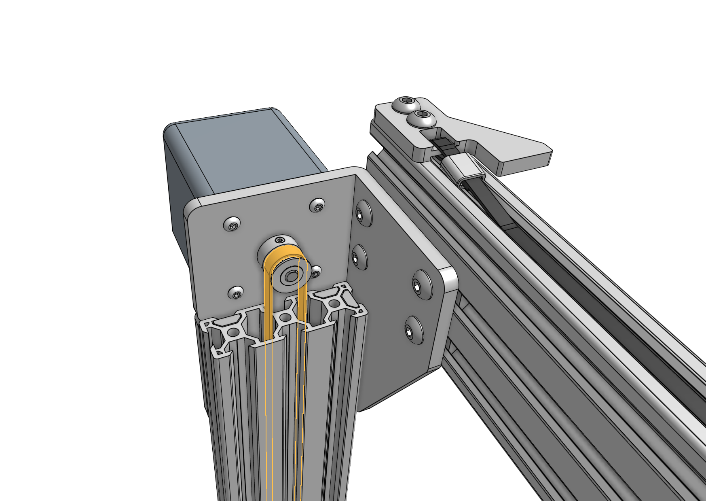
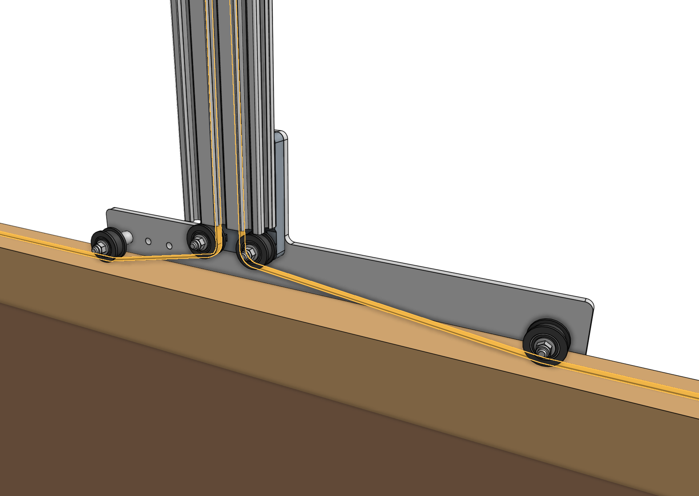
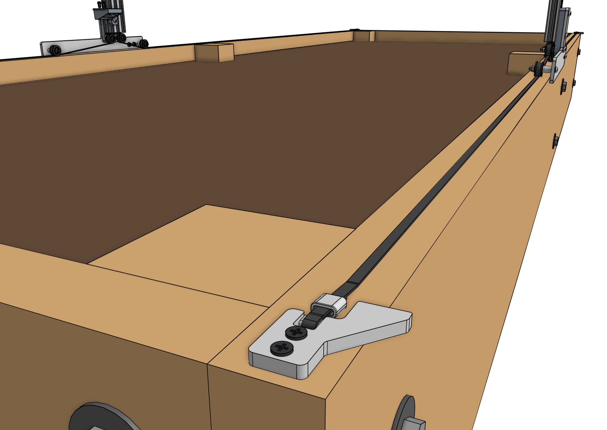
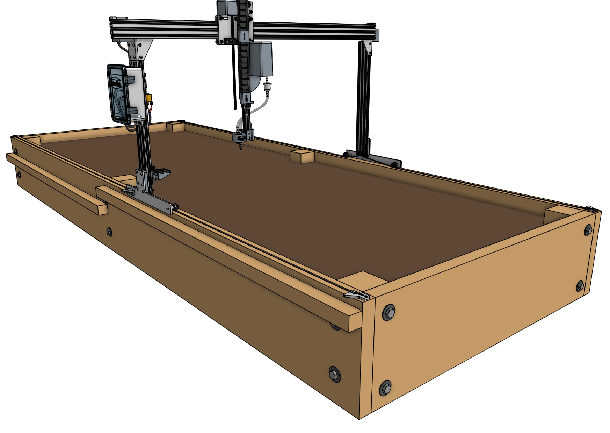
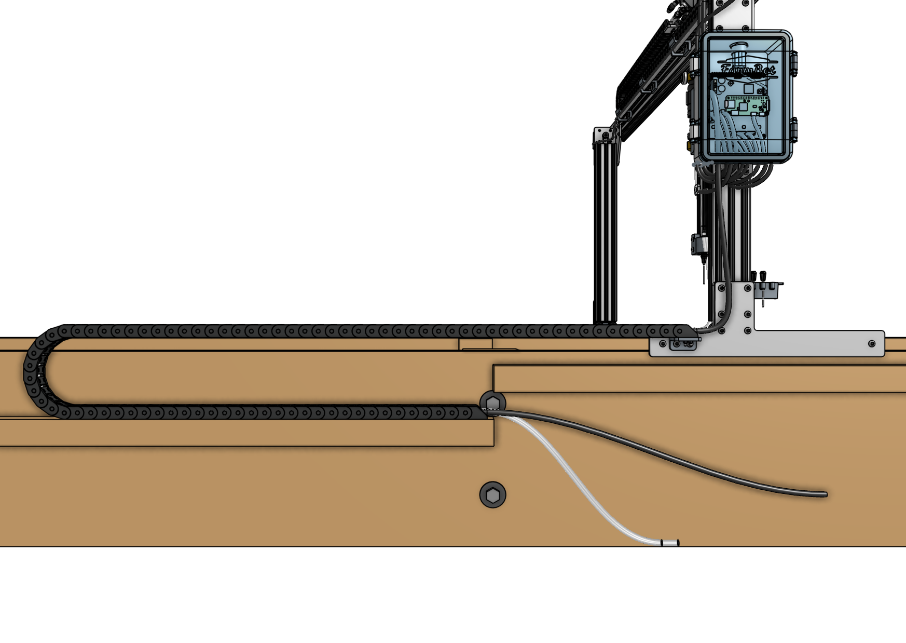
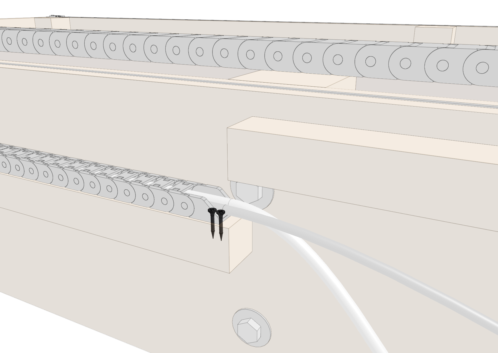
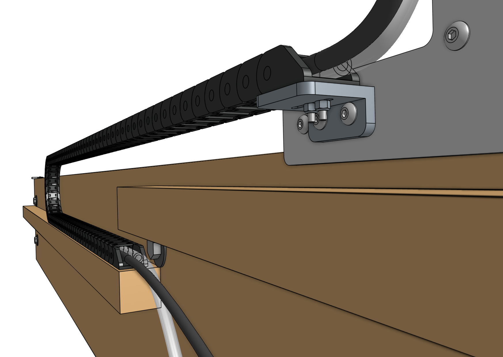

# Step 1: Route the belts

Feed each end of the x-axis [[belts]] down through the center channels in the two [[gantry columns]]. Then route the belts under the [[idler pulleys]]. Ensure there are no twists inside the extrusions. The belt teeth should be facing down towards the bed.



# Step 2: Secure the belts

Secure both ends of each [[belt]] to a [[belt clip]] using a [[belt sleeve]] and the same method used when [securing the y-axis belt](attach-the-z-axis.md#step-3-attach-the-y-axis-belt). Then attach the belt clips to the **raised bed** using two [[wood screws]]. The belt clip tabs should be extending over the outside of the bed to serve as hardstops against the gantry wheel plates.







# Step 3: Attach the x-axis cable carrier

Lay the **loaded x-axis cable carrier** onto the bed's **cable carrier support**. Fasten it to the bed with two [[wood screws]] and to the **cable carrier mount** with two [[M3 x 16mm flat head screws]] and [[M3 locknuts]].



# Step 4: Equalize the gantry



To equalize the gantry, first ensure that the x-axis motors are unpowered. For first time installation this will always be the case because we haven't yet plugged everything in!

Gently push or pull on the gantry **from the middle of the gantry main beam** such that it moves slowly along the raised bed about 30cm. This process will remove any torque on the gantry, and ensure it is not crooked. If you push or pull the gantry from one of the gantry columns, or anywhere that is not the middle of the main beam, then you will torque the gantry and make it crooked. _Don't do that!_



# What's next?

 * [Plug Everything In](plug-everything-in.md)
