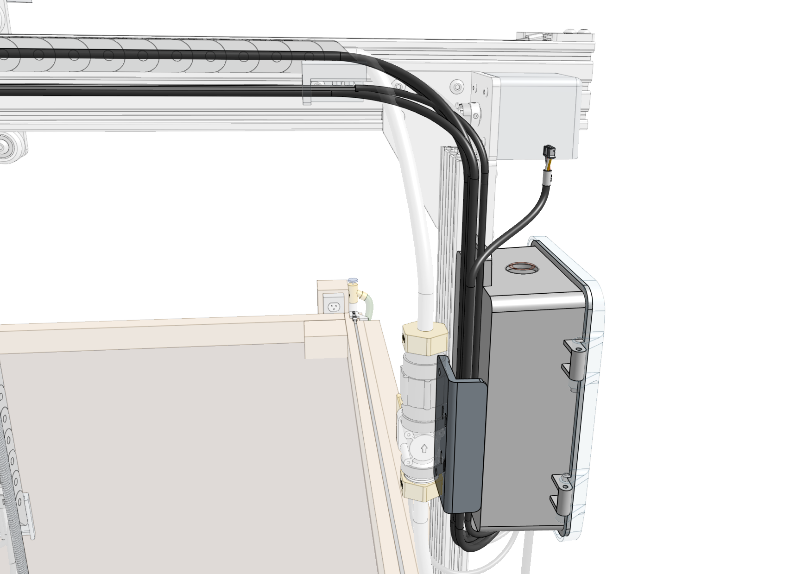
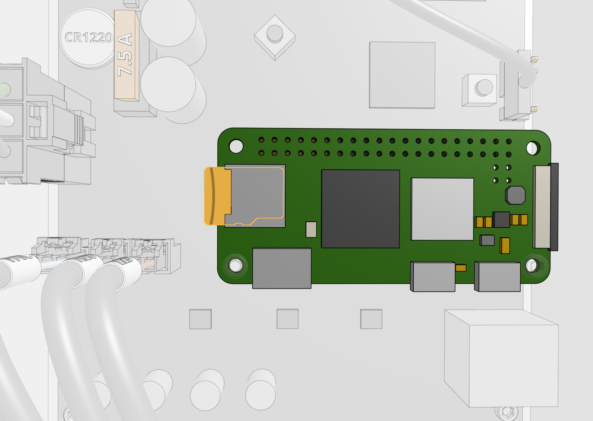



# Step 1: Connect the Y motor

Route the Y [[motor cable]] through the slot in the [[cross-slide plate]] and connect it to the **Y motor**.

# Step 2: Connect the water tubes

Connect the [[water tube]] coming from the y-axis [[cable carrier]] to the [[90-degree barb]] and the [[NPT to barb adapter]] above the [[solenoid valve]].



Connect the [[water tube]] coming from the top of the x-axis [[cable carrier]] to the [[NPT to barb adapter]] below the [[solenoid valve]].

Screw the [[garden hose to barb adapter]] onto a **garden hose** of the appropriate length. Then connect the [[water tube]] coming from the bottom of the x-axis [[cable carrier]] to the [[garden hose to barb adapter]].

# Step 3: Check for leaks

Turn on the supply of water at your **garden hose spigot** and check the FarmBot for any leaks. If your municipal water pressure is abnormally high, you may need to add [[zip ties]] to the tube-to-barb connections to prevent the tubes from popping off. In rare circumstances you also may need to add plumber's tape (PTFE tape) to the threaded connections at the hose or solenoid valve to prevent leaking.

# Step 4: Connect the Z-axis cables

Connect the cables at the junction of the y-axis and z-axis cable carriers:

* **Vacuum pump cables** labeled `VAC`
* **Z motor cables** labeled `ZY` and `ZZ`
* **Camera cables** labeled `CAM`





Pay special attention that you fully insert the 90-degree connectors together. This may require a multi-step process of pushing together, slightly tightening the thumb screws, pushing together again, and tightening some more. See the video below for detail.



# Step 5: Route the X2 motor cable and LED strip

Attach the **X2** [[motor cable]] to the **X2** [[motor]]. Then route the cable and the [[LED strip]] through the [[30mm horizontal cable carrier supports]] along the [[gantry main beam]].

# Step 6: Route all cables behind the electronics box

Route all of the cables down between the [[solenoid valve mount]] and the [[electronics box]]. You may need to temporarily disconnect the solenoid valve mount from the extrusion to facilitate fitting all of the cables in the space.

# Step 7: Plug everything in



The diagram below illustrates the FarmBot Express electronics schematic. In the following steps you'll connect each motor and peripheral one at a time, and finally the power supply.

Connect the peripheral cables to the [[Farmduino Express]] board. From left to right:

* [[Vacuum pump cable]] labeled `VAC` to the `VACUUM` connector.
* [[Solenoid valve cable]] labeled `H20` to the `WATER` connector.
* [[LED strip]] labeled `LED` to the `LIGHTING` connector.

Connect the [[motor cables]] to the [[Farmduino Express]] board. From left to right:

* Cable labeled `X1` to the `X1 MOTOR` connector. (this should be pre-connected)
* Cable labeled `X2` to the `X2 MOTOR` connector.
* Cable labeled `Y` to the `Y MOTOR` connector.
* Cable labeled `ZY` to the `Z MOTOR` connector.

Connect the [[camera cable]] to one of the **vertically oriented** USB Type-C connectors labeled `USB1` or `USB2` on the [[Farmduino Express]] board.



Connect the [[power supply cable]] to the `24V POWER IN` connector on the [[Farmduino Express]] board.

# Step 8: Flash FarmBot OS to the microSD card

Remove the [[micro SD card]] from the **Raspberry Pi Zero** and follow our [FarmBot OS installation instructions](https://software.farm.bot/docs/farmbot-os#installing-farmbot-os) to install the latest version of our software. Then reinsert the microSD card into the Pi.

# Step 9: Mount the power supply

Mount the [[power supply]] to the **bed** using four [[wood screws]]. Then connect the **power supply's output** to the [[power supply cable]].

# Step 10: Plug FarmBot into the power source



If everything looks good, and you understand the precautions needed around powered electronics, plug the [[power supply]] into a **GFCI protected outlet**. If an appropriate outlet is not close enough to plug in directly, use an extension cord of the appropriate length and the green [[power cord protector]].







# What's next?

 * [Configure FarmBot](http://configure.farm.bot)
