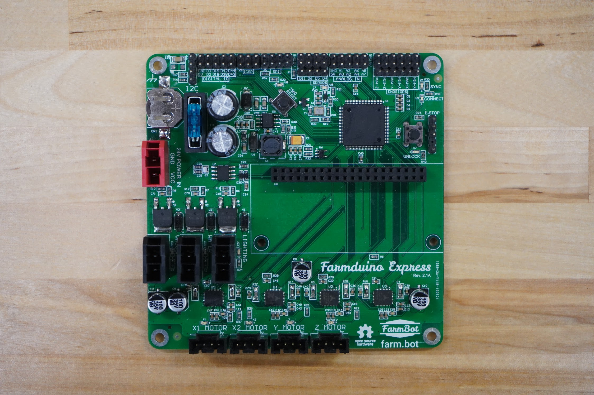
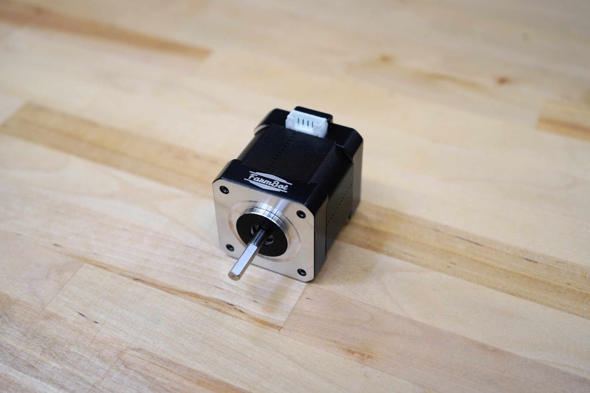

* toc
{:toc}



|Component|$/Unit|Express Qty|Express Subtotal|XL Qty|XL Subtotal|MAX Qty  |MAX Subtotal|
|------------------------------|------------------------------|------------------------------|------------------------------|------------------------------|------------------------------|------------------------------|------------------------------|
|[Electronics Box](#electronics-box)|$50.00|1|$50.00|1|$30.00|1|$30.00
|[Power Supply](#power-supply)|$60.00|1|$60.00|1|$30.00|1|$30.00
|[Power Supply Cable](#power-supply-cable)|$20.00 to $70.00|1|$20.00|1|$30.00|1|$70.00
|[Raspberry Pi Zero W](#raspberry-pi-zero-w)|$15.00|1|$15.00|1|$15.00|1|$15.00
|[MicroSD Card](#microsd-card)|$15.00|1|$15.00|1|$15.00|1|$15.00
|[E-Stop Button](#e-stop-button)|$7.00|1|$7.00|1|$7.00|1|$7.00
|[Farmduino Express](#farmduino-express)|$75.00|1|$75.00|1|$75.00|1|$75.00
|[NEMA 17 Stepper Motors](#nema-17-stepper-motors)|$20.00|4|$80.00|4|$80.00|4|$80.00
|[Motor Cables](#motor-cables)|$15.00 to $32.00|4|$80.00|4|$95.00|4|$95.00
|[X-Axis Cable Carrier](#cable-carrier)|$40.00 to $200.00 |1|$40.00|1|$70.00|1|$200.00
|[Y-Axis Cable Carrier](#cable-carrier)|$30.00 to $50.00|1|$30.00|1|$50.00|1|$50.00
|[Z-Axis Cable Carriers](#cable-carrier)|$20.00|1|$20.00|1|$20.00|1|$20.00
|[Solenoid Valve](#solenoid-valve)|$8.00|1|$8.00|1|$8.00|1|$8.00
|[Solenoid Valve Cable](#solenoid-valve-cable)|$10.00|1|$10.00|1|$10.00|1|$10.00
|[Vacuum Pump](#vacuum-pump)|$15.00|1|$15.00|1|$15.00|1|$15.00
|[Vacuum Pump Cable](#vacuum-pump-cable)|$15.00 to $20.00|1|$15.00|1|$20.00|1|$20.00
|[Camera](#camera) |$30.00|1|$30.00|1|$30.00|1|$30.00
|[Camera Cable](#camera-cable)|$15.00 to $20.00|1|$15.00|1|$20.00|1|$20.00
|[Camera Calibration Card](#camera-calibration-card)|$1.00|1|$1.00|1|$1.00|1|$1.00
|[LED Strip](#led-strip)|$20.00 to $40.00|1|$20.00|1|$40.00|1|$40.00
|[Power Cord Protector](#power-cord-protector)|$7.00|1|$7.00|1|$7.00|1|$7.00
|**TOTALS** | |**28**|**$623.00**|**28**|**$728.00**|**28**|**$898.00**

# Raspberry Pi Zero W
This is the "host computer" of FarmBot. You might also call it FarmBot's brain. The Raspberry Pi runs FarmBot OS, communicates with the web application over ethernet or WiFi, and talks to the Farmduino Express over a serial connection.

| | |
|------------------------------|------------------------------|
|**CPU**  |1Ghz single core processor
|**RAM**  |512MB
|**WiFi** |2.4GHz 802.11n wireless
|**USB**  |1x micro USB port
|**Storage**|MicroSD
|**GPIO** |40-pin header
|**Price**|$15.00
|**Quantity**|1



# Farmduino Express
The Farmduino Express board receives G-code commands from the Raspberry Pi and then moves the motors, reads sensors, activate peripherals, and more.



| | |
|------------------------------|------------------------------|
|**Microcontrollers**  |ATmega2560
|**Input Voltage** |24V
|**Power Connector**   |[Molex Part Number 151048-1209](https://www.molex.com/molex/products/datasheet.jsp?part=active/1510481209_PCB_HEADERS.xml)
|**Peripheral Connectors** |[Molex Part Number 151048-1206](https://www.molex.com/molex/products/datasheet.jsp?part=active/1510481206_PCB_HEADERS.xml)
|**DC Current per I/O Pin**|40 mA
|**DC Current for 3.3V Pin**   |50 mA
|**Flash Memory**|256 KB (8 KB used by bootloader)
|**SRAM** |8 KB
|**EEPROM** |4 KB
|**Clock Speed** |16 MHz
|**Price**|$75.00
|**Quantity**|1

# NEMA 17 Stepper Motors
These powerful 200 resolution stepper motors allow FarmBot to move precisely in the X, Y, and Z directions. Download the [motor spec sheet](https://drive.google.com/file/d/1Ehqu20q84Lyycn1fOj6dvWKbrMLvoNv4/view?usp=sharing).

|Motor Specs| |
|------------------------------|------------------------------|
|**Motor Resolution**  |200 steps/revolution (1.8 deg/step)
|**Winding Type**|Bipolar
|**Voltage**|12V
|**Current Draw**|1.68A max
|**Shaft Diameter**|5mm diameter
|**Mount Hole Pattern**|4x M3 holes, standard NEMA 17 pattern
|**Motor Connector**   |6-pin connector (only 4 pins used)
|**Price**|$20.00
|**Quantity**|4

# Cable Carrier
These hollow plastic chains are used throughout FarmBot to manage cables and tubing along each of the three axes.

| | |
|------------------------------|------------------------------|
|**Material**|Nylon PA66
|**Lengths**|**Express** X-Axis - 1.7m (85 links + end pieces) Y-Axis - 1.4m (70 links + end pieces) Z-Axis - 0.74m (37 links + end pieces)  **Express XL** X-Axis - 3.2m (160 links + end pieces) Y-Axis - 2.6m (130 links + end pieces) Z-Axis - 0.74m (37 links + end pieces)
|**Inside Height** |15mm
|**Inside Width**|30mm
|**Outside Height**|20mm
|**Outside Width** |38.2mm
|**Pitch**|20mm
|**Bending Radius**|28mm
|**Price**|**Express** X-Axis - $40.00 Y-Axis - $30.00 Z-Axis - $20.00  **Express XL** X-Axis - $70.00 Y-Axis - $50.00 Z-Axis - $20.00
|**Quantity**|1 for each axis

