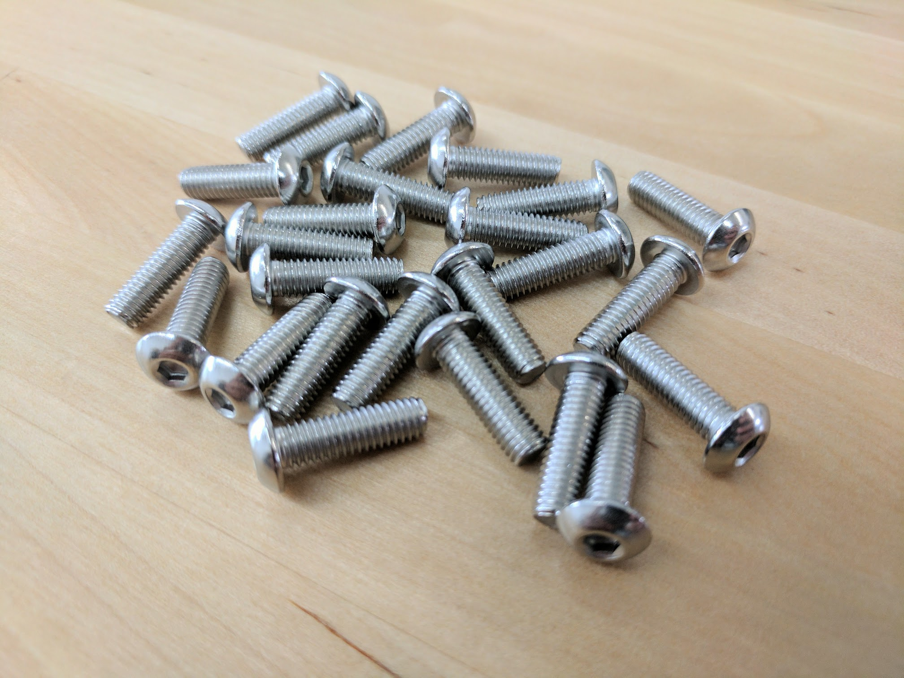
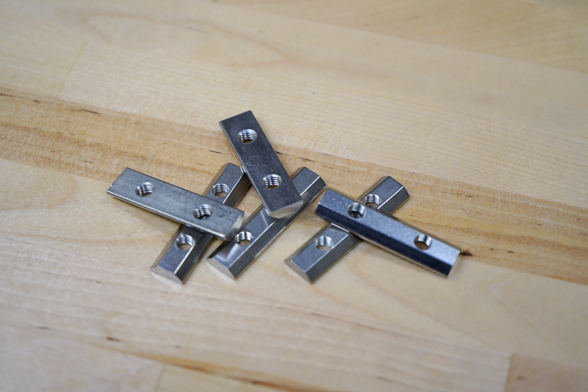

* toc
{:toc}



|Component                     |$/Unit                        |Express Qty                   |Express Subtotal              |XL Qty                        |XL Subtotal                   |MAX Qty                       |MAX Subtotal                  |
|------------------------------|------------------------------|------------------------------|------------------------------|------------------------------|------------------------------|------------------------------|------------------------------|
|[M2.5 x 4mm Screws](#m25-x-4mm-screws)|$0.15                         |8                             |$1.20                         |8                             |$1.20                         |8                             |$1.20
|[M2.5 x 11mm F/F Standoffs](#standoffs)|$0.50                         |2                             |$1.00                         |2                             |$1.00                         |2                             |$1.00
|[M3 x 12mm Screws](#m3-x-12mm-screws)|$0.15                         |16                            |$2.40                         |16                            |$2.40                         |16                            |$2.40
|[M3 Locknuts](#m3-locknuts)|$0.10                         |4                             |$0.40                         |4                             |$0.40                         |4                             |$0.40
|[M5 x 10mm Screws](#m5-x-10mm-screws)|$0.15                         |56                            |$8.40                         |72                            |$10.80                        |72                            |$10.80
|[M5 x 16mm Screws](#m5-x-16mm-screws)|$0.20                         |14                            |$2.80                         |14                            |$2.80                         |14                            |$2.80
|[M5 x 20mm Screws](#m5-x-20mm-screws)|$0.24                         |12                            |$2.88                         |12                            |$2.88                         |12                            |$2.88
|[M5 x 25mm Screws](#m5-x-25mm-screws)|$0.26                         |2                             |$0.52                         |2                             |$0.52                         |2                             |$0.52
|[M5 x 30mm Screws](#m5-x-30mm-screws)|$0.30                         |12                            |$3.60                         |12                            |$3.60                         |12                            |$3.60
|[M5 x 40mm Screws](#m5-x-40mm-screws)|$0.40                         |8                             |$3.20                         |8                             |$3.20                         |8                             |$3.20
|[M5 Flange Locknuts](#m5-flange-locknuts)|$0.20                         |34                            |$6.80                         |34                            |$6.80                         |34                            |$6.80
|[M5 x 6mm Spacers](#m5-x-6mm-spacers)|$0.20                         |5                             |$1.00                         |5                             |$1.00                         |5                             |$1.00
|[M5 x 14.5mm Spacers](#m5-x-145mm-spacers)|$0.30                         |4                             |$1.20                         |4                             |$1.20                         |4                             |$1.20
|[M5 x 6mm Eccentric Spacers](#m5-x-6mm-eccentric-spacers)|$2.00                         |5                             |$10.00                        |5                             |$10.00                        |5                             |$10.00
|[M5 Tee Nuts](#m5-tee-nuts)|$0.40                         |10                            |$4.00                         |10                            |$4.00                         |10                            |$4.00
|[20mm Nut Bar](#20mm-nut-bar)|$1.50                         |2                             |$3.00                         |2                             |$3.00                         |2                             |$3.00
|[40mm Nut Bar](#40mm-nut-bar)|$1.75                         |11                            |$19.25                        |15                            |$26.25                        |15                            |$26.25
|[60mm Nut Bar](#60mm-nut-bar)|$2.00                         |17                            |$34.00                        |21                            |$42.00                        |21                            |$42.00
|[25mm Wood Screws](#wood-screws)|$0.05                         |15                            |$0.75                         |15                            |$0.75                         |15                            |$0.75
|[200mm Zip Ties](#200mm-zip-ties)|$0.10                         |4                             |$0.40                         |4                             |$0.40                         |4                             |$0.40
|[3mm Hex Driver](#3mm-hex-driver)|$5.00                         |1                             |$5.00                         |1                             |$5.00                         |1                             |$5.00
|[8mm Wrench](#8mm-wrench)|$3.00                         |1                             |$3.00                         |1                             |$3.00                         |1                             |$3.00
|**TOTALS**                    |                              |**243**                       |**$114.80**                   |**270**                       |**$138.20**                   |**270**                       |**$138.20**

# M2.5 Screws
These screws are used to mount the electronics boards into the electronics box.

|                              |                              |
|------------------------------|------------------------------|
|**Length**                    |4mm
|**Threads**                   |M2.5
|**Drive Size**                |2mm
|**Price**                     |$0.15
|**Quantity**                  |8

## M2.5 x 4mm Screws

# M3 Screws
M3 screws are used throughout FarmBot for mounting motors and other small electronic components on the tools.

|                              |                              |
|------------------------------|------------------------------|
|**Trade Name**                |M3 Low-Profile Socket Head Cap Screw
|**Material**                  |18-8 Stainless Steel
|**Lengths**                   |12mm
|**Threads**                   |M3 x 0.5mm
|**Head Height**               |2mm
|**Head Diameter**             |5.5mm
|**Socket Size**               |2mm Hex
|**Tensile Strength**          |70,000 psi
|**Price**                     |12mm - $0.15
|**Quantity**                  |12mm - 16

## M3 x 12mm Screws

# M5 Screws
M5 button-head screws of various lengths are used throughout FarmBot to attach plates and 3D printed parts to extrusions, V-wheels to plates, and other components together. They are usually used in combination with M5 washers, and terminated with an M5 tee nut or locknut. The button head provides a wide bearing surface, a low-profile head, and a finished appearance. Length is measured from under the head.

|                              |                              |
|------------------------------|------------------------------|
|**Trade Name**                |Button-Head Socket Cap Screw
|**Material**                  |18-8 Stainless Steel
|**Tensile Strength**          |70,000psi
|**Lengths**                   |10, 16, 20, 25, 30 and 40mm
|**Threads**                   |M5, 0.8 pitch
|**Head Type**                 |3mm Hex
|**Head Height**               |2.75mm
|**Head Diameter**             |9.5mm
|**Price**                     |10mm - $0.15 16mm - $0.20 20mm - $0.24 25mm - $0.26 30mm - $0.30 40mm - $0.40
|**Quantity**                  |10mm - Express: 56, Express XL and MAX: 72 16mm - Express: 14, Express XL and MAX: 14 20mm - Express: 12, Express XL and MAX: 12 25mm - Express: 2, Express XL and MAX: 2 30mm - Express: 12, Express XL and MAX: 12 40mm - Express: 8, Express XL and MAX: 8

## M5 x 10mm Screws

## M5 x 16mm Screws

## M5 x 20mm Screws

## M5 x 25mm Screws

## M5 x 30mm Screws

## M5 x 40mm Screws

# Locknuts
Locknuts are used throughout FarmBot to secure M3 and M5 screws in place. The nylon insert allows the locknut to resist loosening when subjected to vibration.

|                              |                              |
|------------------------------|------------------------------|
|**Trade Name**                |Nylon-Insert Locknut
|**Threads**                   |M3 x 0.5mm, M5 x 0.8mm
|**Height**                    |M3 - 4mm M5 - 5mm
|**Width**                     |M3 - 5.5mm M5 - 8mm
|**Material**                  |18-8 Stainless Steel
|**Price**                     |M3 - $0.10 M5 - $0.15
|**Quantity**                  |M3 - 4 M5 - 34

## M3 Locknuts

## M5 Flange Locknuts

# Spacers
These spacers are used to offset V-wheels from plates so that they may engage extrusions.

|                              |                              |
|------------------------------|------------------------------|
|**Material**                  |Aluminum
|**Outer Diameter**            |10mm
|**Inner Diameter**            |5.10mm
|**Length**                    |6mm, 14.5mm
|**Price**                     |6mm - $0.20 14.5mm - $0.30
|**Quantity**                  |6mm - 5 14.5mm - 4

## M5 x 6mm Spacers

## M5 x 14.5mm Spacers

# Eccentric Spacers
When rotated, eccentric spacers accurately position V-wheels on a plate such that they can firmly engage V-slot aluminum extrusions. They are only used on wheels on one side of an extrusion. Adjustments are made by using a 8mm wrench on the spacer itself.

|                              |                              |
|------------------------------|------------------------------|
|**Material**                  |Stainless Steel
|**Height**                    |6mm (not including rim)
|**Bore**                      |5mm
|**Rim**                       |Fits into a 7.12mm hole
|**Hex Size**                  |8mm
|**Divot**                     |Indicates shortest distance from rim to bore
|**Price**                     |$2.00
|**Quantity**                  |5

## M5 x 6mm Eccentric Spacers

# Standoffs
These F/F standoffs are used to offset the Raspberry Pi Zero from the Farmduino Express board.

|                              |                              |
|------------------------------|------------------------------|
|**Material**                  |Stainless steel
|**Lengths**                   |11mm
|**Male Threads**              |M2.5
|**Female Threads**            |M2.5, 4mm length
|**Price**                     |$0.50
|**Quantity**                  |4

# Tee Nuts
Combined with screws, these drop-in style tee nuts allow components such as plates and 3D printed parts to be attached quickly and securely anywhere on a V-slot aluminum extrusion.

|                              |                              |
|------------------------------|------------------------------|
|**Trade Name**                |Drop-in Tee Nut
|**Material**                  |Stainless Steel
|**Threads**                   |M5 x 0.8mm pitch
|**Fits Slot Size**            |6
|**Price**                     |$0.40
|**Quantity**                  |10

## M5 Tee Nuts

# Nut Bars
These stainless steel bars act as long tee nuts allowing two screws to securely hold plates, brackets, and other components to a v-slot extrusion.

|                              |                              |
|------------------------------|------------------------------|
|**Material**                  |Stainless steel
|**Threads**                   |M5 x 0.8mm pitch
|**Fits Slot Size**            |6
|**Price**                     |20mm - $1.50 40mm - $1.75 60mm - $2.00
|**Quantity**                  |20mm - Express: 2, Express XL and MAX: 2 40mm - Express: 11, Express XL and MAX: 15 60mm - Express: 17, Express XL and MAX: 21

## 20mm Nut Bar

## 40mm Nut Bar

## 60mm Nut Bar

# Wood Screws
These are used to attach the track end plates and track joining plates to supporting infrastructure such as a raised.

|                              |                              |
|------------------------------|------------------------------|
|**Material**                  |Steel
|**Finish**                    |Black Oxide
|**Length**                    |25mm
|**Head Diameter**             |12mm
|**Price**                     |$0.05
|**Quantity**                  |15

# Zip Ties
Zip ties are used to fasten the vacuum pump and solenoid valve.

|                              |                              |
|------------------------------|------------------------------|
|**Material**                  |Nylon
|**Color**                     |Black
|**Length**                    |200mm
|**Price**                     |$0.10
|**Quantity**                  |10

## 200mm Zip Ties

# 3mm Hex Driver
This hex (allen) driver is used to tighten all of the M5 screws on FarmBot.

|                              |                              |
|------------------------------|------------------------------|
|**Hex Size**                  |3mm
|**Bit Material**              |Hardened steel with a titanium nitride coating
|**Handle Material**           |Anodized aluminum
|**Price**                     |$5.00
|**Quantity**                  |1

# 8mm Wrench
The wrench is for tightening M5 locknuts and adjusting eccentric spacers throughout FarmBot.

|                              |                              |
|------------------------------|------------------------------|
|**Size**                      |8mm
|**Price**                     |$3.00
|**Quantity**                  |1

