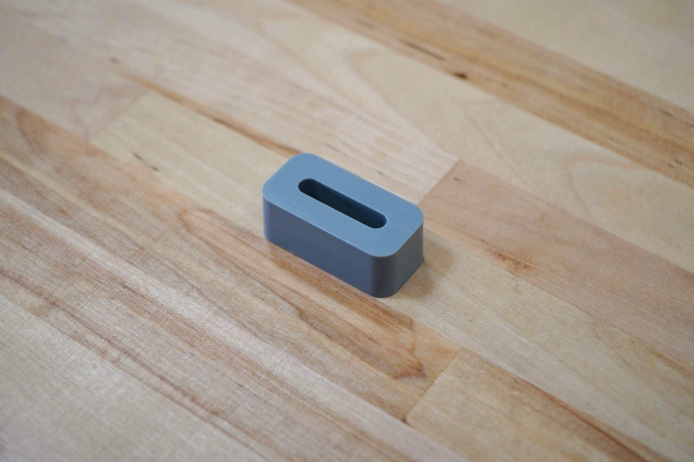
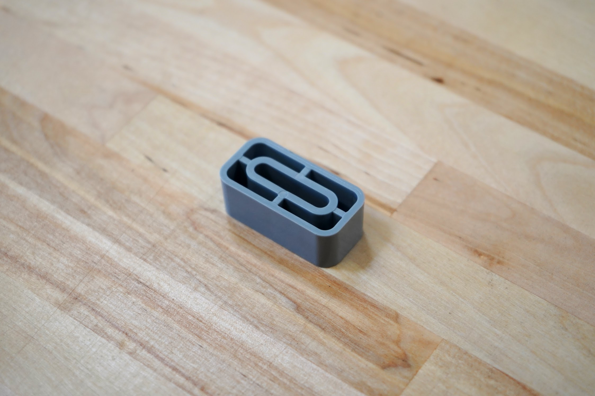

* toc
{:toc}

|                              |                              |
|------------------------------|------------------------------|
|**Material**                  |Gray UV stabilized ABS
|**Price**                     |$3.00
|**Quantity**                  |1
|**Recommended Supplier**      |[The FarmBot Shop](http://shop.farm.bot)

|                              |                              |
|------------------------------|------------------------------|
|**Internal Part Name**        |`40mm CC Spacer Block Rev A`
{:.internal}

