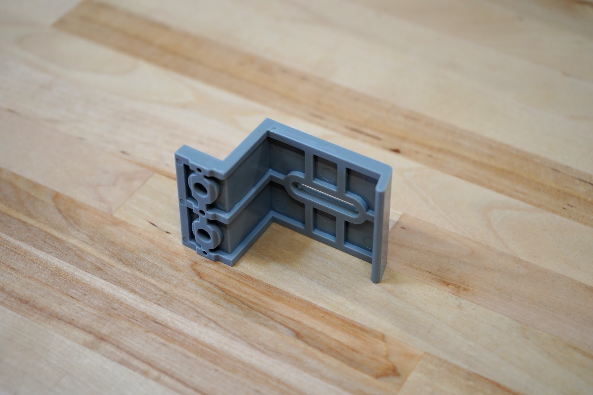

* toc
{:toc}

# 40mm Horizontal Cable Carrier Support

|                              |                              |
|------------------------------|------------------------------|
|**Material**                  |Gray UV stabilized ABS
|**Price**                     |$3.00
|**Quantity**                  |Express - 4 Express XL - 8
|**Recommended Supplier**      |[The FarmBot Shop](http://shop.farm.bot)

|                              |                              |
|------------------------------|------------------------------|
|**Internal Part Name**        |`40mm Horizontal CC Support Rev B`
{:.internal}



# 40mm Vertical Cable Carrier Support

|                              |                              |
|------------------------------|------------------------------|
|**Material**                  |Gray UV stabilized ABS
|**Price**                     |$3.00
|**Quantity**                  |4
|**Recommended Supplier**      |[The FarmBot Shop](http://shop.farm.bot)

|                              |                              |
|------------------------------|------------------------------|
|**Internal Part Name**        |`40mm Vertical CC Support Rev B`
{:.internal}

