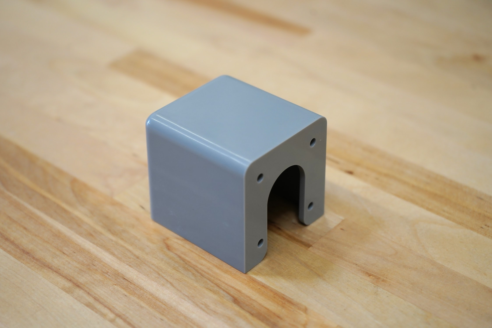
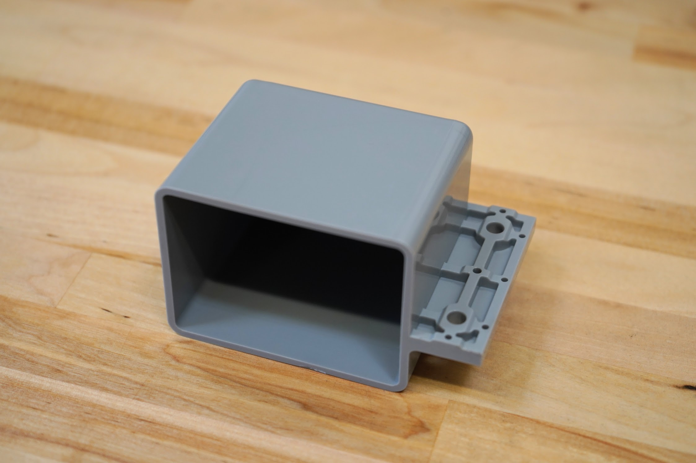

* toc
{:toc}

# 50mm Horizontal Motor Housing

|                              |                              |
|------------------------------|------------------------------|
|**Material**                  |Gray UV stabilized ABS
|**Price**                     |$8.00
|**Quantity**                  |3
|**Recommended Supplier**      |[The FarmBot Shop](http://shop.farm.bot)

|                              |                              |
|------------------------------|------------------------------|
|**Internal Part Name**        |`50mm Horizontal Motor Housing Rev A`
{:.internal}

# 60mm Vertical Motor Housing

|                              |                              |
|------------------------------|------------------------------|
|**Material**                  |Gray UV stabilized ABS
|**Price**                     |$10.00
|**Quantity**                  |1
|**Recommended Supplier**      |[The FarmBot Shop](http://shop.farm.bot)

|                              |                              |
|------------------------------|------------------------------|
|**Internal Part Name**        |`60mm Vertical Motor Housing Rev B`
{:.internal}


