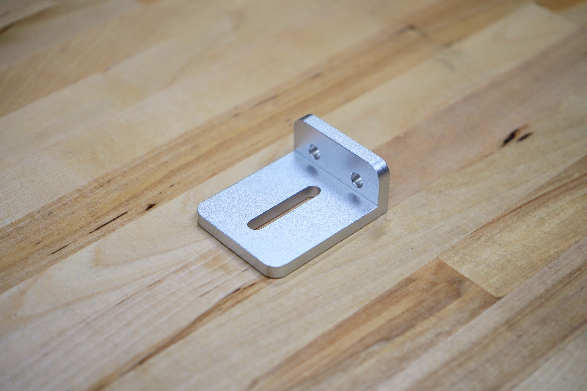

* toc
{:toc}

# 50mm Cable Carrier Mount
This part allows the x-axis cable carrier to be mounted to the gantry column.

|                              |                              |
|------------------------------|------------------------------|
|**Material**                  |Machined 6061 Aluminum
|**Surface Treatments**        |Tumble polished Sandblasted Clear anodized
|**Price**                     |$8.00
|**Quantity**                  |1
|**Recommended Supplier**      |[The FarmBot Shop](http://shop.farm.bot)

|                              |                              |
|------------------------------|------------------------------|
|**Internal Part Name**        |`50mm CC Mount Rev A`
{:.internal}

# 65mm Cable Carrier Mount
This part allows the y-axis cable carrier to be mounted to the cross-slide plate.

|                              |                              |
|------------------------------|------------------------------|
|**Material**                  |Machined 6061 Aluminum
|**Surface Treatments**        |Tumble polished Sandblasted Clear anodized
|**Price**                     |$10.00
|**Quantity**                  |1
|**Recommended Supplier**      |[The FarmBot Shop](http://shop.farm.bot)

|                              |                              |
|------------------------------|------------------------------|
|**Internal Part Name**        |`65mm CC Mount Rev A`
{:.internal}

