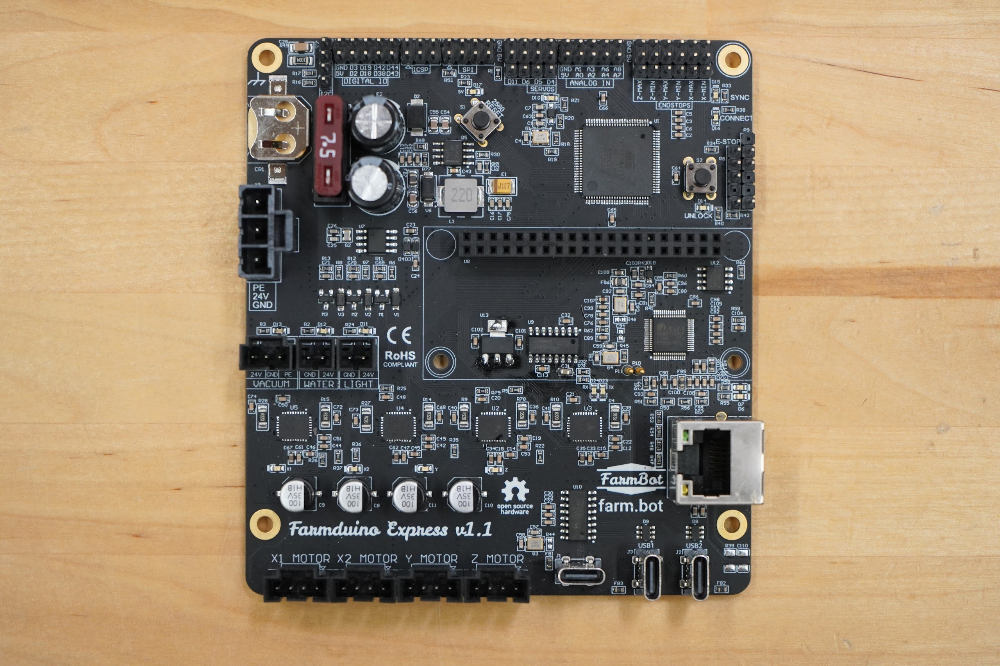

| ID        |board |schematic| source | description                   | color  | location | statuses     |
|-----------|------|---------|--------|-------------------------------|--------|----------|--------------|
| PWR       | D17  | V8      |        | Farmduino power               | red    | board    | solid        |
| D13       | V9   | V9      | D13    | controllable LED              | green  | board    | solid        |
| SYNC      | D15  | V4      | GPIO24 | FarmBot OS sync               | green  | board    | solid, blink |
| CONNECT   | D16  | V5      | GPIO25 | FarmBot OS account connection | blue   | board    | solid, blink |
| UNLOCK    | D14  | V7      | GPIO23 | E-STOP unlock                 | yellow | board    | blink        |
| ESTOP     |      |         | GPIO17 | E-STOP                        | red    | box      | solid, blink |
| VACUUM    | D13  | LED3    | D9     | VACUUM power                  | green  | board    | solid        |
| WATER     | D12  | LED2    | D8     | WATER power                   | green  | board    | solid        |
| LIGHT     | D11  | LED1    | D7     | LIGHT power                   | green  | board    | solid        |
| TX        | D23  | V10     | TX0    | firmware transmit             | yellow | board    | blink        |
| RX        | D24  | V11     | RX0    | firmware receive              | green  | board    | blink        |
| FDX_LED   | D6   | D6      |        | ethernet duplex               | green  | board    | solid, blink |
| USB_LED   | D7   | D7      |        | ethernet USB                  | green  | board    | solid, blink |
| LINK_LED  |      |         |        | ethernet link                 | green  | eth      | solid, blink |
| SPEED_LED |      |         |        | ethernet speed                | yellow | eth      | solid, blink |
| X1        | X1   | X1      | D26    | X1 motor power / activity     | green  | board    | solid, blink |
| X2        | X2   | X2      | D15    | X2 motor power / activity     | green  | board    | solid, blink |
| Y         | Y    | Y       | D32    | Y motor power / activity      | green  | board    | solid, blink |
| Z         | Z    | Z       | D35    | Z motor power / activity      | green  | board    | solid, blink |
| PI        |      |         |        | Raspberry pi power / activity | green  | pi       | solid, blink |

