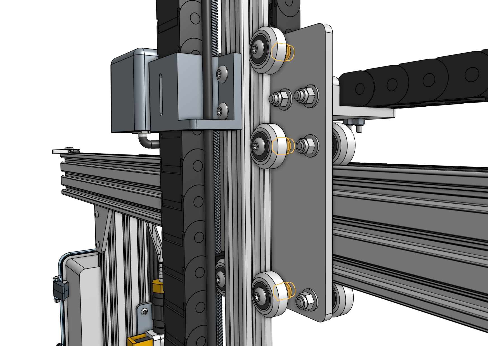
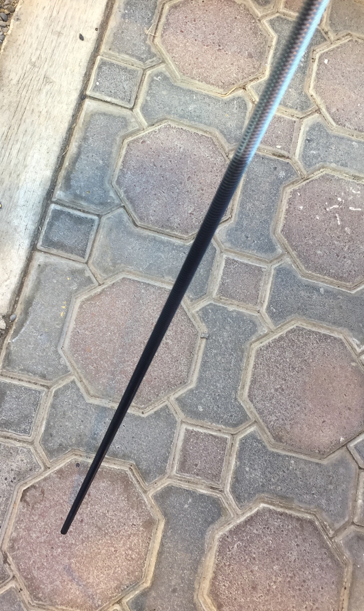
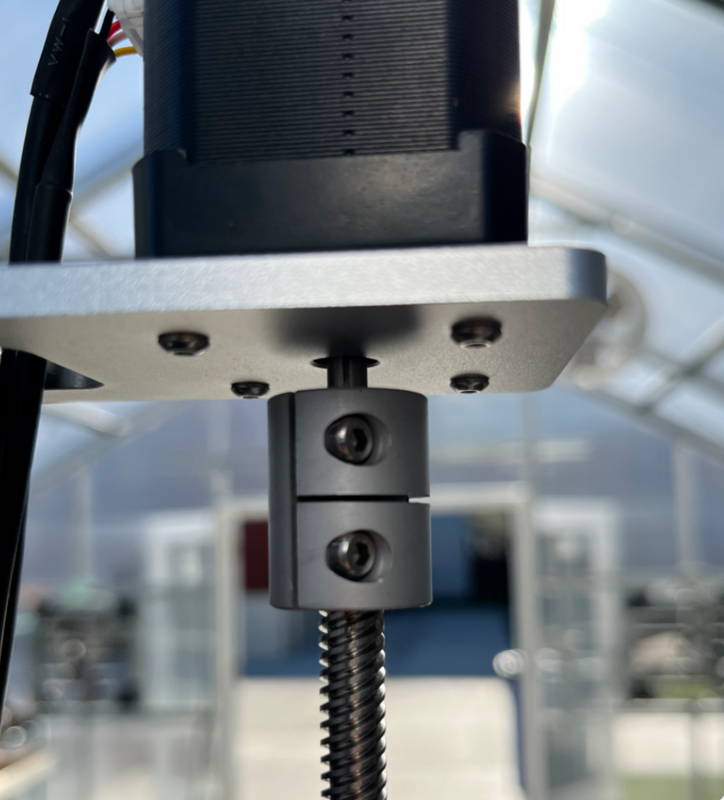

# 1. Check the z-axis eccentric spacers

Check the [[eccentric spacers]] on the [[cross-slide plate]] that are used to adjust the [[V-wheels]] that support the [[z-axis extrusion]]. If the eccentric spacers are adjusted too tightly, then they will exert too much force onto the z-axis extrusion which can make it difficult or impossible for the z-axis motor to raise the z-axis. With the FarmBot powered off, you should be able to rotate the leadscrew by hand without too much effort.



# 2. Lubricate the leadscrew

Dust and debris can build up on the [[leadscrew]] and cause additional friction between the leadscrew and the [[leadscrew block]]. Clean the leadscrew with a rag and then use a **dry graphite lubricant spray** such as [Jig-a-Loo Graphite Lubricant](https://www.amazon.com/dp/B08285N7LG/) to coat the bottom 90% of the leadscrew surface with a fast drying coating of graphite. Leave the very top 10% unlubricated so that a sturdy grip can be applied to leadscrew by the coupler.

Apply enough graphite lubricant so that the hue of the screw looks significantly darker than the original silver metallic color. You should use enough graphite lubricant so that the screw should appear black or dark grey. This will create a slippery surface that reduces the resistance of movement through the leadscrew block and also may decrease any noise from the leadscrew.





# 3. Adjust the z-axis speed and acceleration

Try lowering the z-axis **[MAX SPEED TOWARDS HOME](https://my.farm.bot/app/designer/settings?highlight=max_speed_towards_home)** by 10% and increasing the z-axis **[ACCELERATE FOR TOWARDS HOME](https://my.farm.bot/app/designer/settings?highlight=accelerate_for_towards_home)** by 25%. Because every FarmBot installation is a bit different, you will need to experiment to find the best values for you.

# 4. Turn off stall detection and adjust motor settings

If the troubleshooting steps above are not successful, try disabling stall detection for the z-axis. This will unlock slower motor speeds and higher motor current which can help the z-axis move more reliably.

- Disable z-axis **[STALL DETECTION](https://my.farm.bot/app/designer/settings?highlight=stall_detection)**
- Increase the z-axis **[MOTOR CURRENT](https://my.farm.bot/app/designer/settings?highlight=motor_current)** to 100%
- Decrease the z-axis **[MIN SPEED](https://my.farm.bot/app/designer/settings?highlight=min_speed)**, **[MAX SPEED](https://my.farm.bot/app/designer/settings?highlight=max_speed)**, and **[MAX SPEED TOWARDS HOME](https://my.farm.bot/app/designer/settings?highlight=max_speed_towards_home)**
- Increase the z-axis **[ACCELERATE FOR](https://my.farm.bot/app/designer/settings?highlight=accelerate_for)** and **[ACCELERATE FOR TOWARDS HOME](https://my.farm.bot/app/designer/settings?highlight=accelerate_for_towards_home)**



# 5. Check the shaft coupler for slipping

The aluminum [[shaft coupler]] connects the Z-axis [[motor]] to the [[leadscrew]] to allow FarmBot to move in the Z direction up and down depending on the rotation of the motor.

Check to make sure that the shaft coupler is not slipping as it transfers rotational power from the motor to the leadscrew. If there is slipping, tighten the screws on the coupler. You may optionally use blue Loctite to prevent the screws from loosening over time.

