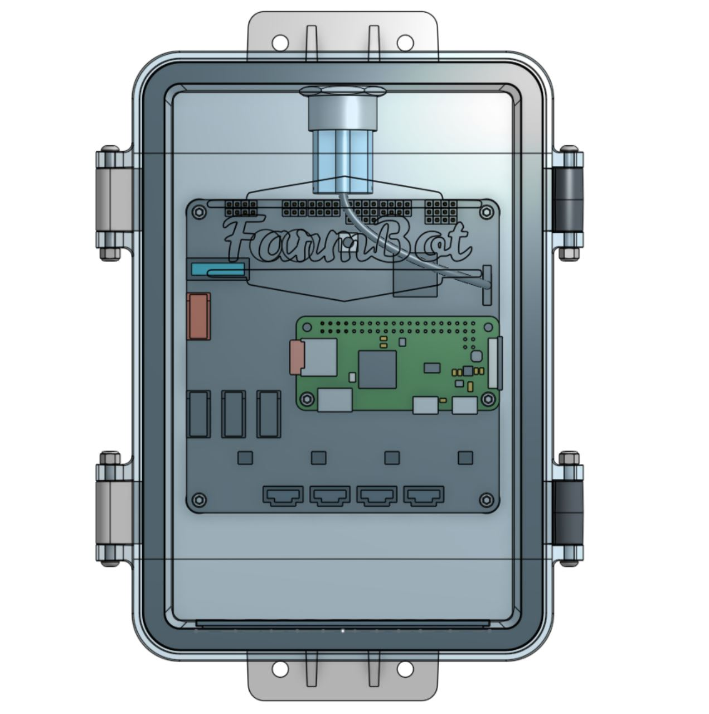
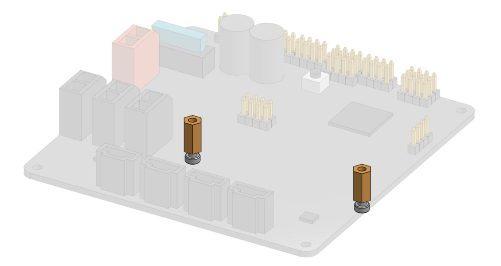
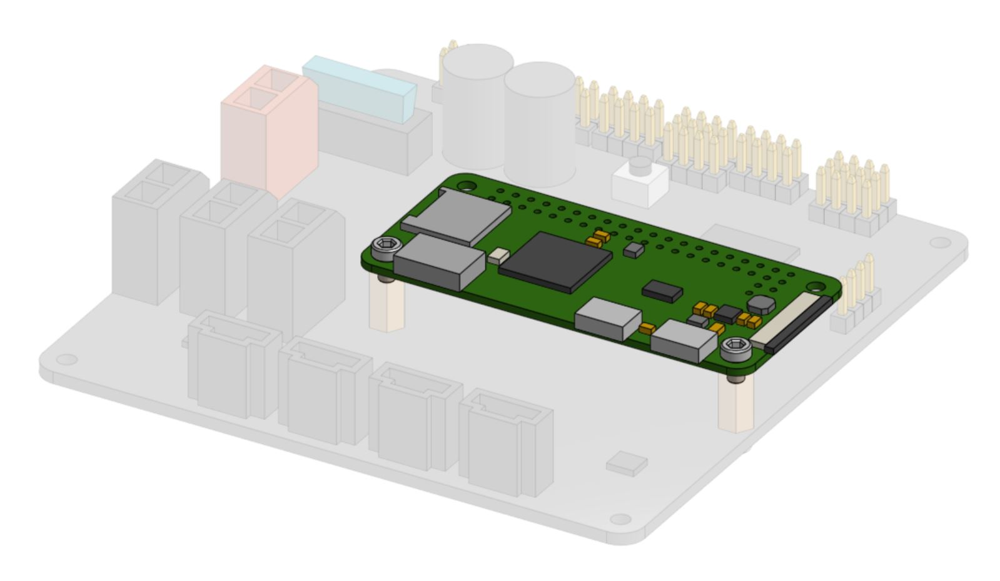
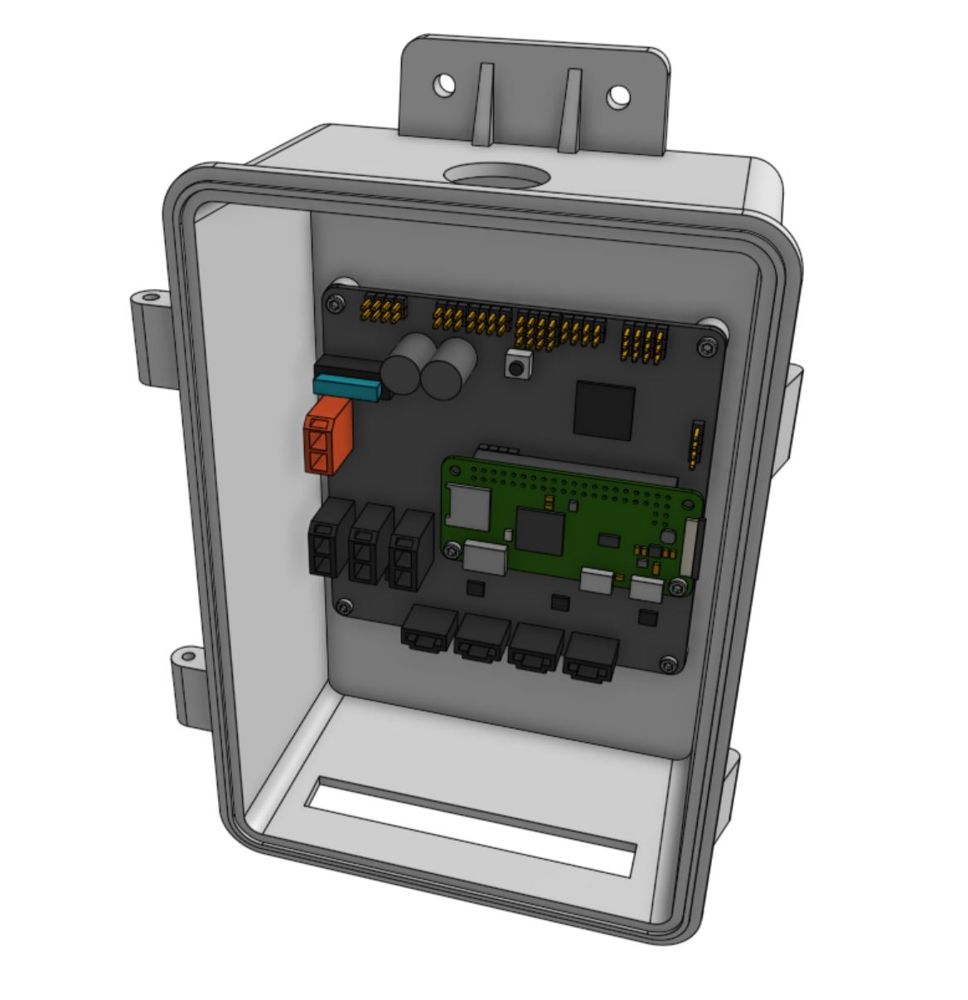
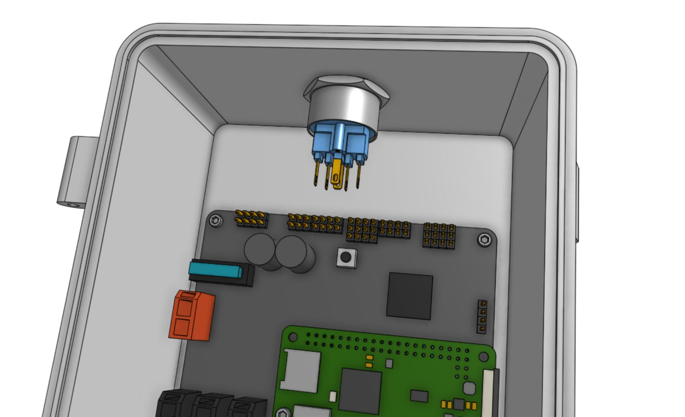
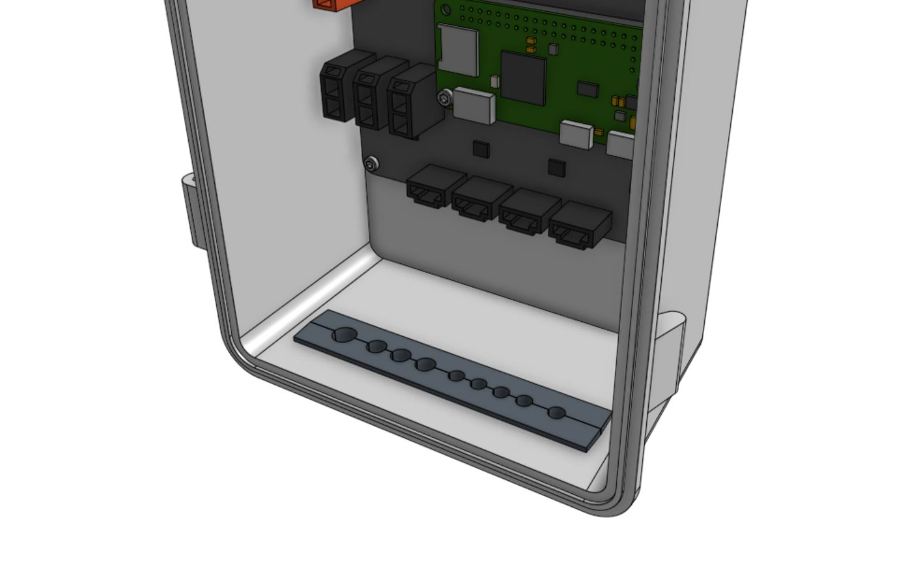
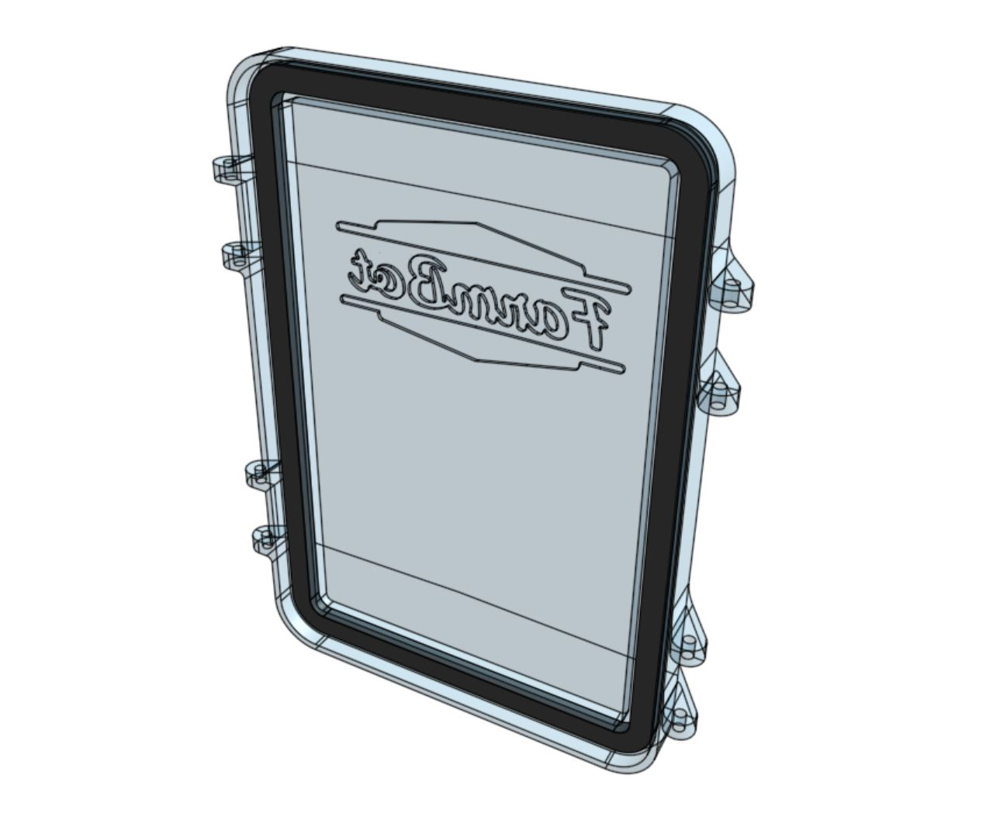
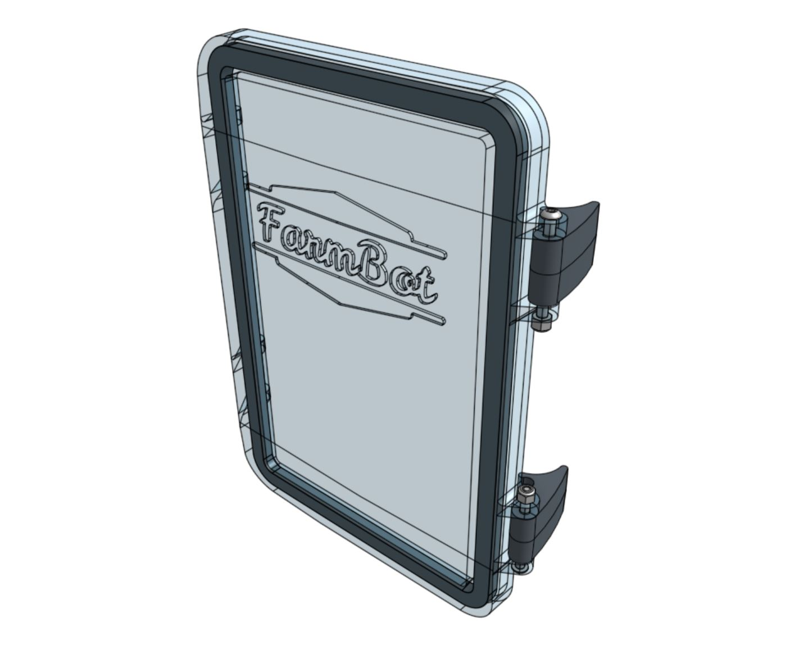
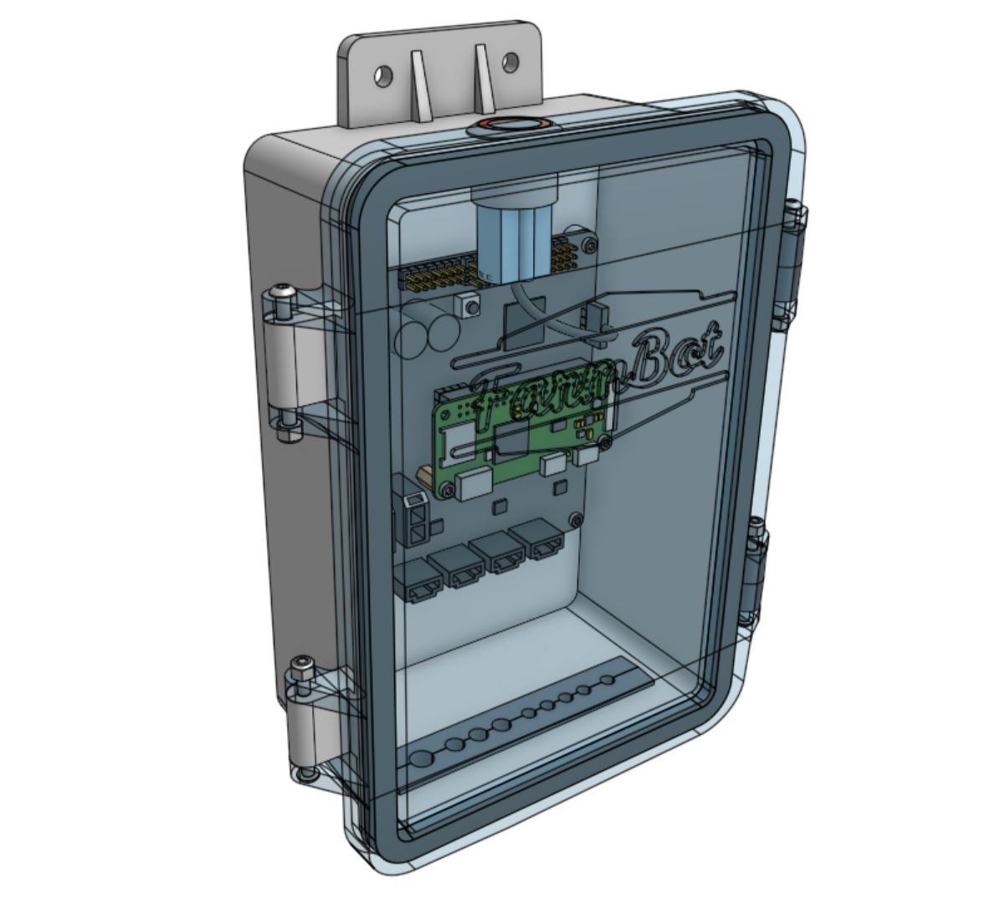
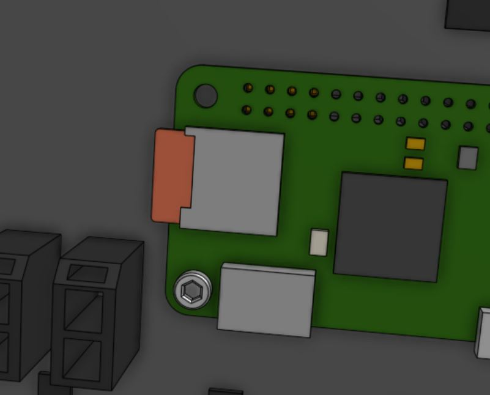

# Component list

|Component                     |Qty                           |
|------------------------------|------------------------------|
|Electronics Box (Box)         |1
|Electronics Box (Lid)         |1
|Electronics Box (Gasket)      |1
|Electronics Box (Latch)       |2
|Electronics Box (Supergland Half)|2
|Farmduino Express             |1
|Raspberry Pi Zero W           |1
|MicroSD Card                  |1
|E-Stop Button                 |1
|E-Stop Button Wiring Harness  |1
|M3 x 35mm Screws              |4
|M3 Locknuts                   |4
|M2.5 x 11mm F/F Standoffs     |2
|M2.5 x 4mm Screws             |8

# Step 1: Mount the Pi to the Farmduino

Mount the two **M2.5 x 11mm F/F standoffs** to the **Farmduino Express** board using two **M2.5 x 4mm screws**.

Mount the **Raspberry Pi Zero W** onto the **Farmduino Express** by pressing the Pi's GPIO pins into the Farmduino's pin header. Be careful not to bend any pins.

Then secure the Pi using two **M2.5 x 4mm screws** screwed into the **M2.5 x 11mm F/F standoffs**.

# Step 2: Mount the electronics in the box

Mount the **Farmduino Express** in the **electronics box** using four **M2.5 x 4mm Screws**.

# Step 3: Insert the E-stop button

Insert the **E-stop button** into the large hole in the top of the **electronics box**. Secure it with the locking ring, ensuring the locking tab is facing towards you (out of the front of the box).

Attach the **E-stop button wiring harness** to the **E-stop button** and the `E-STOP` pin header located on the right side of the **Farmduino Express** board. The wiring harness release tab should be facing towards you (out of the front of the box).

# Step 4: Insert the supergland

Insert the two **supregland halves** into the slot in the bottom of the **electronics box**. The largest hole in the supergland should be positioned on the left side of the box.

# Step 5: Prepare the lid

Press the **electronics box gasket** into the **electronics box lid**, ensuring the gasket seats fully into the slot.

Attach the two **electronics box latches** to the **electronics box lid** using two **M3 x 35mm screws** and **M3 locknuts**. The latches should be on the right side of the lid (when the logo is facing towards you). The locknuts should be located on the inside mounting tabs while the screw heads should be located on the outside mounting tabs.



# Step 6: Attach the lid

Attach the **electronics box lid** to the **electronics box** using two **M3 x 35mm screws** and **M3 locknuts**. The locknuts should be located on the inside mounting tabs while the screw heads should be located on the outside mounting tabs.



# Step 7: Insert the microSD card

Once **FarmBot OS** has been loaded onto the **microSD card**, insert the card into the **Pi**.

